# AppDev SME Academy: Apigee Lab 1: Design and Publish RESTful API and Spec


## Lab Notation


* ➡️  This symbol denotes an explicit instruction that you should follow.
* `${ENVIRONMENT_VARIABLE}` - This is an environment variable you should set.


## Lab Environment


### Commands

Throughout this lab there will be instructions where you have to copy and paste commands.  The commands may include environment variables. It's recommended that you run the commands from a terminal within the<b> lab-startup</b> VM provided in the GCP project. 

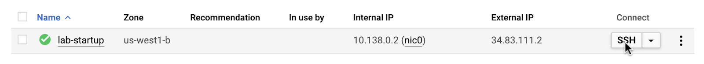

This VM comes preinstalled with all the tools you will need to use throughout the lab. (e.g. `kubectl`, `gcloud`, `jq`, etc). This VM also has an environment file (<b>lab.env</b>) located in your student home directory. 

Most environment variables used throughout the lab should already be part of the <b>lab.env</b> file. If a command uses an environment variable that is not part of <b>lab.env</b>, it will be explicitly called out with a shell `export` statement before the command.

### URLs

A lot of the URLs in the lab include the `${PROJECT}` variable. This variable is a placeholder for your  `GCP Project ID`. You will have to replace this variable manually when opening websites in your browser.

Alternatively, you can use this  [Text Replacer](https://chrome.google.com/webstore/detail/text-replacer/mgnajoenbahbencfgjellmpebknkiekg?hl=en) Chrome extension. The extension can help you automagically substitute every instance of the `${PROJECT}` variable with the actual `GCP Project ID`.  It will save you a lot of time. 

Here is how you install and use the extension:

➡️ Open the Chrome Web Store page for the  [Text Replacer](https://chrome.google.com/webstore/detail/text-replacer/mgnajoenbahbencfgjellmpebknkiekg?hl=en) extension 

➡️ Click on the   button to install the extension

➡️ Click on the puzzle piece   button  (in the Chrome toolbar,  to the left of your profile pic.) 

➡️ Scroll to locate the newly installed extension

➡️ Click on the pin button to show the extension to the Chrome toolbar

➡️ Return to the Qwiklabs page

➡️ Click on the pencil   button to open extension's `Find & Replace` dialog

➡️ Enter  `\${PROJECT}` as the `Find` string.

➡️ Enter your `GCP Project ID`  as the `Replace` string 

➡️ Leave the `Color` field empty

➡️ Click on the   button

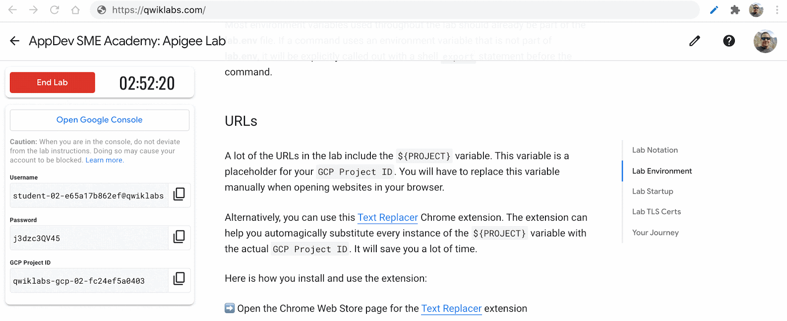

<aside class="special">

<b>Note</b>: The `${PROJECT}` variable is already part of the `~/lab.env` environment file.  You don't have to replace it for commands you run within the <b>lab-startup</b> VM.
</aside>


## Lab Startup


As part of the lab startup, Qwiklabs auto-provisions all the base components and configuration you will need to complete the lab.  

#### Base Components

* GKE cluster with  [Apigee hybrid](https://docs.apigee.com/hybrid/) installed
* Drupal developer portal
* OpenAPI spec editor

The startup process takes around 15 minutes.  Follow the instructions below to monitor the lab deployment process.

➡️ Navigate to 

```
http://startup.${PROJECT}.apigeelabs.com
```

<aside class="warning">

<b>Note</b>: The page may not be immediately available. It may take a minute or two for the DNS entry to propagate. Wait a couple of minutes and try refreshing a few times if it does not come up.  
</aside>

➡️ Wait until all `Tasks` are in <b>`complete`</b> `State` (approximately 15 minutes)

When complete, it should look like this

```
         - Lab Startup Tasks -                         

   Time      State    Task

│ 13:15 │ completed │ Overall deployment 
│ 00:18 │ completed │ Setting up GCP logging agent 
│ 00:09 │ completed │ Installing base tools 
│ 02:00 │ completed │ Setting up certificates 
│ 00:19 │ completed │ Installing lab tools 
│ 00:01 │ completed │ Setting up student account 
│ 00:08 │ completed │ Configuring GS assets bucket 
│ 00:01 │ completed │ Cloning hybrid player git repo 
│ 00:00 │ completed │ Configuring activity tracking 
│ 00:01 │ completed │ Cloning lab git repo 
│ 00:03 │ completed │ Uploading lab assets to GS bucket 
│ 00:10 │ completed │ Enabling Google APIs for Apigee hybrid 
│ 02:36 │ completed │ Creating GKE cluster for Apigee hybrid 
│ 00:33 │ completed │ Creating Apigee organization 
│ 00:09 │ completed │ Creating Apigee environment 
│ 01:04 │ completed │ Deploying OpenAPI spec editor 
│ 00:01 │ completed │ Downloading Apigee hybrid installer (1.2.0) 
│ 01:35 │ completed │ Deploying OurBank's developer portal 
│ 00:07 │ completed │ Creating GCP IP for Apigee runtime 
│ 00:09 │ completed │ Creating GCP IP for Apigee MART 
│ 00:44 │ completed │ Creating service accounts for Apigee hybrid 
│ 01:39 │ completed │ Initializing Apigee hybrid runtime 
│ 04:25 │ completed │ Waiting Apigee hybrid runtime to be ready 
```

Note that bootstrap tasks are dynamically added as the overall deployment progresses. Initially you will see only a few tasks.


## Lab TLS Certs


Some of the web-facing components of this lab use TLS Certificates. These certificates are signed by the   [Let's Encrypt](https://letsencrypt.org/) staging Certificate Authority (CA). This is a fake Certificate  Authority. 

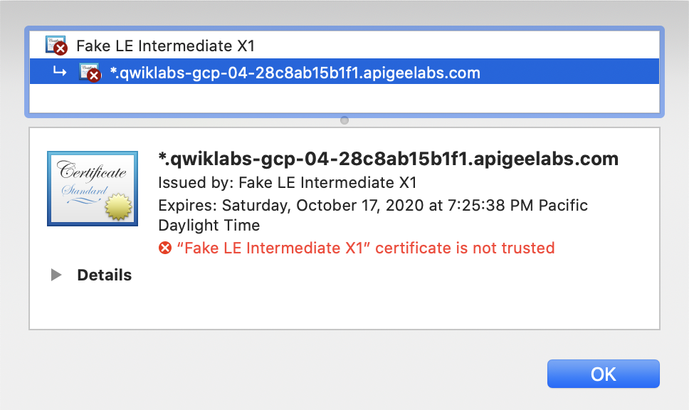

For the duration of this lab you should install this CA as trusted in your computer.  Follow the instructions below for installing the Let's Encrypt "<b>Fake LE Root X11</b>" CA in your machine's operating system.

<aside class="warning">

<b>Note</b>: Once you are done with the lab you should uninstall the "<b>Fake LE Root X11</b>" CA.  There are also instructions below for uninstalling it.
</aside>

### <b>MacOS</b>: Install Certificate Authority

➡️ Open a terminal window in your computer

➡️ Download the CA  <b>fakelerootx1.pem</b> file using cURL

```shell script
curl -sSOL https://letsencrypt.org/certs/fakelerootx1.pem
```

➡️ Install the CA into the `System.keychain` with this command

```shell script
sudo security add-trusted-cert -d \
 -r trustRoot \
 -k '/Library/Keychains/System.keychain' \
 ./fakelerootx1.pem
```

➡️ (<b>Chrome Only</b>) Restart the browser by entering the following in a new tab

```
chrome://restart
```

This is needed so that the browser sees the newly installed cert. All your tabs and windows will be restored automatically after the restart. Also, your lab will still be active when you come back. 

### <b>MacOS</b>: Uninstall Certificate Authority

When you are done with the lab, follow these instructions to remove the CA.

➡️ Open a terminal window in your computer

➡️ Remove the CA from the `System.keychain` with this command

```shell script
sudo security delete-certificate -c "Fake LE Root X1"
```

### <b>ChromeOS</b>: Install Certificate Authority

➡️ Open a new Chrome tab and enter the URL below (download the file)

```
https://letsencrypt.org/certs/fakelerootx1.pem
```

➡️  Enter the URL below (in the same tab) to open the certificate manager

```
chrome://settings/certificates
```

➡️ Select the `Authorities` tab

➡️ Click on the  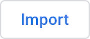 button

➡️ Select `Base64-encoded ASCII, Single Certificate` (bottom left corner)

➡️ Locate and select the <b>fakelerootx1.pem</b> CA file from your file system

<aside class="special">

<b>Hint</b>: Select   `Recent`  in the file browser dialog to locate the file quickly
</aside>

➡️Click on the   button

➡️Select    `Trust this certificate for identifying websites`

➡️Click on the   button

The new certificate will show now in the list with the name "<b>Fake LE Root X1</b>"

### <b>ChromeOS</b>: Uninstall Certificate Authority

➡️ Open a new Chrome tab and enter

```
chrome://settings/certificates
```

➡️ Select the `Authorities` tab

➡️ Select the "<b>Fake LE Root X1</b>" CA from the list

➡️ Click on the three dots   button to open the actions menu

➡️ Click on `Delete`

### <b>Debian/Ubuntu:</b> Install Certificate Authority

➡️ Open a terminal window in your computer

➡️ Download the CA  <b>fakelerootx1.pem</b> file using cURL

```shell script
curl -sSOL https://letsencrypt.org/certs/fakelerootx1.pem
```

➡️ Copy the CA into the <b>ca-certificates</b> directory

```shell script
sudo cp ./fakelerootx1.pem /usr/local/share/ca-certificates/fakelerootx1.crt
```

➡️ Update the system certificates

```shell script
sudo update-ca-certificates
```

➡️ (<b>Chrome Only</b>) Restart the browser by entering the following in a new tab

```
chrome://restart
```

This is needed so that the browser sees the newly installed cert. All your tabs and windows will be restored automatically after the restart. Also, your lab will still be active when you come back. 

### <b>Debian/Ubuntu</b>: Uninstall Certificate Authority

When you are done with the lab, follow these instructions to remove the CA.

➡️ Open a terminal window in your computer

➡️ Remove the CA from the system with this command

```shell script
sudo rm -f /usr/local/share/ca-certificates/fakelerootx1.crt
```

➡️ Update the system certificates

```shell script
sudo update-ca-certificates --fresh
```

<aside class="special">

<b>Note</b>: For other operating systems, see  [these additional instructions](https://manuals.gfi.com/en/kerio/connect/content/server-configuration/ssl-certificates/adding-trusted-root-certificates-to-the-server-1605.html)
</aside>


## Your Journey


You are a senior API Architect working at OurBank.  The bank recently partnered several retailers to offer credit card and address verification services. OurBank has an existing SOAP API that can perform these tasks. This SOAP API was developed many years ago as part of the  [Jabberwocky](https://www.youtube.com/watch?v=knAvKI33LOM)™ project.  The SOAP API works,  but everyone from the Jabberwocky project has either left the bank or retired. 

You have been assigned to design an API that the retail partners can use. However, you do not want to expose the raw SOAP API. Instead, you want to provide partners with a modern and consistent RESTful API. 


## Task 1. Create Mock API
Duration: 02:00


In the API lifecycle, a typical workflow is to design the API first.  You then socialize the design with the people who are going to consume it. After that, you gather feedback and refine the design. This process might go through a few iterations. 

A very popular format for documenting and socializing RESTful API designs is  [OpenAPI](https://swagger.io/specification/).

<aside class="special">

You may have also heard of Swagger specs. It's really the same stuff. Swagger is the original open-source spec from which the OpenAPI initiative was born.
</aside>

With Apigee, you can go a step further. In addition to documenting the API with OpenAPI, you can also quickly create a mock implementation. This is very useful. It allows the early evaluators to actually use the API. They can even start implementing their apps while the API is still in development. 

### Task 1.1 Inspect the Spec 

As the API Architect, you have created an OpenAPI spec for OurBank's verification service. This is the design that you are going to share with the retail partners who are interested in using the verification service.

Let's use an OpenAPI spec editor to inspect this file.

➡️ Open the OAS editor in a new incognito window.

```
https://spec-editor.${PROJECT}.apigeelabs.com/
```

You should see a dummy spec in there 

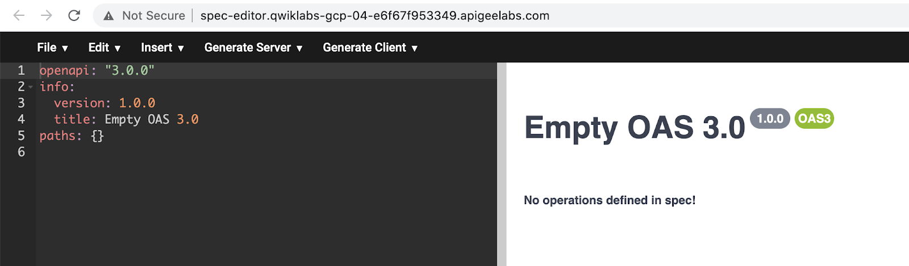

<aside class="warning">

<b>Note</b>: If you have worked with the Swagger Editor before, it may preload one of your old specs from the browser's local storage. Ignore that.
</aside>

➡️ Click on `File > Import URL`

➡️ Enter the following URL

```
https://storage.googleapis.com/${PROJECT}/assets/ourbank-verification-v1.yaml
```

➡️ Click on  

You should see the spec for OurBank's RESTful Verification API.

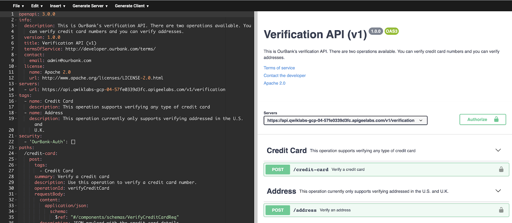

It's a simple API. Simple is good.  It has a couple of operations with minimal request and response payloads. Let's go ahead use this spec to create an API Proxy in Apigee.

### Task 1.2 Create API from Spec 

Now, let's create an API Proxy in Apigee from this OpenAPI spec. 

➡️ Open an incognito browser window and navigate to 

[https://apigee.google.com](https://apigee.google.com)

➡️ Login to Apigee with your Qwiklabs student credentials

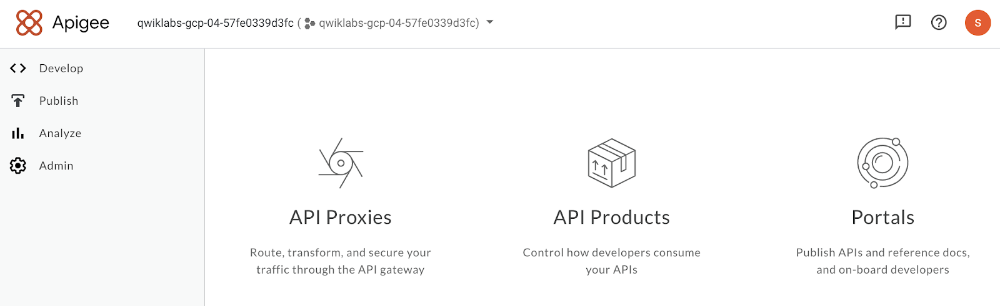

➡️ Navigate to `Develop > API Proxies`

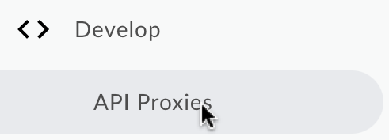

➡️ Click on the   button (top right)

➡️ Within the `No Target` option`,` click on `Use OpenAPI Spec`

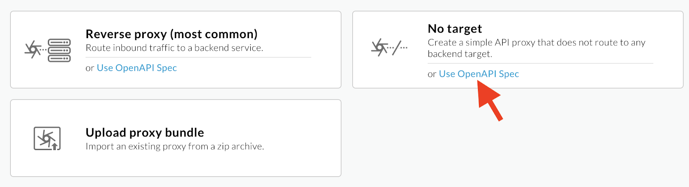

➡️ Enter the following URL in the dialog

OpenAPI Spec URL:

```
https://storage.googleapis.com/${PROJECT}/assets/ourbank-verification-v1.yaml
```

➡️ Click on the   button

➡️ Use the following values for the `Proxy Details` section

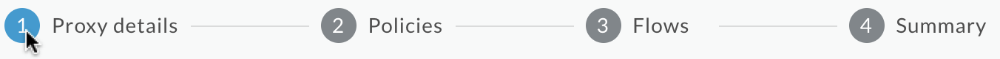

Name:

```
ourbank-verification-v1
```

Base path:

```
/v1/verification
```

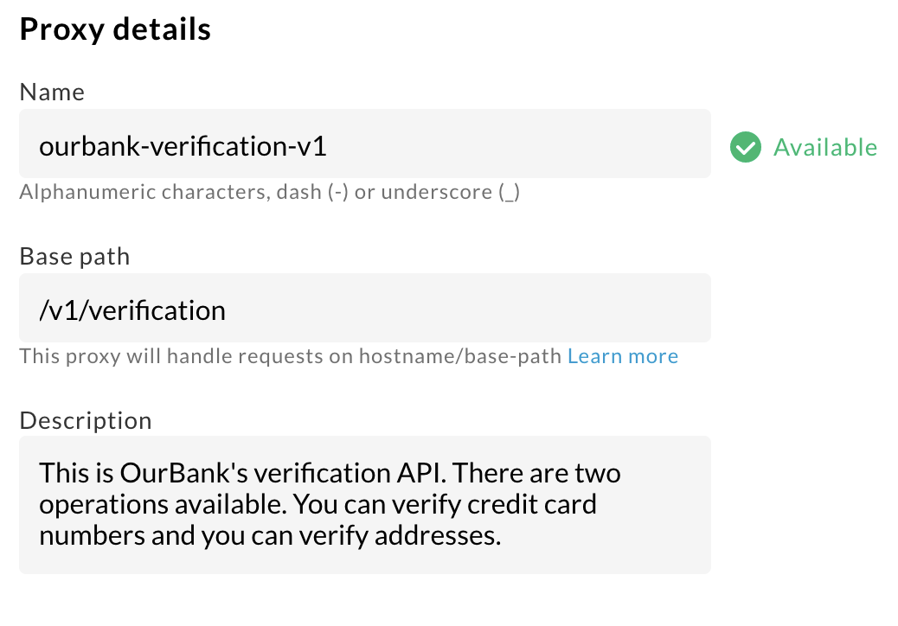

➡️ Keep clicking the   until you reach the `Flows` section

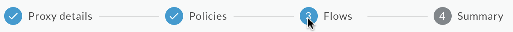

➡️ Verify that both <b>verifyCreditCard</b> and <b>verifyAddress</b> operations are selected

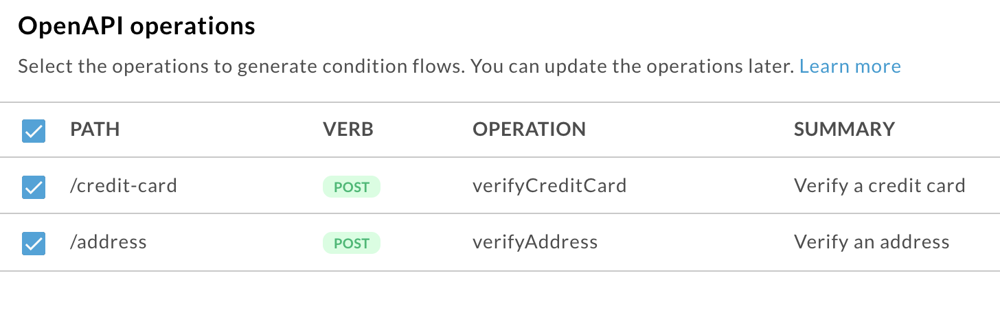

➡️ Click   once more to reach the `Summary` section

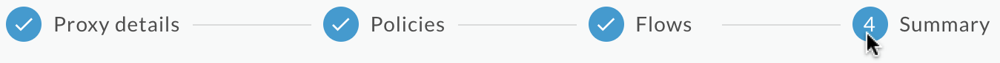

➡️ Select the <b>test</b> environment 

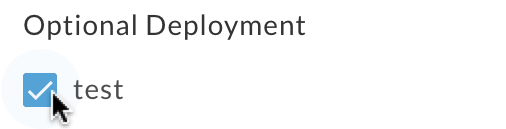

➡️ Click on the   button

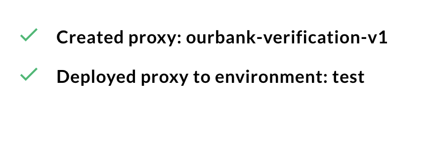

➡️ Click  on the   button


## Task 2.  Review Flows
Duration: 02:00


Now that you have a basic API Proxy created, let's take a look at it.

➡️ Click on the `Develop` tab (top right)

You should see the API already has a couple of  [conditional flows](https://docs.apigee.com/api-platform/fundamentals/flow-configurations) (<b>verifyCreditCard</b> and <b>verifyAddress</b>). These were created from the operations in the OpenAPI spec.

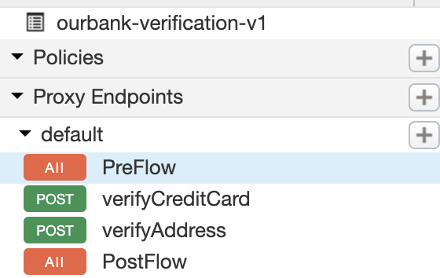

So what are these `Flows` anyway? Apigee uses the concept of `Flows`  to route messages as they pass through the API gateway.  The animation below depicts more or less how this works for this simple API Proxy.

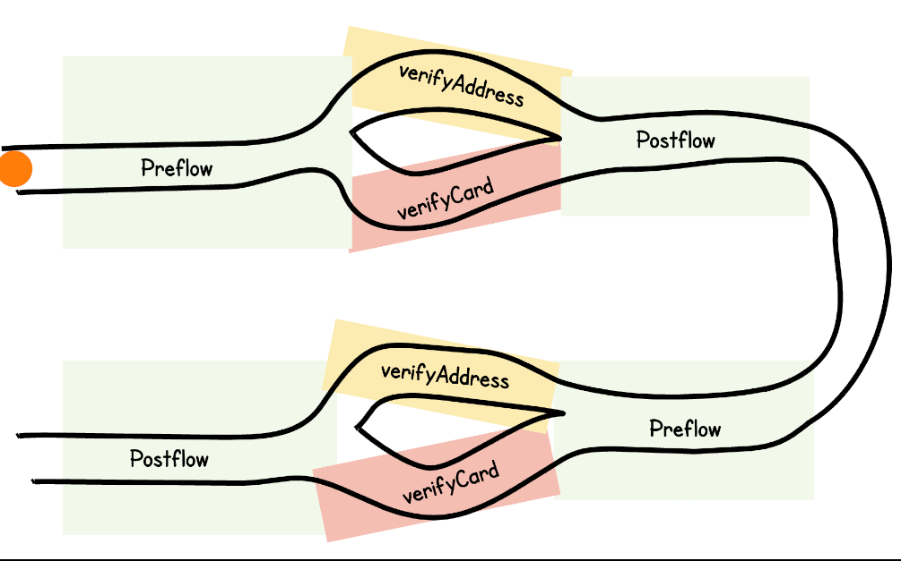

<aside class="special">

* <b>1.</b> The message enters in at one end (`Request Message`) 
* <b>2.</b> The message moves through the top side (`Request Path`).
* <b>3.</b> The message moves through the bottom side (`Response Path`)
* <b>4.</b> The message exits at the other end (`Response Message`)
</aside>

At each fork Apigee evaluates conditions to decide which path the message should move through.  

What do you think will happen if none of the conditions evaluate to `true`? 

Actually, nothing happens. Apigee just echoes back the same message it received from the client. This may not always be the desired behavior (more on this later in the lab).

<aside class="special">

<b>Note</b>: In more complex proxies where there is an actual back-end endpoint, the picture would be quite different.
</aside>

Let's see what those flows actually look like.

➡️ Click on the "<b>default</b>" `Proxy Endpoint`

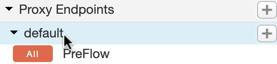

➡️ Inspect the `Flows` element within the main code window

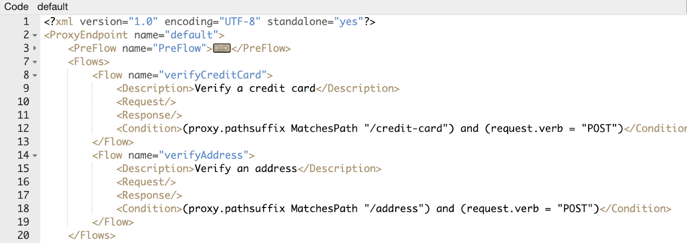

You can see there are two flows (one for each operation). Each flow has a `Condition` element with a logical expression. Apigee evaluates the expressions one at a time  (in top-down order).  Once an expression evaluates to `true`, Apigee chooses the corresponding `Flow`. The remaining flows below are ignored.

This process happens twice. First, on the way in (`Request Path`). Then, on the way out (`Response Path`).

<aside class="warning">

<b>Note</b>: This explanation of Flows is super simplistic given that your API Proxy is simple. As proxies become more complex, more flows come into the picture.  If you are interested, hop over to the Apigee Docs for a more  [in-depth explanation of Flows](https://docs.apigee.com/api-platform/fundamentals/what-are-flows).
</aside>

### Task 2.1 (Rename Proxy)

Before we do anything, let's give the "<b>default</b>" `Proxy Endpoint` a more descriptive name.

➡️ Click on the `Proxy Endpoint` named "<b>default</b>"

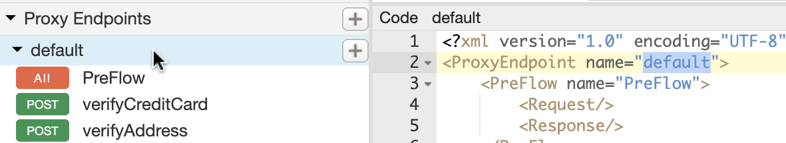

➡️ Set the `ProxyEndpoint`‘s  `name` attribute to:

```
Verification-Proxy
```

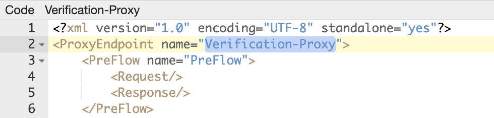

➡️ Save your progress by clicking on the   button 

➡️ Click   if you are asked to save a new revision


## Task 3. Policies
Duration: 05:00


Alright, so you've seen how `Flows` work. But, `Flows` are not enough if you actually want to do meaningful stuff with the HTTP messages. That's where  [Policies](https://docs.apigee.com/api-platform/develop/policy-attachment-and-enforcement) come in.  

In Apigee, a policy is a reusable and configurable piece of logic. Think of it as a small module you can configure to do useful work.  You can attach policies to `Flows`. You can even make the policies run conditionally. It's a super powerful model. Heck, you can even write custom code to create your own policies.

Enough theory about policies, let's actually use one of them. Let's add payload validation to one of the operations. For this, you are going to use the `OAS Validation` policy.

### Task 3.1 (OAS Validation)

First, let's grab the spec from the editor.

➡️ Head back to the spec editor tab

```
http://spec-editor.${PROJECT}.apigeelabs.com/
```

➡️ Click on `File > Save as YAML`

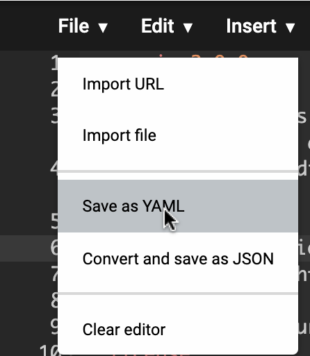

Next, let's add the `OAS Validation` policy in Apigee.

<aside class="warning">

<b>Note</b>: Your browser may rename the file. Make sure the file is named <b>openapi.yaml</b>. This is the name you will use in the next steps.
</aside>

➡️ Return to the Apigee tab where you are authoring the API Proxy.

➡️ Click on the "<b>verifyCreditCard</b>" conditional flow


➡️ Click on the  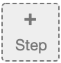button (within the   path) to add a new policy.  

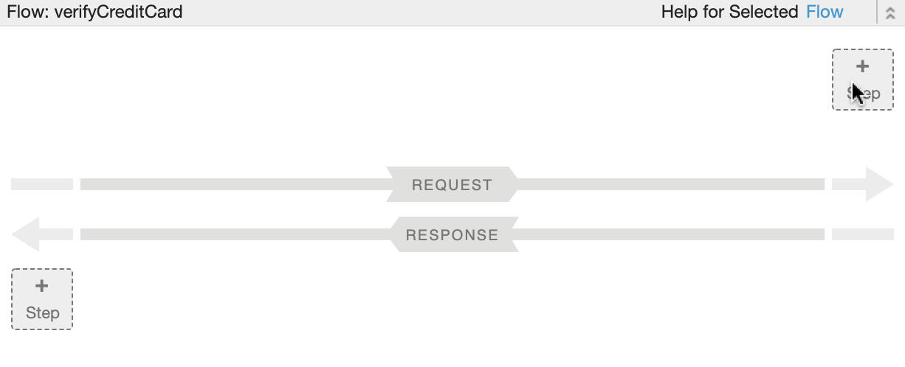

➡️ Select `OpenAPI Spec Validation` from the policy palette.

➡️ Enter this value for both the policy `Name` and `Display Name`

```
OAS-ValidateRequest
```

➡️ Select  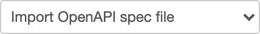 from the dropdown

➡️ Click on the   button, and select the `openapi.yaml` file from earlier

➡️ Verify (and update if needed) the `Spec Name` field is set to

```
openapi.yaml
```

The dialog should look like this:


➡️ Click on  

➡️ Click on the new policy  

➡️ Replace the default contents of the policy with the XML below:

```xml
<?xml version="1.0" encoding="UTF-8" standalone="yes"?>
<OASValidation continueOnError="false" enabled="true" name="OAS-ValidateRequest">
    <DisplayName>OAS-ValidateRequest</DisplayName>
    <Properties/>
    <Source>request</Source>
    <Options>
        <ValidateMessageBody>true</ValidateMessageBody>
    </Options>
    <OASResource>oas://openapi.yaml</OASResource>
</OASValidation>
```

➡️ Save your progress by clicking on the   button

### Task 3.2 (Mocked Response)

Now, let's make the API reply with a  mocked response. For this, you will use an `Assign Message` policy.

➡️ Click on the "<b>verifyCreditCard</b>" conditional flow

➡️ Click on the   button (within the   path) to add a new policy.

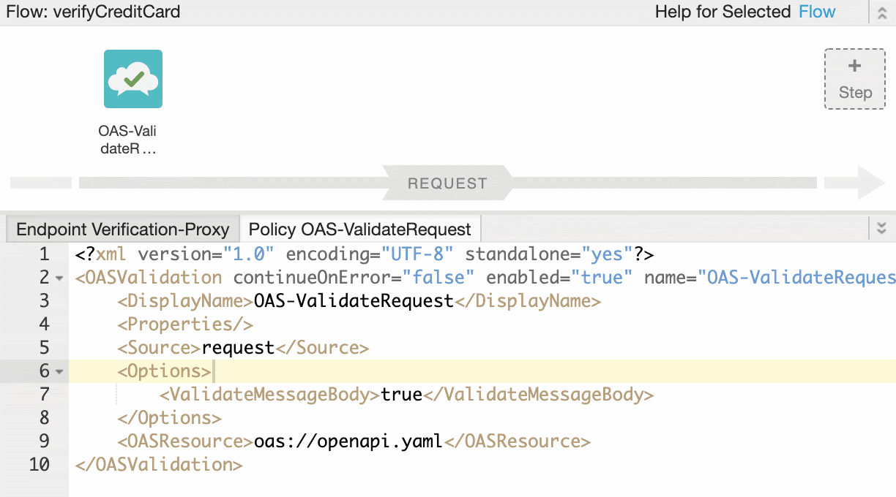

➡️ Select  `Assign Message` from the policy palette.

➡️ Enter this value for both the policy `Name` and `Display Name`

```
AM-CreditCardRes
```

➡️ Click on  

➡️ Click on the new policy   

➡️ Replace the contents of the policy with the following XML code:

```xml
<?xml version="1.0" encoding="UTF-8" standalone="yes"?>
<AssignMessage async="false" continueOnError="false" enabled="true" name="AM-CreditCardRes">
    <DisplayName>AM-CreditCardRes</DisplayName>
    <Properties/>
    <Set>
        <Headers>
            <Header name="Content-Type">application/json</Header>
        </Headers>
        <StatusCode>200</StatusCode>
        <ReasonPhrase>OK</ReasonPhrase>
        <Payload>
{
  "valid": true,
  "message": "Credit card is valid"
}
</Payload>
        <Path/>
    </Set>
    <IgnoreUnresolvedVariables>true</IgnoreUnresolvedVariables>
    <AssignTo createNew="true" transport="http" type="response">response</AssignTo>
</AssignMessage>
```

➡️ Save your progress by clicking on the   button

<aside class="special">

Notice at the bottom, the policy has `createNew="true"`.  This means it will discard the existing HTTP message and create a new HTTP message which will flow out to the client. 

In this scenario it's fine to override the entire message. There are cases where overriding is not appropriate.  e.g. if you want to add an extra HTTP header to the existing message.
</aside>

### Task 3.3 (Catch-All Flow)

Earlier we talked about what happens when none of the conditional flows execute. You learned that Apigee simply echoes back the same HTTP message it received. Let's fix that now.

Let's add an unconditional `Flow` to catch all requests that fall through. 

➡️ Click on the "<b>Verification-Proxy</b>" endpoint

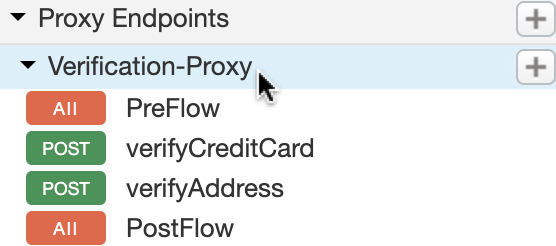

➡️ Scroll to find the existing <b>verifyAddress</b> conditional flow

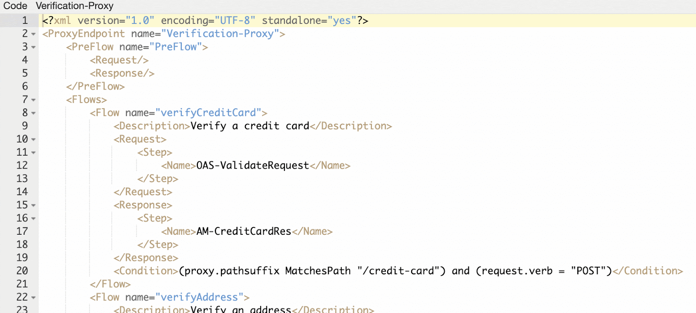

<aside class="special">

<b>Hint</b>: Within the code window, you can click on the arrows next to the line numbers. This  collapses XML elements. It makes it easier to navigate and understand the proxy XML.
</aside>

➡️ Add the following unconditional `Flow` as a sibling directly below it.

```xml
        <Flow name="catch-all">
            <Description>Requests that arrive here, should error out</Description>
            <Request/>
            <Response/>
            <Condition>true</Condition>
        </Flow>
```

➡️ Save your progress by clicking on the   button

The result should look like this:

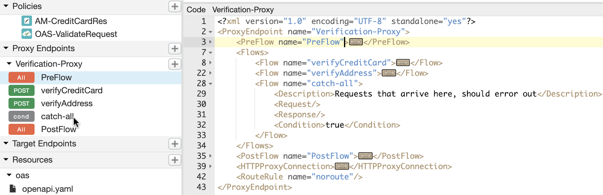

<aside class="warning">

<b>Defect Warning</b>: Sometimes the Apigee UI does not fully detect the changes made directly in the `Code` window. When this happens, you may see something like this:

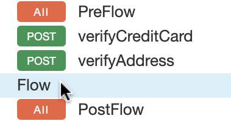

If this happens to you, save the changes and reload the page. That should fix it.
</aside>

Next, let's use a `Raise Fault` policy to reply with an HTTP 400 message.

➡️ Click on the newly added <b>catch-all</b> unconditional flow 

➡️ Click on the   button (within the   path) to add a new policy.

➡️ Select  `Raise Fault` from the policy palette.

➡️ Enter this value for both the policy `Name` and `Display Name`

```
RF-BadRequest
```

➡️ Click on  

➡️ Click on the new policy   

➡️ Replace the contents of the policy with the following XML code:

```xml
<?xml version="1.0" encoding="UTF-8" standalone="yes"?>
<RaiseFault async="false" continueOnError="false" enabled="true" name="RF-BadRequest">
    <DisplayName>RF-BadRequest</DisplayName>
    <Properties/>
    <FaultResponse>
        <AssignVariable>
            <Name>custom_fault</Name>
            <Value>true</Value>
        </AssignVariable>
        <Set>
            <Headers>
                <Header name="Content-Type">application/json</Header>
            </Headers>
            <Payload>
{
  "valid": false,
  "message": "Unknown verification request"
}
            </Payload>
            <StatusCode>400</StatusCode>
            <ReasonPhrase>Bad Request</ReasonPhrase>
        </Set>
    </FaultResponse>
    <IgnoreUnresolvedVariables>true</IgnoreUnresolvedVariables>
</RaiseFault>
```

➡️ Save your progress by clicking on the   button


## Task 4. Deploy, Trace, Test
Duration: 03:00


In this task you are going to deploy and test your API Proxy. During the test you will have the Apigee `Trace Tool` running in the background. The `Trace Tool` is one of Apigee's most powerful tools at your disposal for troubleshooting issues with API Proxies.

### Task 4.1 Deploy

Let's deploy the API Proxy.

➡️ Click on the  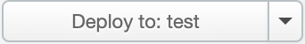 button (on the top-right)

➡️ Click on the   button to confirm.

➡️ Mouse over the spinning wheel.

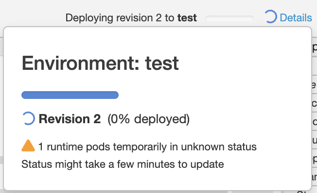

➡️ Wait until the deployment completes

Upon successful deployment, you should see the following:

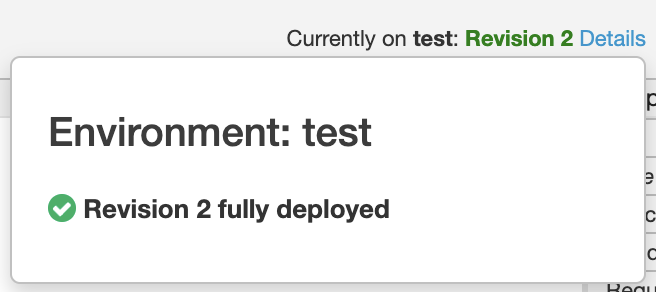

### Task 4.2 Troubleshoot

This is an optional task. If the deployment from the previous task fails, you will see an error like this:

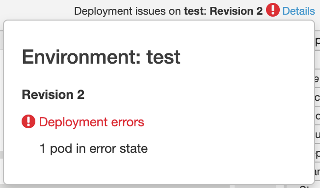

The Apigee hybrid UI currently does not fetch the specific error details. However, this information can be retrieved using the Apigee APIs.

➡️ Use the following curl command to retrieve the error details:

```shell script
export ACCESS_TOKEN=$(gcloud auth print-access-token)
export REVISION=2
```

```shell script
curl -s --http1.1 -X GET https://apigee.googleapis.com/v1/organizations/${PROJECT}/environments/test/apis/ourbank-verification-v1/revisions/${REVISION}/deployments \
  -H "Authorization: Bearer ${ACCESS_TOKEN}" \
  -H 'Accept: application/json' | jq
```

(make sure to set the correct revision environment variable) 

Here is a sample of what the response would look like:

```json
{
 "environment": "test",
 "apiProxy": "ourbank-verification-v1",
 "revision": "2",
 "deployStartTime": "1594004110753",
 "pods": [
   {
     "podName": "apigee-runtime-qwiklabs-gcp-03-9409efafedd4-test-v120-gxd8f",
     "appVersion": "self",
     "deploymentStatusTime": "1594004850650",
     "deploymentStatus": "error",
     "statusCode": "500",
     "statusCodeDetails": "Deployment Failed: keyvaluemap.service.keyvaluemap_name_invalid\nKeyValueMap name  is invalid",
     "deploymentTime": "1594004153587",
     "podStatus": "active",
     "podStatusTime": "1594004850650"
   }
 ],
 "basePath": "/"
}
```

Once you've fixed the error described in the <b>`statusCodeDetails`</b> field, save a new revision of the API proxy, and re-deploy it.

### Task 4.3 Trace

➡️ Click on the `Trace` tab (on the top-right)

➡️ Click on the `Env.` drop-down to select the revision

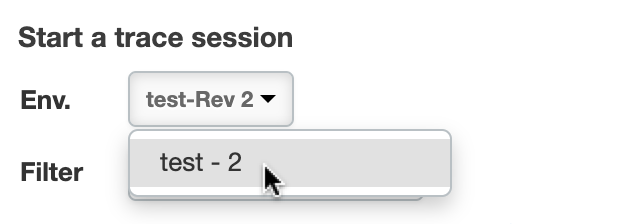

➡️ Click on the   button

➡️ Uncheck the option to compare selected phases (bottom left)

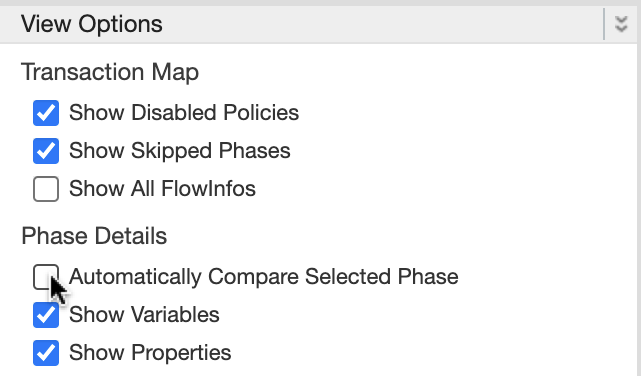

### Task 4.4 Test

Next, let's use cURL to test the API Proxy.

➡️ Open a new browser tab and navigate to 

[https://console.cloud.google.com/compute/instances](https://console.cloud.google.com/compute/instances.)

➡️ Login with your student credentials

➡️ Select your student `GCP Project ID` (if not already selected)


➡️ SSH into the "<b>lab-startup</b>" VM.


➡️ Source the lab environment

```shell script
source ~/lab.env
```

➡️ Run the following cURL command

```shell script
curl -s --http1.1 -X POST "https://api.${PROJECT}.apigeelabs.com/v1/verification/credit-card" \
  -H 'Content-Type: application/json' \
  -H 'Accept: application/json' \
  -d '
{
  "number": "2221005276762844",
  "cvv": "345",
  "expiration": "10/1025"
}' 
```

Response should look like this:

```json
{
 "valid": true,
 "message": "Credit card is valid"
}
```

➡️ Send a few more calls using the same cURL command


## Task 5. The Trace Tool
Duration: 05:00


Now that you have sent a few API calls, there should be some data in the `Trace Tool`. Let's take a look at it.

### Task 5.1 Inspect Trace

➡️ Return the Apigee tab where you had the `Trace` tool running

There should be a few calls traced now.  

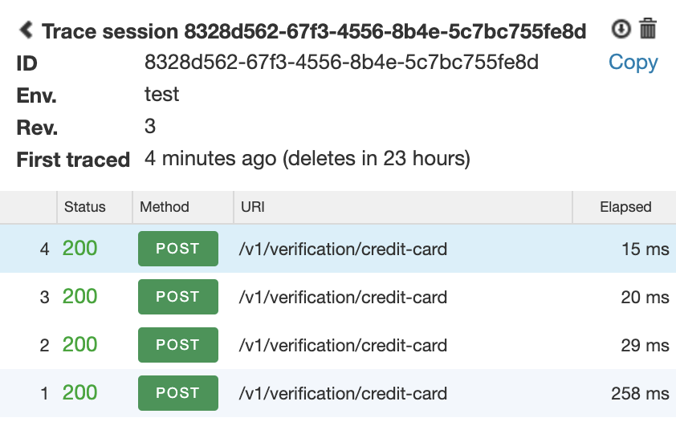

<aside class="warning">

<b>Defect Warning</b>: If you do not see traced calls, try deleting the trace by clicking on the trash icon  . Then, start a new trace, and send a few more calls. This happens sometimes. Apigee hybrid is a new product, it has growing pains sometimes.
</aside>

➡️ Select one of the calls from the `Trace` session

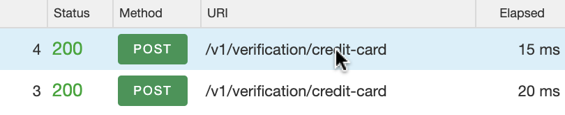

It should look like this.

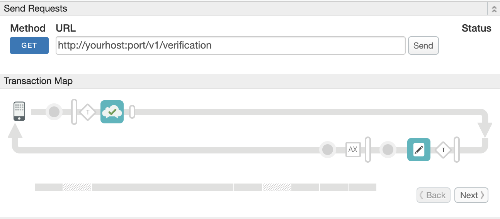

Using the `Trace` tool you can see exactly how the API Gateway processed the request. The different symbols in the `Transaction Map` have different meanings.

Let's go over some of them.

### Task 5.2 The Bubble

Wherever you see a bubble  , it means an HTTP message is entering or leaving a `Flow`. You can click on the bubble itself to see more details about the message.

➡️ Click on the first bubble on the `Request Path`.

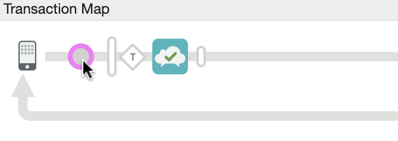

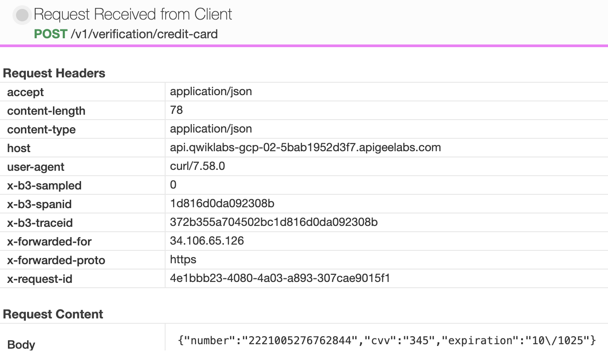

You can see that Apigee shows you the values of individual HTTP headers, as well as the body of the HTTP Request you sent.

### Task 5.2 Tall Pipe

Next, let's look at the tall pipe symbol  . This indicates the start of a major `Flow`. 

➡️ Mouse over the tall pipe symbols so you can see the different `Flows`.

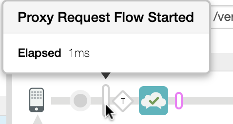

<aside class="special">

You may notice the last tall pipe refers to a `Flow` called `Post Client Flow`. This `Flow` is different from all others. It allows you to execute policies after the HTTP response has already been sent to the client. This is very useful for executing policies asynchronously. Apigee customers typically use the `Post Client Flow` to ship off logging and analytics  data to an external syslog server.  Hop over to the Apigee docs to read more about the  [Post Client Flow](https://docs.apigee.com/api-platform/fundamentals/what-are-flows#designingflowexecutionsequence-havingcodeexecuteaftertheclientreceivesyourproxysresponsewithapostclientflow).
</aside>

### Task 5.4 Diamonds

Next, you have the diamond symbol . 

This indicates a condition being evaluated. The letter inside the symbol indicates the result. (`True` or `False`). 

➡️ Click on the diamond symbol to see more details

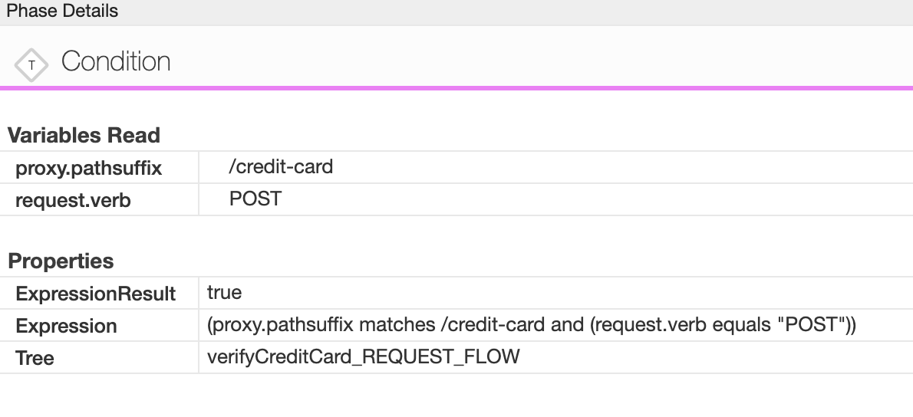

### Task 5.5 Policies

Finally, if you click on the policy icons within the `Transaction Map`, you will be able to see specific information about the policy execution.

➡️ Click on the Assign Message policy  

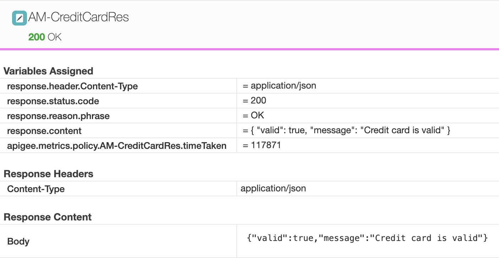

Notice the section titled `Variables Assigned`. Those are Apigee `Flow Variables.`

There are two types of `Flow Variables`:

* <b>1.</b> System created (see the Apigee docs for a   [complete list](https://docs.apigee.com/api-platform/reference/variables-reference))
* <b>2.</b> User created (you create these)

`Flow Variables` are the main mechanism to pass information around between policies. As you work with more advanced proxies, you too will get to <b>assign</b> and <b>read</b> your own custom flow variables. 

<aside class="special">

<b>Note</b>: Each HTTP request has its own `Flow Variables` context. A `Flow Variable` assigned in one request is not visible to other requests.
</aside>


## Task 6. Error Handling
Duration: 05:00


So, you've got a working API Proxy. Well, the <b>verifyCreditCard</b> operation at least.  In this task let's add some basic error handling logic.

Currently there are two ways an error can happen in your API Proxy:  

* <b>First</b>, if you pass a request body that does not match the schema described in the OpenAPI spec, the `OAS Validation` policy will raise a `Fault`.
* <b>Second</b>, if there is a bug in your proxy logic, like an incorrectly configured policy, Apigee may raise a `Fault` of its own.

Either way, `Faults` are going to happen.  You cannot just ignore them. You should be aware of the different ways in which your API Proxy can fail, and decide how to handle the different failure scenarios.

### Task 6.1 Trigger a Fault

Let's trigger a fault in and see what happens in a `Trace` session.

➡️ Click on the `Trace` tab (on the top-right)

➡️ Click on the   button to delete the current `Trace` session if it's still there.

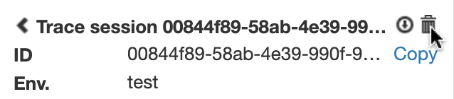

➡️ Click on the `Env.` drop-down to select the revision


➡️ Click on the   button to start a new `Trace` session.

➡️ Run the following cURL command a few times from the "<b>lab-startup</b>" VM.

```shell script
curl -s --http1.1 -X POST "https://api.${PROJECT}.apigeelabs.com/v1/verification/credit-card" \
  -H 'Content-Type: application/json' \
  -H 'Accept: application/json' \
  -d '
{
  "number": "2221005276762844"
}' | jq
```

Response should look like this:

```json
{
 "fault": {
   "faultstring": "OASValidation OAS-ValidateRequest with resource \"oas://openapi.yaml\": failed with reason: \"[ERROR - Object has missing required properties ([\"cvv\",\"expiration\"]): []]\"",
   "detail": {
     "errorcode": "steps.oasvalidation.Failed"
   }
 }
}
```

➡️ Return to the `Trace` session.

You should see something like this.

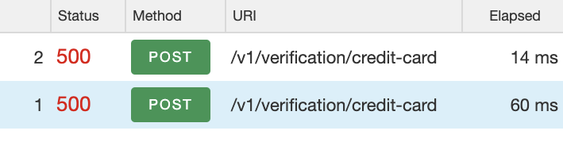

➡️ Click on one of the failed calls.

You see, the `OAS Validation` policy now has this icon   indicating that it failed and a `Fault` was raised. This `Fault` was raised by Apigee itself. 


<aside class="special">

<b>Aside</b>: You can raise your own custom faults using a `Raise Fault` policy. (more on this later).
</aside>

Whenever a `Fault` is raised, the normal execution `Flow` is interrupted. Apigee switches to the `Error Flow`.

The `Error Flow` behaves just like other `Flows`. You can attach policies to it to do interesting stuff. For example, you can reformat the error message. Or, you could even log the error message to an external system. You get the idea.

### Task 6.2 Reformat Apigee Errors

Now that you know about the `Error Flow` and `Faults`, let's put the theory in practice.

In the previous task you saw the default format for Apigee error messages. They look like SOAP Faults that have been converted into JSON. It's not pretty. But, more importantly it's not consistent with your RESTful API design. Let's fix that.

In this task you are going to transform the error messages returned by Apigee itself into this format:

```json
{
 "valid": false,
 "message": "Some error message."
}
```

To accomplish this, you will use a  [Fault Rule](https://docs.apigee.com/api-platform/fundamentals/fault-handling). 

A `Fault Rule` is like a conditional `Flow` that runs when the Apigee `Error Flow` starts.  `Fault Rules` behave in a similar way to `Flows`:

* They are conditional 
* They get evaluated in-order * 
* The first `Fault Rule` with a condition that evaluates to `true` gets executed
* After one `Fault Rules` executes, the remaining `Fault Rules` are skipped

<aside class="warning">

<b>*Note</b>: The execution order depends on the `Fault Rule`‘s location:

* Within a `Proxy Endpoint`, they execute bottom->up ⇡ 
* Within a `Target Endpoint`, they execute top->down ⇣
</aside>

Your API Proxy does not have  a `Target Endpoint`, so all the `Fault Rules` will execute in bottom->up ⇡ order.

Let's add a `Fault Rule` to the "<b>Verification-Proxy</b>".

➡️ Click on the `Develop` tab

➡️ Click on the "<b>Verification-Proxy</b>" endpoint

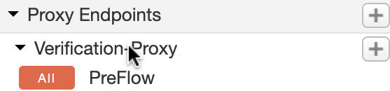

➡️ Add the following `FaultRules` element as a child of the `ProxyEndpoint` (at the top)

```xml
    <FaultRules>
        <FaultRule name="catch-all">
            <Step>
            </Step>
        </FaultRule>
    </FaultRules>
```

➡️ Save your progress by clicking on the   button

➡️ Click   if you are asked to save a new revision

The end-result should look like this:

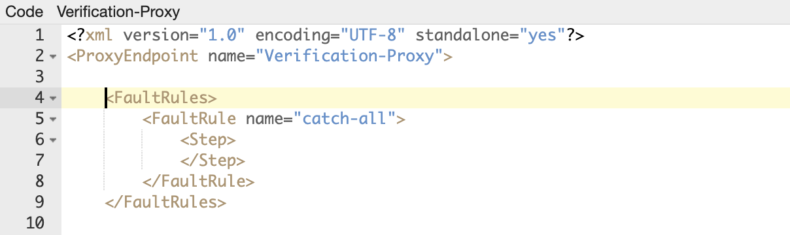

Next, let's add a policy to reformat the `Faults` raised by the Apigee system itself.

➡️ Click on the plus button   next to the `Policies` list to add a new policy 

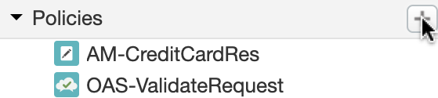

➡️ Select `Assign Message` from the policy palette.

➡️ Enter this value for both the policy `Name` and `Display Name`

```
AM-GenericError
```

➡️ Click on  

➡️ Click on the newly added policy from the `Policies` list

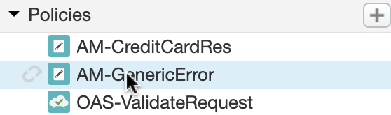

<aside class="warning">

<b>Note</b>:  The broken chain-link icon (on the left) indicates that the policy is not attached to any flows.
</aside>

➡️ Replace the default contents of the policy with the XML below:

```xml
<?xml version="1.0" encoding="UTF-8" standalone="yes"?>
<AssignMessage async="false" continueOnError="false" enabled="true" name="AM-GenericError">
    <DisplayName>AM-GenericError</DisplayName>
    <Properties/>
    <Set>
        <Headers>
            <Header name="Content-Type">application/json</Header>
        </Headers>
        <StatusCode>500</StatusCode>
        <Payload>
{
  "valid": false,
  "message": "An internal server error has occurred. {error.message}"
}
        </Payload>
    </Set>
    <IgnoreUnresolvedVariables>true</IgnoreUnresolvedVariables>
    <AssignTo createNew="true" transport="http" type="response">error</AssignTo>
</AssignMessage>
```

➡️ Save your progress by clicking on the   button

Now, let's attach the new `Assign Message` policy to the "<b>catch-all</b>" `Fault Rule`.

➡️ Click on the "<b>Verification-Proxy</b>" endpoint

➡️ Locate the existing "<b>catch-all</b>" `Fault Rule`

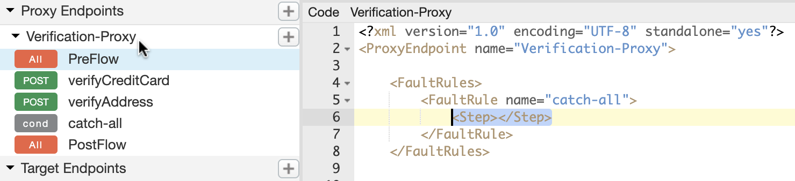

➡️ Replace the `Step` in  `Fault Rule` with the following XML

```xml
            <Step>
                <Name>AM-GenericError</Name>
            </Step>
```

➡️ Save your progress by clicking on the   button

The result should look like this:

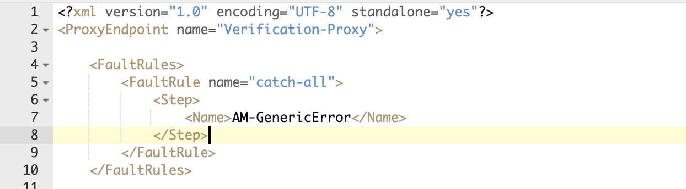

Great, so now you have one rule to catch them all. Get it? Lord of the rings ... :-)

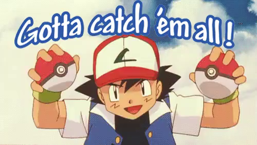 


## Task 7. Custom Faults
Duration: 05:00


So, you have added a new `Fault Rule` (<b>catch-all</b>) that is responsible for handling system raised `Faults`.  Those should be formatted nicely now. But, they will all have the HTTP status code set to 500. This is not always the desired behavior. In fact, for this proxy it does not make sense to respond with HTTP 500 (Internal Server Error) when payload validation fails. Instead, you should respond with HTTP 400 (Bad Request). That is more RESTful.

To fix this, let's add a mechanism for raising and handling your own <b>custom-faults</b>.

So, how can you distinguish between your own <b>custom-faults</b> and system raised `Faults`. One way to do it is to <b>assign</b> a new `Flow Variable` that will act as a flag indicating a <b>custom-fault </b>has been raised. That way you can have a `Fault Rule` to detect your <b>custom-faults</b>.

<aside class="special">

<b>Note</b>: There are many ways to do error handling in Apigee. This is only one possible solution. It's simple but effective.
</aside>

Hopefully that all made sense. Let's actually do it to see it working in practice.  

### Task 7.1 Fault Rule

First, let's add the new `Fault Rule`.

➡️ Click on the "<b>Verification-Proxy</b>" endpoint

➡️ Scroll to locate the <b>catch-all </b>`Fault Rule`

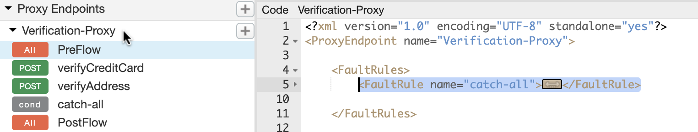

➡️ Add the following `FaultRule` as a sibling below the <b>catch-all</b> Fault Rule

```xml
        <FaultRule name="custom-fault">
            <!-- do nothing  -->
            <Condition>custom_fault = true</Condition>
        </FaultRule>
```

➡️ Save your progress by clicking on the   button

The end-result should look like this:

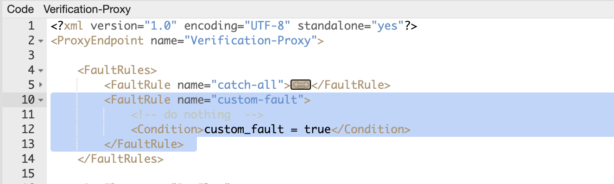

### Task 7.2 Raise Custom Fault

Next, let's update the `OAS Validation` policy so that you can raise your own `Fault`.

➡️ Click on the <b>verifyCreditCard</b> conditional flow

➡️ Click on the <b>OAS-ValidateRequest</b> policy  

➡️ Change the `continueOnError` attribute form `false` to `true`

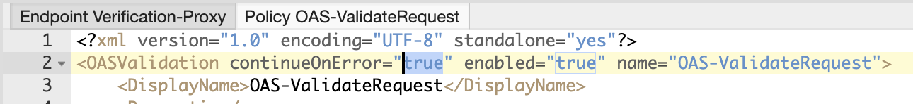

➡️ Save your progress by clicking on the   button

Essentially, what you've done is told Apigee to not raise a `Fault` when this policy fails. This will give you a chance to raise your own <b>custom-fault</b>. 

To do that, let's add your very own  `Raise Fault` policy.

➡️ Click on the   button (within the   path) to add a new policy.  

➡️ Select `Raise Fault` from the policy palette.

➡️ Enter this value for both the policy `Name` and `Display Name`

```
RF-OASFailed
```

➡️ Click on  

➡️ Click on the new policy  

➡️ Replace the contents of the policy with the following XML code:

```xml
<?xml version="1.0" encoding="UTF-8" standalone="yes"?>
<RaiseFault async="false" continueOnError="false" enabled="true" name="RF-OASFailed">
    <DisplayName>RF-OASFailed</DisplayName>
    <Properties/>
    <FaultResponse>
        <AssignVariable>
            <Name>custom_fault</Name>
            <Value>true</Value>
        </AssignVariable>
        <Set>
            <Headers>
                <Header name="Content-Type">application/json</Header>
            </Headers>
            <StatusCode>400</StatusCode>
            <ReasonPhrase>Bad Request</ReasonPhrase>
            <Payload>
{
  "valid": false,
  "message": "{escapeJSON(OASValidation.OAS-ValidateRequest.fault.cause)}"
}
</Payload>
        </Set>
    </FaultResponse>
    <IgnoreUnresolvedVariables>true</IgnoreUnresolvedVariables>
</RaiseFault>
```

➡️ Save your progress by clicking on the   button

Note the  `AssignVariable` element nested within the `Raise Fault` policy.  It is adding a new flow variable <b>custom_fault</b> with value <b>true</b>

That's the flag to distinguish between your <b>custom-faults</b> and system raised `Faults`.

Next, let's make the new `Raise Fault` conditional so that it only executes if the `OAS Validation` policy fails

➡️ Click on the "<b>Verification-Proxy</b>" endpoint 

➡️ Scroll to locate the newly added policy step

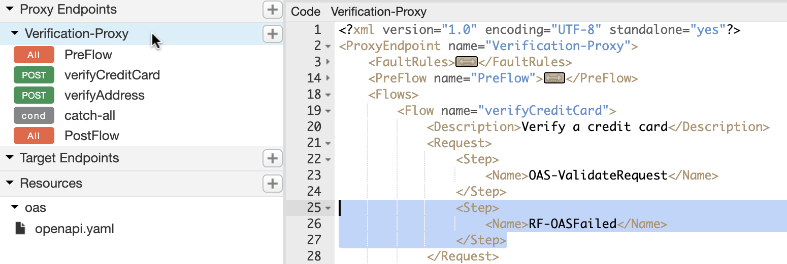

➡️ Add the following condition element directly above the step `Name` element.

```xml
<Condition>OASValidation.OAS-ValidateRequest.failed = true</Condition>
```

➡️ Save your progress by clicking on the   button

The result should look like this:

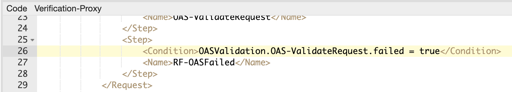

The `Flow Variable` <b>OASValidation.OAS-ValidateRequest.failed</b> is set automatically by the system when the `OAS Validation` policy fails. 

<aside class="special">

This is a very common pattern in Apigee for detecting if a previous policy fails. Apigee sets a `Flow Variable` indicating the failure condition. You can then use that `Flow Variable` to run some logic conditionally.
</aside>

### Task 7.3 Deploy

Next, let's deploy the API Proxy again so that you are able to test it.

➡️ Click on the   button (on the top-right)

➡️ Click on the   button to confirm.

➡️ Mouse over the spinning wheel.

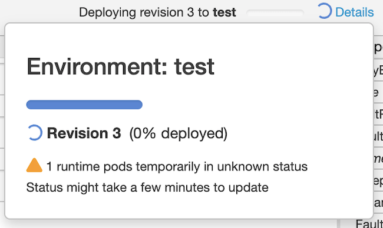

➡️ Wait until the deployment completes

Upon successful deployment, you should see the following:


### Task 7.4 Test the API

Now let's test the API by sending a request payload that violates the schema:

➡️ Run the following cURL command from the <b>lab-startup</b> VM

```shell script
curl -i -s --http1.1 -X POST "https://api.${PROJECT}.apigeelabs.com/v1/verification/credit-card" \
  -H 'Content-Type: application/json' \
  -H 'Accept: application/json' \
  -d '
{
  "number": "2221005276762844"
}'
```

Response should look like this:

```json
< HTTP/2 400
< content-type: application/json
< content-length: 226
< x-envoy-upstream-service-time: 11
< date: Sat, 11 Jul 2020 22:02:31 GMT
< server: istio-envoy
{
 "valid": false,
 "message": "OASValidation OAS-ValidateRequest with resource \"oas://openapi.yaml\": failed with reason: \"[ERROR - Object has missing required properties ([\"cvv\",\"expiration\"]): []]\""
}
```

Woohoo! This is now consistent with your RESTful API design. It has the correct format and a proper HTTP status code.


## Task 8. Protect API
Duration: 05:00


In this task you are going to protect the API proxy with API Key verification. 

### Task 8.1 Validate API Key

Let's add a policy to do API Key validation. The API key will come either as a header named <b>apikey</b>.

➡️ Head back to the Apigee window (where you are working on the API Proxy)

➡️ Click on the "<b>verifyCreditCard</b>" conditional flow


➡️ Click on the    button (within the   path) to add a new policy.

➡️ Select `Verify API Key` from the policy palette.

➡️ Enter this value for both the policy `Name` and `Display Name`

```
VAK-Verify
```

➡️ Click on  

➡️ Drag the policy   to the beginning of the flow

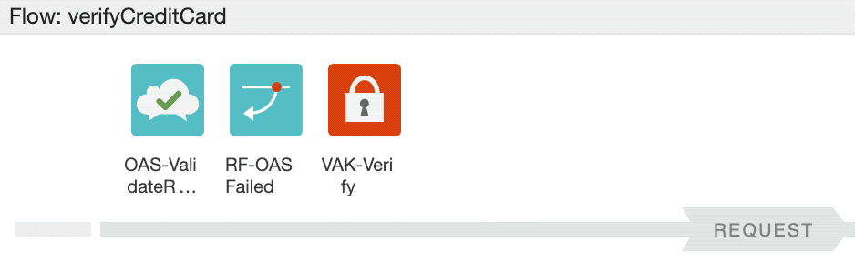

➡️ Click on the new policy   

➡️ Replace the default contents of the policy with the XML below:

```xml
<?xml version="1.0" encoding="UTF-8" standalone="yes"?>
<VerifyAPIKey async="false" continueOnError="true" enabled="true" name="VAK-Verify">
    <DisplayName>VAK-Verify</DisplayName>
    <Properties/>
    <APIKey ref="request.header.apikey"/>
</VerifyAPIKey>
```

➡️ Save your progress by clicking on the   button

➡️ Click   if you are asked to save a new revision

Notice this policy has `continueOnError="true"`. This will allow you to raise your own <b>custom-fault</b> for setting the HTTP status code to 401.

<aside class="special">

<b>Note</b>: HTTP 401 is the RESTful status code you should use for authorization failures.
</aside>

Let's do that.

➡️ Click on the "<b>verifyCreditCard</b>" conditional flow

➡️ Click on the   button (within the   path) to add a new policy.  

➡️ Select `Raise Fault` from the policy palette

➡️ Enter this value for both the policy `Name` and `Display Name`

```
RF-AuthFailed
```

➡️ Click on  

➡️ Drag the new policy   `RF-AuthFailed` to be after the    `VAK-Verify` policy

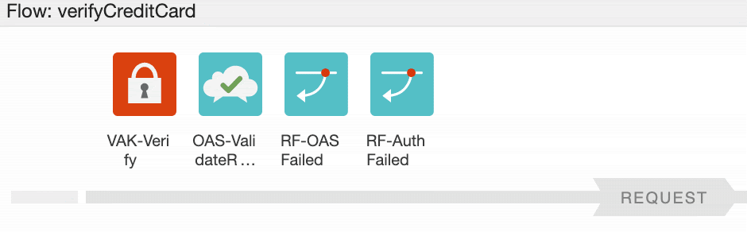

➡️ Click on the new policy   

➡️ Replace the contents of the policy with the following XML code:

```xml
<?xml version="1.0" encoding="UTF-8" standalone="yes"?>
<RaiseFault async="false" continueOnError="false" enabled="true" name="RF-AuthFailed">
    <DisplayName>RF-AuthFailed</DisplayName>
    <Properties/>
    <FaultResponse>
        <AssignVariable>
            <Name>custom_fault</Name>
            <Value>true</Value>
        </AssignVariable>
        <Set>
            <Headers>
                <Header name="Content-Type">application/json</Header>
            </Headers>
            <StatusCode>401</StatusCode>
            <ReasonPhrase>Unauthorized</ReasonPhrase>
            <Payload>
{
  "valid": false,
  "message": "Not authorized. API Key is not valid."
}
            </Payload>
        </Set>
    </FaultResponse>
    <IgnoreUnresolvedVariables>true</IgnoreUnresolvedVariables>
</RaiseFault>
```

➡️ Save your progress by clicking on the   button

Finally, let's make this new `Raise Fault` policy conditional so that it only runs when API Key validation fails.

➡️ Click on the "<b>Verification-Proxy</b>" endpoint 

➡️ Scroll to locate the newly added policy step


➡️ Add the following condition element directly below the step `Name` element.

```xml
<Condition>oauthV2.VAK-Verify.failed = true</Condition>
```

➡️ Save your progress by clicking on the   button

The result should look like this:

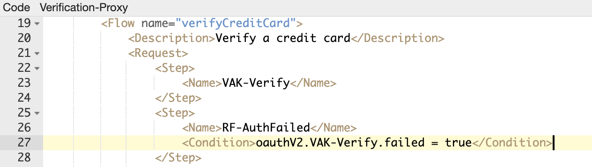

### Task 8.2 Deploy

Let's now re-deploy the API with the latest changes.

➡️ Click on the   button (on the top-right)

➡️ Click on the   button to confirm.

➡️ Mouse over the spinning wheel.

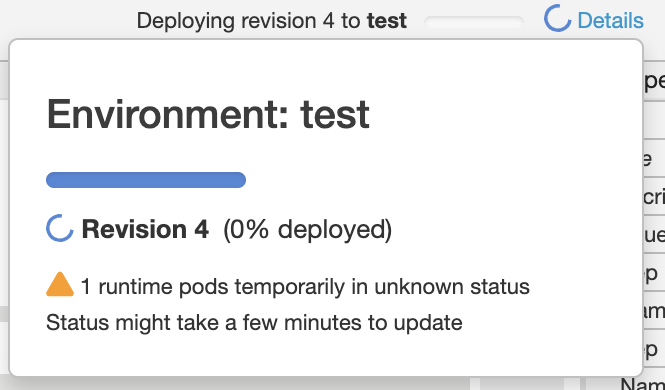

➡️ Wait until the deployment completes

Upon successful deployment, you should see the following:

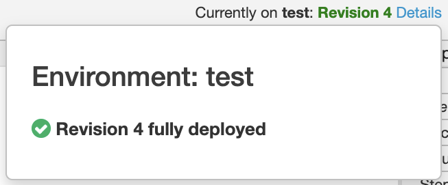

### Task 8.3 Test without API Key

Let's do a quick test to make sure the API Proxy it's working correctly.

➡️ Run the following cURL command from the "<b>lab-startup</b>" VM

```shell script
curl -i -s --http1.1 -X POST "https://api.${PROJECT}.apigeelabs.com/v1/verification/credit-card" \
  -H 'Content-Type: application/json' \
  -H 'Accept: application/json' \
  -d '
{
  "number": "2221005276762844"
}'
```

Response should look like this:

```json
< HTTP/2 401
< content-type: application/json
< content-length: 88
< x-envoy-upstream-service-time: 9
< date: Sat, 11 Jul 2020 22:38:28 GMT
< server: istio-envoy
<
{
 "valid": false,
 "message": "Not authorized. API Key is not valid."
}
```

Nice, cute little error message with the proper HTTP 401 status code.


## Task 9.  Products, Developers, Apps
Duration: 06:00


Your API Proxy is now protected. You need an API Key to call it. But, how do you get an API Key? To answer that, let's do a quick overview of Apigee's model for managing access to API Proxies.

This model has four main components:  `API Products`,  `App Developers`,  `Apps`,  `API Keys.`

* <b>1. </b>`API Products` allow you to bundle one or more `API Proxy` resources.
* <b>2. </b>`App Developers` are the people who build  apps to consume `API Products`. 
* <b>3. </b>`Apps` are created by `App Developers`. `Apps` can have one or more `API Keys`. 
* <b>4. </b>`API Keys` can be linked to one or more `API Products`.

 And THAT is how <b>API Keys</b> are born.  Here is picture showing how it works:


Wait. That's the wrong picture. This happens when you spend hours writing lab instructions :-). 

This is the one:

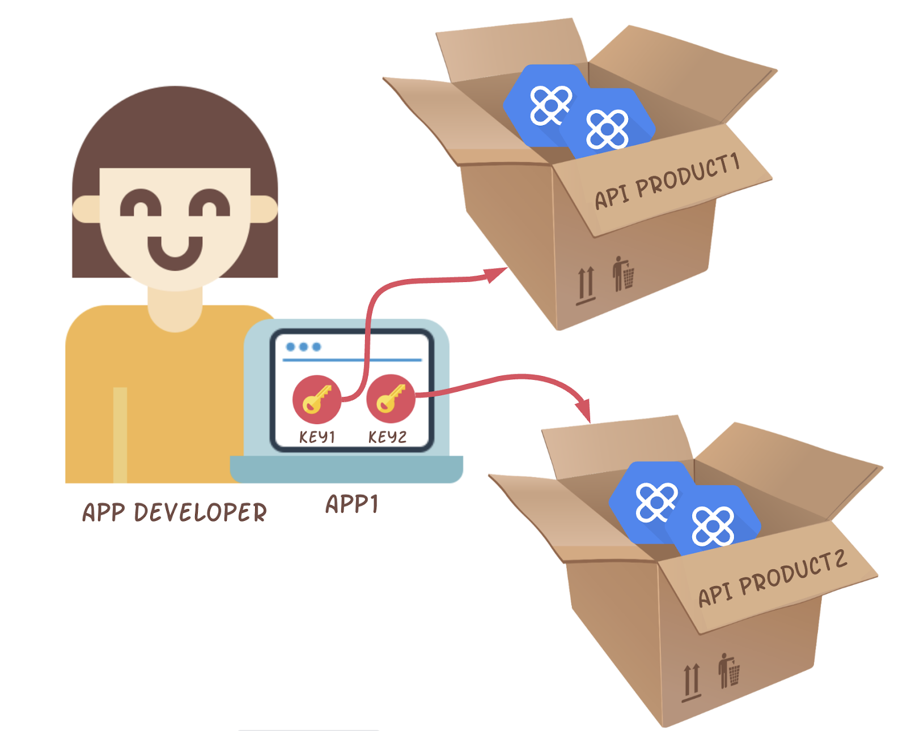

Had a laugh? I hope so! Let's actually create this stuff next.

### Task 9.1 Create Product

In this task you are going to create an `API Product` that contains all the resources your API Proxy.

➡️ Navigate to `Publish > API Products` (main menu on the left)

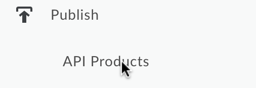

➡️ Click on the   button (top right)

➡️ Fill in the following values within the `Product Details` section

Name:

```
OurBankVerification
```

Display Name:

```
OurBank Verification API
```

Description:

```
This API Product provides access for verifying credit cards and addresses
```

<aside class="warning">

<b>Note</b>: It might be a little weird that you are naming the `API Product` as "<b>OurBank Verification API</b>". That's because the display name will be visible in the developer portal. People who have never used Apigee would not know what an `API Product` is.  To them an `API Product` looks like a collection of API resources. So, this is done to avoid confusion. 
</aside>

➡️ Select  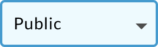 from the `Access` drop-down menu

➡️ Enable the feature to `Automatically approve access requests`

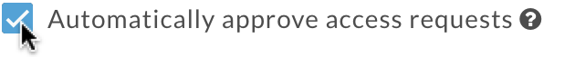

➡️ Enable the product to work on the <b>test </b>`Environment`

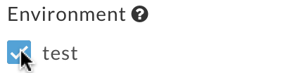

➡️ Click on the   button within the `API Resources` section

➡️ Select the "<b>ourbank-verification-v1</b>" API Proxy from the list

➡️ Click on the   button to add the API Proxy

➡️ Click on the `Add a path` link 

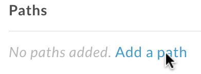

➡️ Enter a single forward slash `/` as the path within the `Add API Resource` dialog

➡️ Click on the   button to complete adding the path

<aside class="special">

The single forward `/` slash indicates that all sub-resources of your API Proxy will be made available through the `API Product`. There is a whole set of rules for configuring `API Resources` in an `API Product`. Hop over to the Apigee docs to learn more about  [these rules](https://docs.apigee.com/api-platform/publish/create-api-products#behavior-resource-path).
</aside>

➡️ Click on the   button (top right) to save all the changes

### Task 9.2 Create Developer

Next, let's create an App Developer.

In your case, the retail partners are going to be the `App Developers`. The normal process signing up as an `App Developer` is to visit OurBank's developer portal to create an account. But, you don't have a developer portal yet. So, instead let's create an `App Developer` account using the admin UI. 

➡️ Navigate to `Publish > Developers` (main menu on the left)

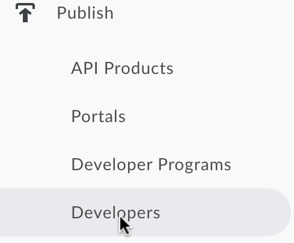

➡️ Click on the   button

➡️ Use the following values within the `Create a Developer` dialog 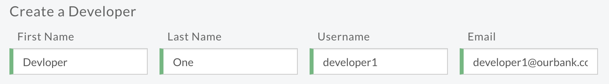

First Name:

```
Developer
```

Last Name:

```
One
```

Username:

```
developer1
```

Email:

```
developer1@ourbank.com
```

➡️ Click on the   button

<aside class="special">

<b>Note</b>: As an admin, you get to enter any email when creating a developer account. There is no email verification. This is not the case when signing up through a developer portal. People over there need to go through a proper email confirmation process.
</aside>

### Task 9.3 Create App

Finally, let's create the `App`.

This is an activity that is normally done by the `App Developer` himself from a developer portal. But, again, you don't have a developer portal yet. So, instead let's use the admin UI to do it.

➡️Navigate to `Publish > Apps` (main menu on the left)

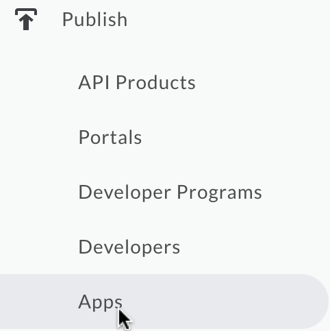

➡️Click on the   button (top right)

➡️ Use the following values within the `App Details` section

Name:

```
ourbank-verification-app
```

Display Name:

```
OurBank Verification App
```

➡️ Select "<b>Developer One</b>" from the `Developer` search box

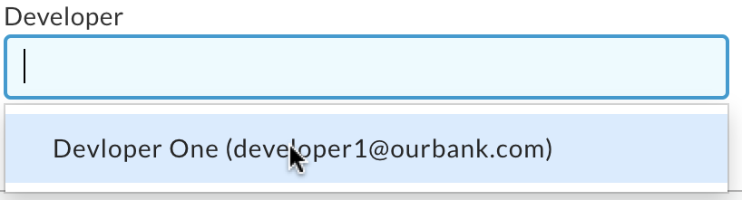

➡️ Click the   button within the `Credentials` section

➡️ Select "<b>OurBank Verification API</b>" from the list

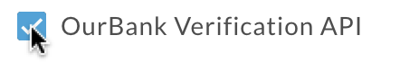

➡️ Click on the  button

➡️ Click on the  button to complete creating the `App`.

Once the App is created, you should see that the credentials section now has the API Key.

➡️ Click on the the `Show` link to display it

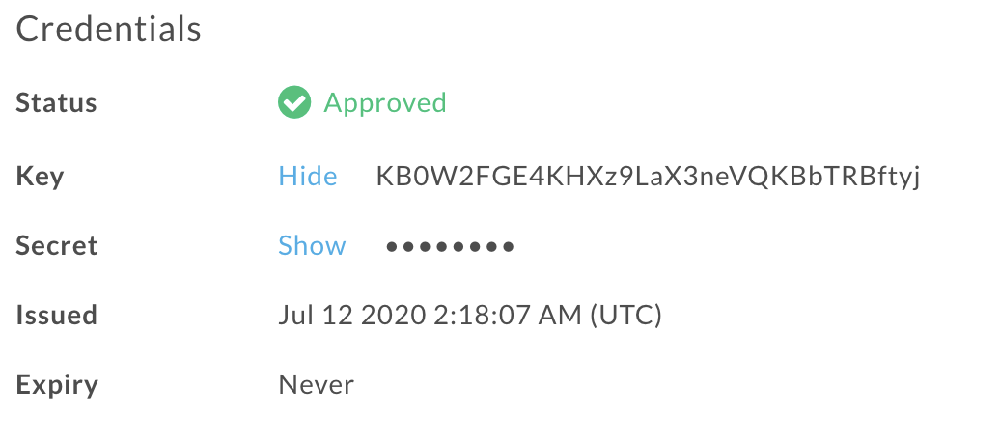

➡️ Copy + Paste the API key somewhere else to keep it handy. 

### Task 9.4 Test with API Key

Now that you have an API key, let's test the API Proxy again with it.

➡️ Run the following cURL command from the "<b>lab-startup</b>" VM

```shell script
export API_KEY="fill in API Key"
```

```shell script
curl -i -s --http1.1 -X POST "https://api.${PROJECT}.apigeelabs.com/v1/verification/credit-card" \
  -H 'Content-Type: application/json' \
  -H 'Accept: application/json' \
  -H "apikey: ${API_KEY}" \
  -d '
{
  "number": "2221005276762844",
  "cvv": "345",
  "expiration": "10/1025"
}' 
```

Response should look like this:

```json
< HTTP/2 200 
< content-type: application/json
< content-length: 66
< x-envoy-upstream-service-time: 29
< date: Sun, 12 Jul 2020 03:56:37 GMT
< server: istio-envoy
< 

{
  "valid": true,
  "message": "Credit card is valid"
}
```

Yey! API Key validation is working properly. 


## Task 10. Dev. Portal Prep
Duration: 10:00


In this task you are going to do a couple of tasks that will help you get ready to publish your `API Product` to a developer portal.

<b>First</b>, you will need to modify your API Proxy to support Cross-Origin Resource Sharing (CORS). 

<aside class="special">

CORS is a security mechanism that browsers use to decide whether or not they are allowed to make HTTP requests to other websites from a different origin. Hop over to the  [Mozilla documentation](https://developer.mozilla.org/en-US/docs/Web/HTTP/CORS) to learn more about CORS.
</aside>

<b>Second</b>, you will need to update the OpenAPI spec to specify that your API Proxy is protected with API Key validation.

Let's do these tasks.

### Task 10.1 Allow CORS

Let's add a few policies to support Cross-Origin Resource Sharing. 

For proper CORS support, there are a couple of rules you should keep in mind:

<aside class="special">

* <b>1.</b> CORS response headers are needed regardless of the HTTP status code
* <b>2.</b> Preflight CORS requests (OPTIONS verb) should respond with 200
</aside>

In terms of Apigee, this means that:

* Given <b>Rule 1</b>, you will need to inject CORS response headers for both successful and non successful responses.
* Given <b>Rule 2</b>, you will need a dedicated OPTIONS flow that is not subject to security checks.

Let's take care of these scenarios.

First, let's add a policy in the `Proxy Endpoint` to inject CORS headers.  This policy will add CORS headers to any response message that exits normally (regardless of HTTP status code). This takes care of both positive and negative responses.

➡️ Return the the Apigee window, if not already there

➡️ Navigate to `Develop > API Proxies`

➡️ Click on the "<b>ourbank-verification-v1</b>" API Proxy from the list

➡️ Click on the `Develop` tab

➡️ Click on the `Postflow` of the "<b>Verification-Proxy</b>" endpoint.

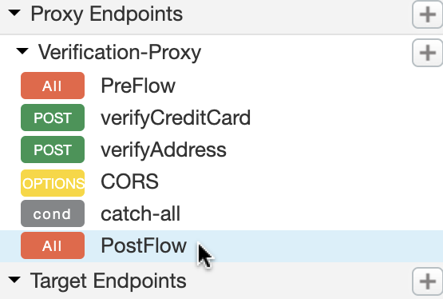

➡️ Click on the   button (within the   path) to add a new policy.

➡️ Select  `Assign Message` from the policy palette.

➡️ Enter this value for both the policy `Name` and `Display Name`

```
AM-CORS-Headers
```

➡️ Click on  

➡️ Click on the new policy   

➡️ Replace the contents of the policy with the following XML code:

```xml
<?xml version="1.0" encoding="UTF-8" standalone="yes"?>
<AssignMessage async="false" continueOnError="false" enabled="true" name="AM-CORS-Headers">
    <DisplayName>AM-CORS-Headers</DisplayName>
    <Properties/>
    <Set>
        <Headers>
            <Header name="Access-Control-Allow-Origin">*</Header>
            <Header name="Access-Control-Allow-Methods">POST,GET,PUT,DELETE,OPTIONS</Header>
            <Header name="Access-Control-Allow-Headers">*,Authorization</Header>
        </Headers>
    </Set>
    <IgnoreUnresolvedVariables>true</IgnoreUnresolvedVariables>
    <AssignTo createNew="false" transport="http" type="request"/>
</AssignMessage>
```

➡️ Save your progress by clicking on the   button

➡️ Click   if you are asked to save a new revision

Next, let's take care of responses that exit through the `Error Flow`. To do this, let's use a  [DefaultFaultRule](https://docs.apigee.com/api-platform/fundamentals/fault-handling#creatingfaultrules-creatingadefaultfaultrule). 

➡️ Click on the "<b>Verification-Proxy</b>" endpoint


➡️ Add the following `DefaultFaultRule` as a child of the `ProxyEndpoint` element (at the top)

```xml
    <DefaultFaultRule name="default">
        <Step>
            <Name>AM-CORS-Headers</Name>
        </Step>
        <AlwaysEnforce>true</AlwaysEnforce>
    </DefaultFaultRule>
```

➡️ Save your progress by clicking on the   button

The result should look like this:

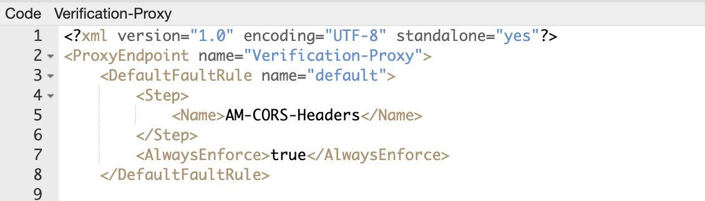

Finally, let's add the OPTIONS conditional flow to take care of CORS Preflight requests. You will need an `Assign Message` policy in this flow to force the HTTP 200 status code.

➡️ Click on the "<b>Verification-Proxy</b>" endpoint to bring XML into the code window

➡️ Scroll to locate the existing<b> catch-all </b>conditional flow (not the `Fault Rule`)

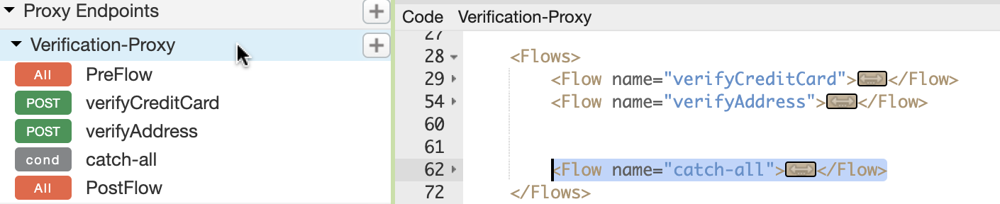

➡️ Add the following conditional flow as a sibling above the <b>catch-all </b>flow. 

```xml
        <Flow name="CORS">
            <Description/>
            <Request/>
            <Response/>
            <Condition>(proxy.pathsuffix MatchesPath "/**") and (request.verb = "OPTIONS")</Condition>
        </Flow>
```

➡️ Save your progress by clicking on the   button

The end result should look like this:

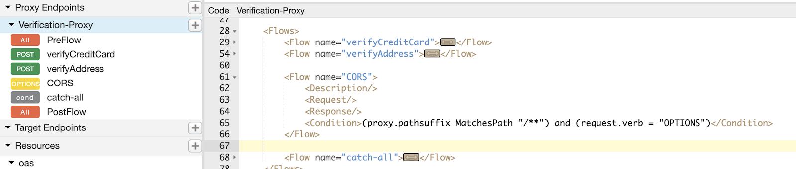

Now, let's add the  `Assign Message` policy to set the HTTP 200 status code.

➡️ Click on the newly added <b>CORS</b> conditional flow.

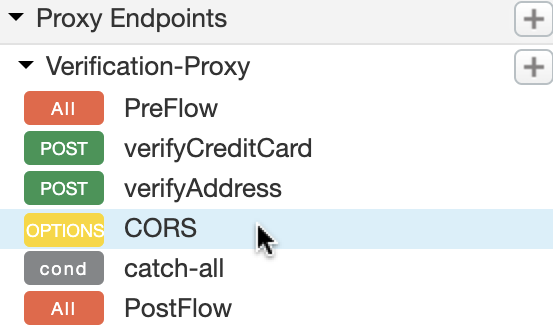

➡️ Click on the    button (within the   path) to add a new policy.

➡️ Select `Assign Message` from the policy palette.

➡️ Enter this value for both the policy `Name` and `Display Name`

```
AM-CORS-OPTIONS
```

➡️ Click on  

➡️ Click on the new policy   

➡️ Replace the default contents of the policy with the XML below:

```xml
<?xml version="1.0" encoding="UTF-8" standalone="yes"?>
<AssignMessage async="false" continueOnError="false" enabled="true" name="AM-CORS-OPTIONS">
    <DisplayName>AM-CORS-OPTIONS</DisplayName>
    <Properties/>
    <Set>
        <Headers>
            <Header name="Access-Control-Allow-Origin">*</Header>
            <Header name="Access-Control-Allow-Methods">POST,GET,PUT,DELETE,OPTIONS</Header>
            <Header name="Access-Control-Allow-Headers">*,Authorization</Header>
        </Headers>
        <StatusCode>200</StatusCode>
    </Set>
    <IgnoreUnresolvedVariables>true</IgnoreUnresolvedVariables>
    <AssignTo createNew="false" transport="http" type="request"/>
</AssignMessage>
```

➡️ Save your progress by clicking on the   button

<aside class="special">

Phew! That was a lot of work just for CORS. You will be happy to know that this experience is being improved. In the future there might be an Apigee policy that takes care of handling all these scenarios.
</aside>

### Task 10.2 Redeploy

Since you made more changes to the API Proxy, let's redeploy it.

➡️ Click on the   button (on the top-right)

➡️ Click on the   button to confirm.

➡️ Mouse over the spinning wheel.

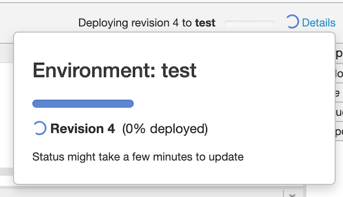

➡️ Wait until the deployment completes

Upon successful deployment, you should see the following:

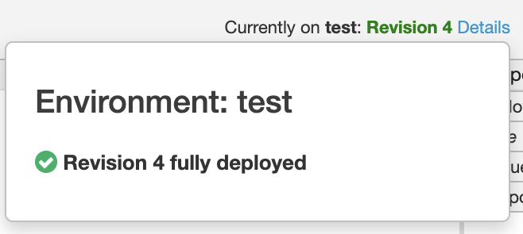

### Task 10.3 Update OAS

Next let's update the OpenAPI spec of your API Proxy. You are going to specify that all operations (<b>verifyCreditCard</b> and <b>verifyAddress</b>) are protected with API Key validation.

➡️ Head back to the spec editor browser tab

```
https://spec-editor.${PROJECT}.apigeelabs.com/
```

➡️ Locate the `components` section of the spec

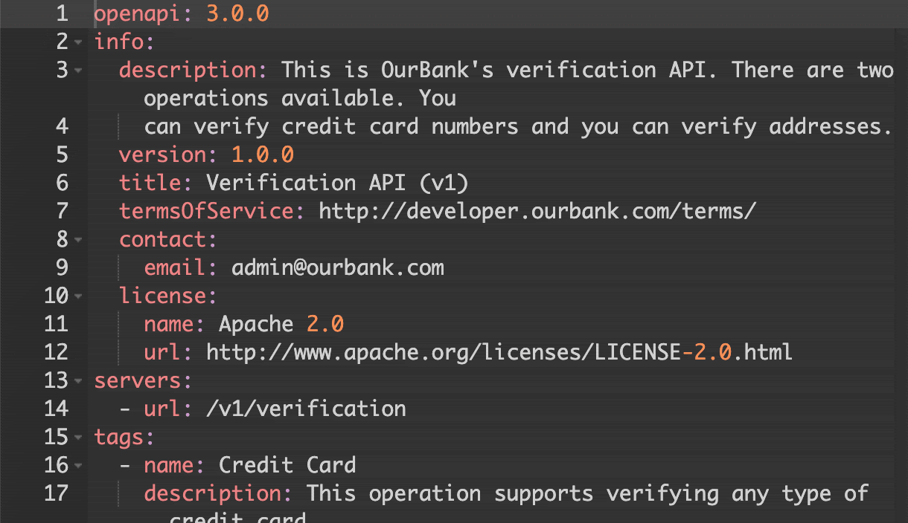

<aside class="special">

<b>Hint</b>:  Use the arrows on the editor's margin (next to the line numbers) to collapse sections of the spec.
</aside>

➡️ Add the following `securitySchemes` as a child of the `components` element

```yaml
  securitySchemes:
    'OurBank-Auth':
       type: apiKey
       name: apikey
       in: header
```

The result should look like this:

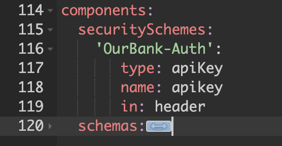

This defines a new security scheme named "<b>OurBank-Auth</b>".  

<aside class="special">

<b>Note</b>: The spec editor will show a warning saying the new security scheme is unused. That's fine, you'll use it in next.
</aside>

Next, let's specify that all operations are protected with this scheme.

➡️ Add the following `security` definition at the root level.

```yaml
security:
  - 'OurBank-Auth': []
```

Finally, let's prefix the API runtime hostname for to the `servers[0].url` element

➡️Replace the servers top element with the following YAML

```yaml
servers:
  - url: https://api.${PROJECT}.apigeelabs.com/v1/verification
```

The result should look like this:

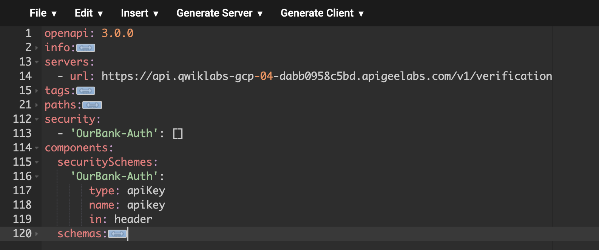

Notice the rendered spec now has an Authorize button  

The changes you have made in the spec editor are automatically persisted. You can access them anytime through the `http://spec-editor.${PROJECT}.apigeelabs.com/data/oas.yaml` URL. You will use this updated spec later in the following task. 

This is it for the prep work. 


## Task 11. Developer Portal
Duration: 10:00


In this task you are finally going to set up a developer portal for OurBank's retail partners to use.

In Apigee there are two* types of developer portals. 

<b>First,</b> you have the `Integrated Portal`. You can create these portals from within the admin UI itself. It's super easy. You click a button, and a few seconds later you've got a simple but functional developer portal. These portals can be customized to a certain extent. For example, you can modify the UI theme, enable SSO, and even set up a vanity domain name for it. For many Apigee customers the `Integrated Portal` is all they need. It's limited in functionality, but it's managed by Google, so they don't have to worry about much. The Google SREs take care of it.

<b>Second</b>, you have the `Drupal Portal`. This type of portal is not managed by Google. You have to manage it yourself, or pay for a service provider to host and manage it for you. But, you get complete control over the portal's look and functionality. Drupal is a fully customizable Content Management System (CMS). Apigee provides a set of modules to help you create a developer portal using Drupal.

<aside class="special">

<b>Note</b>*: Actually, there is a third type. Some Apigee customers choose to build their own developer portal. 

This is usually because they have a deep-seated hatred for Drupal. Haha, no. It's usually because the `Integrated Portal` does not suffice their needs and they are not allowed to use Drupal in their organization. There could be other reasons too. For example, they may not have in-house Drupal expertise. Or, they may even have already an existing developer portal they want to keep using.

Bottom line is that Apigee gives you the flexibility to build your own developer portal if that's what you need. The entire Apigee system is API enabled. Everything you can do from the UI you can also do through APIs.
</aside>

In this lab you are going to use the <b>second</b> approach. A Drupal portal has already been stood up for OurBank. The portal is not configured yet. Let's do that.

### Task 11.1 Create Svc. Account

You will need a service account to configure a connection between the developer portal and your Apigee organization. Let's create one.

➡️ SSH into the "<b>lab-startup</b>" VM.

➡️ Source the lab environment

```shell script
source ~/lab.env
```

➡️ Run the following command to create a new service account

```shell script
gcloud iam service-accounts create developer-portal-sa \
    --description="Connects to Apigee from Dev Portal" \
    --display-name="Developer Portal Service Account"
```

➡️ Run the following command to grant role to the service account

```shell script
gcloud projects add-iam-policy-binding "${PROJECT}" \
    --member=serviceAccount:developer-portal-sa@${PROJECT}.iam.gserviceaccount.com \
    --role=roles/apigee.developerAdmin
```

➡️ Run the following command to create a key for the new service account

```shell script
gcloud iam service-accounts keys create developer-portal-sa.json \
    --iam-account=developer-portal-sa@${PROJECT}.iam.gserviceaccount.com \
    --key-file-type=json
```

➡️ Run the following command to print the contents of the service account key

```shell script
cat ./developer-portal-sa.json
```

➡️ Copy the JSON text of the service account to somewhere else

<aside class="warning">

<b>Do not use use keyboard shortcuts</b> (<b>Ctrl + C</b> , <b>⌘ + C</b>) to copy the text from the terminal.  It will not work properly. It adds extra newline characters. Instead, simply highlight the text. You will notice the scissor icon appear. This means the text is now in your clipboard.
</aside>

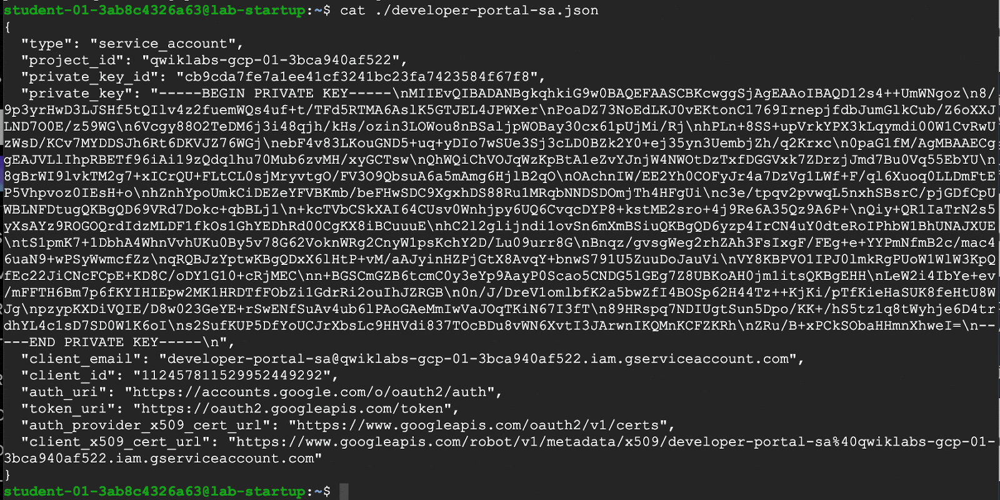

### Task 11.2 Login as Admin

➡️ Navigate to the developer portal in a new tab

```
https://developer.${PROJECT}.apigeelabs.com
```

➡️ Click on the `Login` button (top right)

➡️ Use the following credentials to log in

Username:

```
admin
```

Password:

```
SuperSecret123!
```

### Task 11.3 Configure Connection

Next, let's configure the connection between the developer portal and your Apigee project.

➡️ Click on `Configuration > Apigee Edge > General` (admin menu)

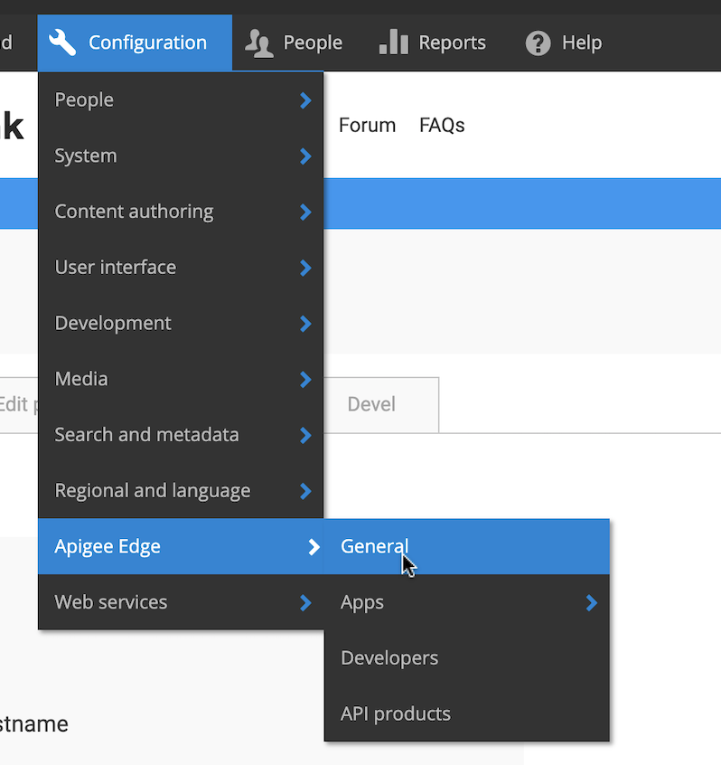

➡️ Expand the `Advanced Settings` section

➡️ Select   from the `Key provider` drop-down

Next, let's complete the `Apigee Edge Connection Settings` form

➡️ Select   `Hybrid Cloud` for the `Apigee instance type` field

➡️ Enter your GCP Project  ID for the `Organization` field

➡️ Enter the the service account JSON (from earlier) into the `GCP service account key` field

➡️ Click on   to test the connection

➡️ Click on the   button (at the bottom)

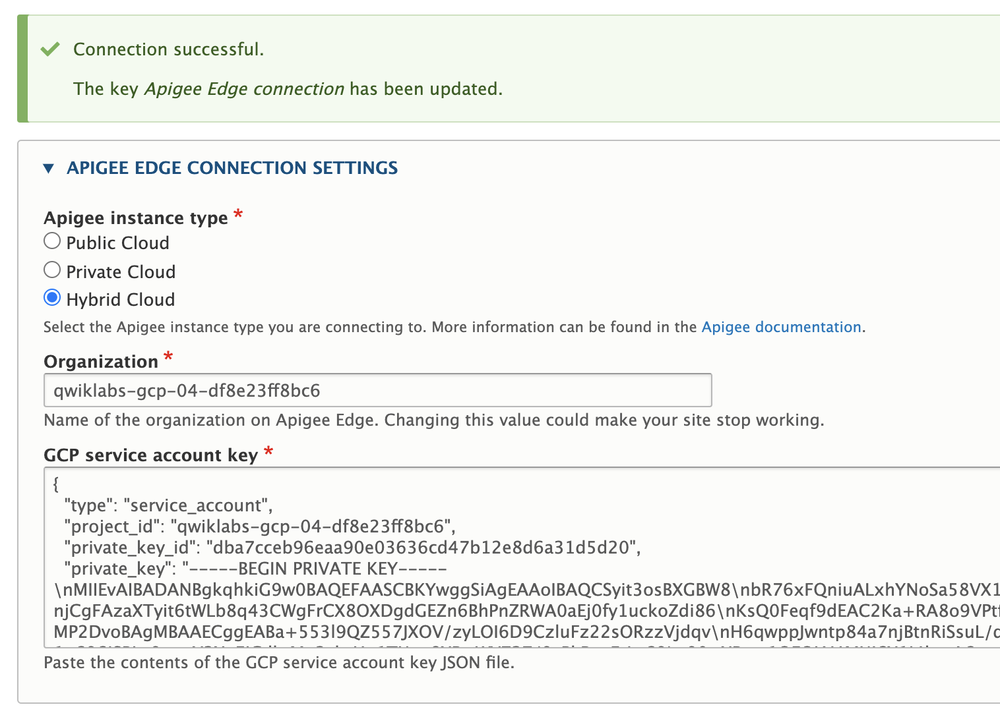

### Task 11.4 Add API Doc

Now, let's add the OpenAPI spec for your API proxy into the developer portal.

➡️ Click on `Content > API Catalog > Add API Doc` (admin menu)

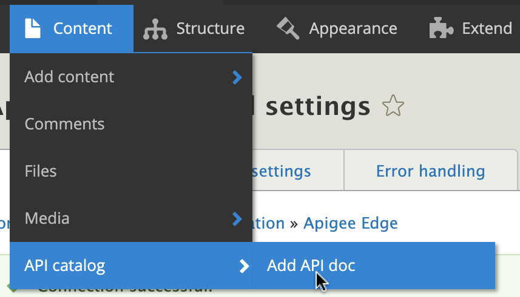

➡️ Use the following value for the `Name` field

Name:

```
Verification API
```

➡️ Select   `URL` for the `"Specification source type"` field

➡️ Enter the following URL for the `"URL to OpenAPI specification file"` field

```
http://spec-editor.${PROJECT}.apigeelabs.com/data/oas.yaml
```

<aside class="warning">

<b>Note</b>: The URL above is purposely using HTTP (instead of HTTPS). The developer does not trust self-signed certificates, and may refuse to load the <b>oas.yaml</b> file.
</aside>

➡️ Use the following value for the `Description` field

Description:

```
This is OurBank's verification API. There are two operations available. You can verify credit card numbers and you can verify addresses.
```

➡️ Click on the   button (bottom of the page)

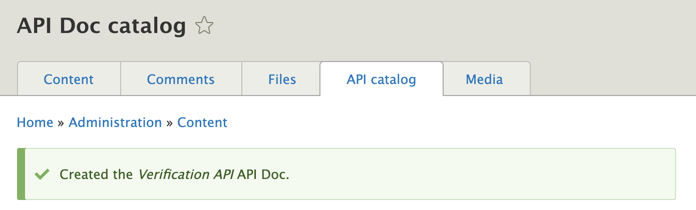

### Task 11.5 Synchronize Developers

One of the tasks you have to do when you first configure a Drupal developer portal is to synchronize developer accounts. This process brings over the developer accounts from Apigee.

Remember, earlier you created a developer account (developer1@ourbank.com) manually using the Apigee admin UI. Let's run a sync job to bring it over to the developer portal.

➡️Click on `Configuration > Apigee Edge > Developers` (admin menu)

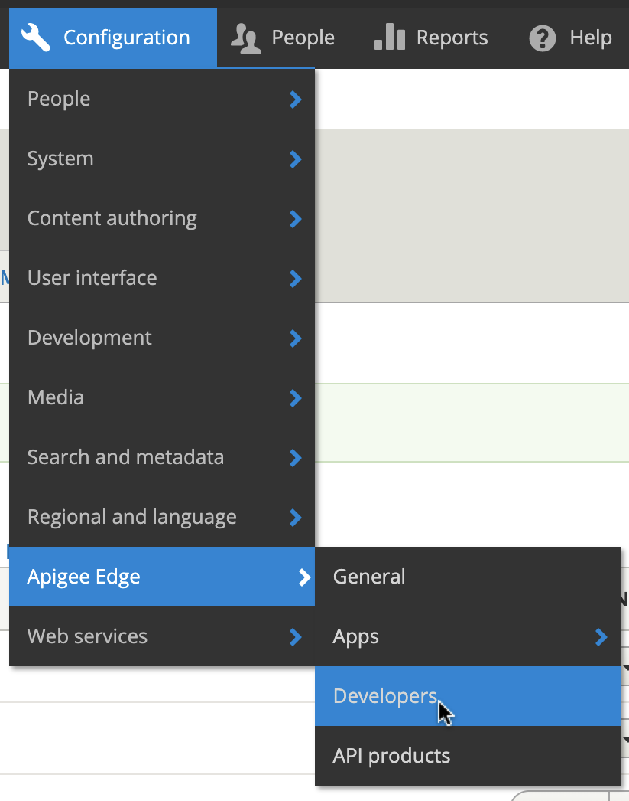

➡️ Click on the `Synchronization` tab

➡️ Click on the   button to begin the sync job

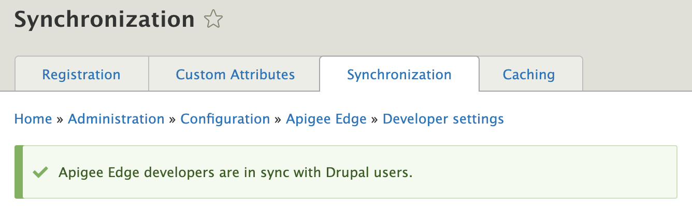

<aside class="special">

<b>Note</b>: Synchronization is not something you need to do often. The normal workflow is for developers to register themselves in Drupal. At that point, a developer account gets automatically created in Apigee as well.
</aside>

### Task 11.6 Configure developer1

Now that you have brought over the developer accounts from Apigee, let's configure the credentials for developer1. You will do this as an administrator. 

➡️ Click on `People` (admin menu)

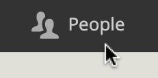

➡️ Click on the   button next to <b>developer1</b>

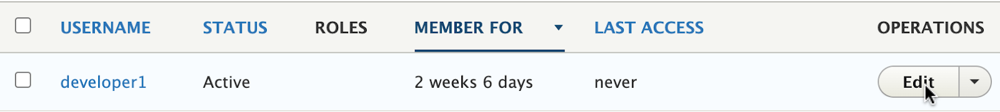

➡️ Enter the following value the `Password` and `Confirm password` fields

```
SuperSecret123!
```

➡️ Click on the   button (bottom of the page)

<aside class="special">

<b>Note</b>: The normal workflow is for developers to use Drupal's password reset mechanism. For this work, Drupal needs to have an email server configured. 
</aside>

### Task 11.7 Login as developer1

You are currently logged in as administrator. Let's switch to the <b>developer1</b> account.

➡️ Click on `D8 > Logout` (admin menu)

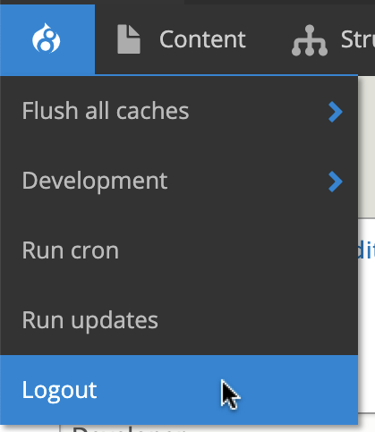

➡️ Click on the `Login` button (main navigation, top right)

➡️ Use the following credentials to log in

Username:

```
developer1
```

Password:

```
SuperSecret123!
```

### Task 11.8 Create New App

Next, let's create a new app.

➡️ Click on the `Apps` (main navigation, top right)

➡️ Click on the   button (top left)

➡️ Enter the following value for the `Name` field

```
Test Verification App
```

➡️ Select the   `OurBank Verification` API from the `APIs` list

➡️ Click on the   button

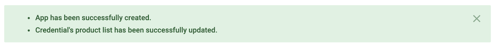

➡️ Select the newly created app from the list

➡️ Click on the eye   button to reveal the `Consumer Key`.

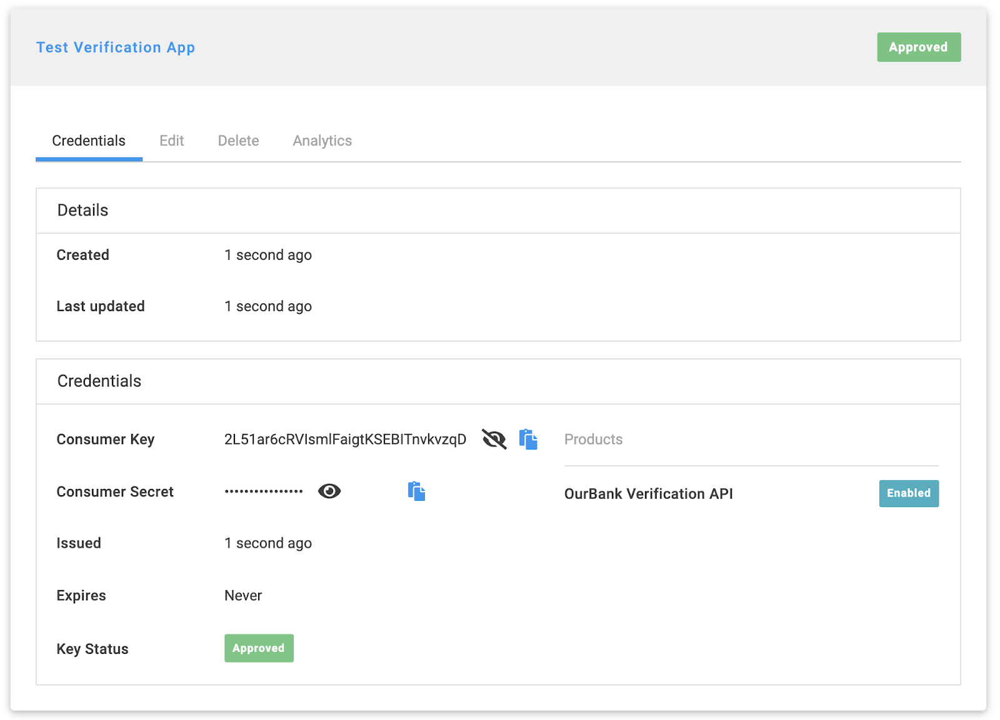

➡️ Copy the `Consumer Key` (you'll use it next)

<aside class="special">

<b>Note: </b>`Consumer Key` and `API Key` are really the same thing. They are used interchangeably.
</aside>


## Task 12. Test from API Docs
Duration: 02:00


Finally. It's time to test the verification API from within the developer portal!

### Task 12.1 Authorize

➡️ Click on the `APIs` button (main navigation)

➡️ Scroll to locate the tile for the <b>Verification API</b>

➡️ Click on `View Documentation`

➡️ Click on the `Authorize` button (on the top-right)

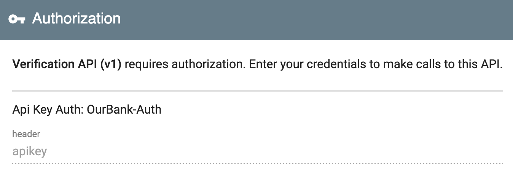

➡️ Enter the new app's `Consumer Key` in the `Key` field

➡️ Click on the `Authorize` button

➡️ Click on `OK` button to close the dialog

### Task 12.2 Try it

➡️ Click on the "<b>/credit-card</b>" resource  (on the left)

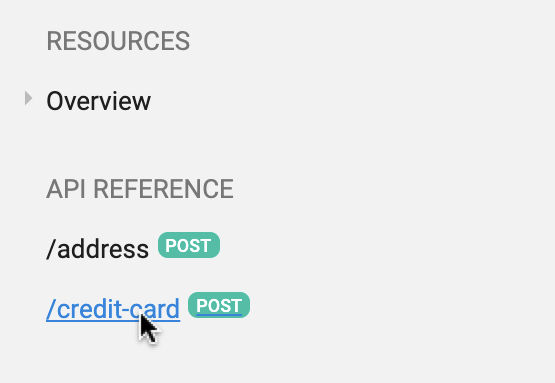

➡️ Scroll to the bottom of the page, to locate the `Try this  API`  widget.

➡️ Enter a credit card `number` (any number really ... )

➡️ Enter a `ccv` number

➡️ Entry an expiration date (mm/yy)

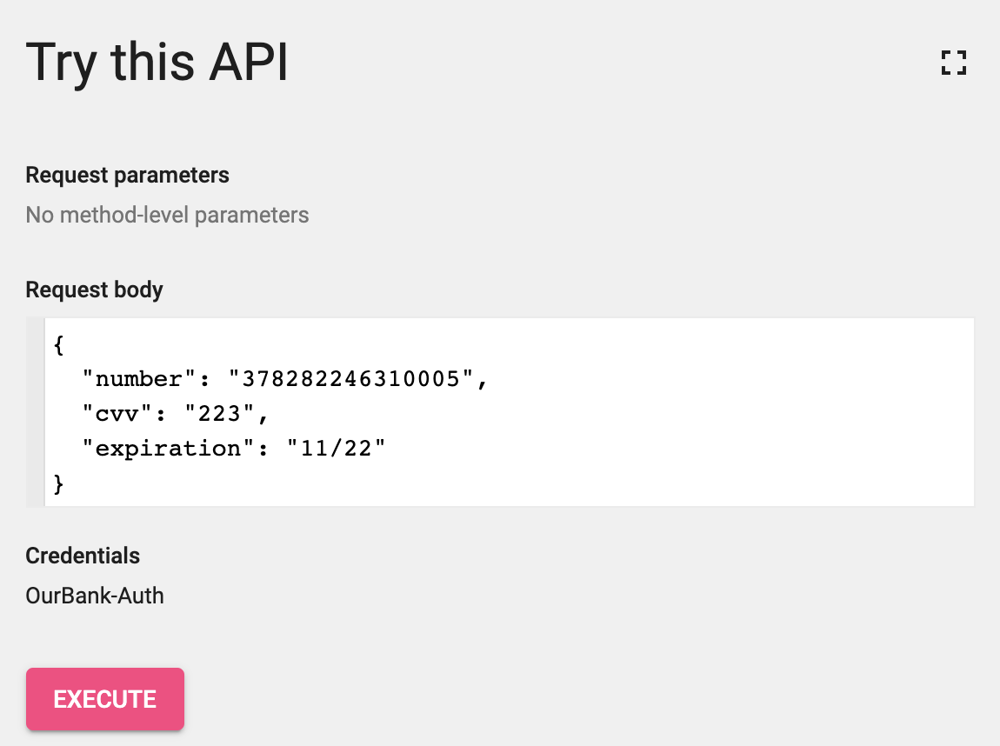

➡️ Click on the `Execute` button.

The response should look like this: 

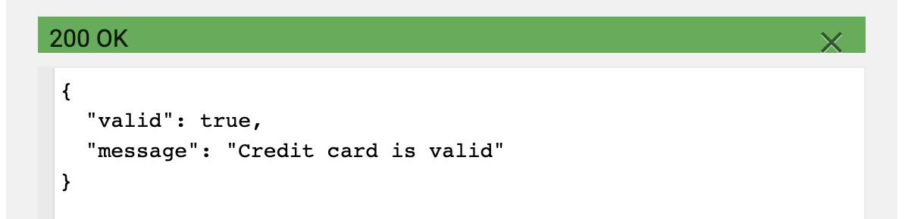

WoooHoo! Hopefully you got a successful response. 


If not, try going back to the Apigee admin UI and start a `Trace` session to troubleshoot.

<aside class="special">

<b>Reminder</b>: By the way, remember the fake CA certificate you installed at the beginning of the lab? If you are going to move on to other Apigee labs in this series, keep it installed. Otherwise, now is a good time to uninstall it.
</aside>


