# Module 1 - API Management Fundamentals


## Introduction


This is the supporting material for a hands-on workshop that introduces you to fundamental API Management concepts and the Apigee API Management Platform. We call this event an "Apigee API Jam". This module - the "Module 1" - focuses on giving attendees an overall understanding of how to build a successful API program with a well managed developer ecosystem. Attendees will learn how to manage their APIs across all phases of the API Lifecycle - including API design, API Security, Developer consumption, as well as API Analytics and Monitoring.


All of the material here is released under the  [Apache 2.0 license](https://github.com/aliceinapiland/apijam/blob/master/Module-1/LICENSE.md)

####  [Labs](https://github.com/aliceinapiland/apijam/blob/master/Module-1/Labs)

1. API Design & Creation - Design OAS & Create a Reverse Proxy with the OpenAPI specification
2. API Products, Apps & API Keys - Securing APIs with API Keys, bundle APIs into API Products and understand the association between Apps, API Products & API Keys
3. Rate Limiting: Rate Limit API Consumption based on API Product tier quotas. 
4. App Developer Experience - Publish API Products Catalog through a self-service Developer Portal. Test App Developer on-boarding experience & API consumption. Restrict access to resources using Teams and Audience entitlements.
5. API Analytics - Measure API Program Success with Apigee Analytics

You can start with the first lab:  [Lab 1 - API Design - Design & Create an API Proxy with OpenAPI specification](https://aliceinapiland.github.io/apijam/codelabs/modules/apijam-mod-1/#1)

##### <b>Apigee Community</b>

If you have any questions/comments please visit  [https://community.apigee.com/index.html](https://community.apigee.com/index.html)

###### <b>This repository is not an official Google or Apigee product. This repository is used for educational/training purposes only.</b>


## Lab 1 - Design & Create an API Proxy with OpenAPI Specification


 *Duration : 15 mins* 

 *Persona : API Team* 

<b>Use case</b>

You have a requirement to create a reverse proxy to handle requests from the Internet and forward them to an existing service. You have decided to follow a design first approach and built a reusable component, a specification which can be used to describe the API contract, generate API documentation, generate API test cases, etc., using the OpenAPI Specification. You would like to generate an Apigee API Proxy by using the OpenAPI Specification (fka: Swagger) instead of building the API Proxy from scratch.

<b>How can Apigee API Management help?</b>

Apigee enables you to quickly expose services as APIs. You do this by creating an  [API proxy](https://docs.apigee.com/api-platform/fundamentals/understanding-apis-and-api-proxies#whatisanapiproxy), which provides a facade for the service that you want to expose, such as existing API endpoints, generic HTTP services, or applications (such as Node.js). The API proxy decouples your service implementation from the API endpoint that developers consume. This shields developers from future changes to your services as well as implementation complexities. As you update services, developers, insulated from those changes, can continue to call the API, uninterrupted. On Apigee, the API Proxy is also where runtime policy configuration is applied for API Management capabilites. For further information, please see:  [Understanding APIs and API Proxies](https://docs.apigee.com/api-platform/fundamentals/understanding-apis-and-api-proxies#whatisanapiproxy).


Apigee also supports the  [OpenAPI specification](https://github.com/OAI/OpenAPI-Specification) out of the box, allowing you to auto-generate API Proxies. Apigee has a built-in OpenAPI specification editor and store which you can use to design and maintain your OpenAPI specifications.

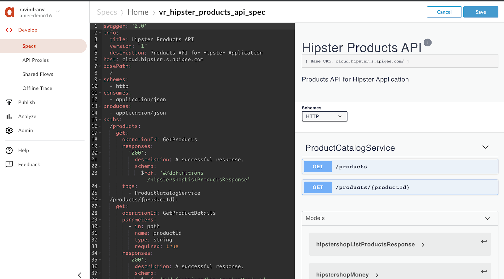

In this lab, we will learn how to

* design an OpenAPI specification for an existing HTTP service and store it within the Apigee platform, and
* create an API proxy that routes inbound requests to an existing HTTP service.


## Pre-requisites


* Basic understanding of  [OpenAPI Specification](https://github.com/OAI/OpenAPI-Specification) (FKA: Swagger)
* Access to an HTTP client to test the API (eg. cURL, Postman, etc.). If you do not have access to one, you can use the  [Apigee Trace Tool](https://docs.apigee.com/api-platform/debug/using-trace-tool-0) or the  [Apigee REST client](https://apigee-restclient.appspot.com/).

Note: During this workshop, as you may be working within an  [Apigee Organization (Org)](https://docs.apigee.com/api-platform/fundamentals/apigee-edge-organization-structure) that is shared by multiple users. Please prefix all asset names within the Org with your initials. For example, Spec name = {your-initials}_{spec name}, API proxy name = {your-initials}_{proxy name}, etc.


## Create an OpenAPI Specification


During the course of this lab, the sample HTTP service we will expose as an API endpoint is the Hipster Products service located at  [http://cloud.hipster.s.apigee.com/products](http://cloud.hipster.s.apigee.com/products). First, we are going to design and create an OpenAPI specification for the different resource endpoints, i.e. /products and /products/{productId}.

1. Go to  [https://apigee.com/edge](https://apigee.com/edge) and log in. This is the Apigee management UI.
2. Select Develop → Specs in the side navigation menu

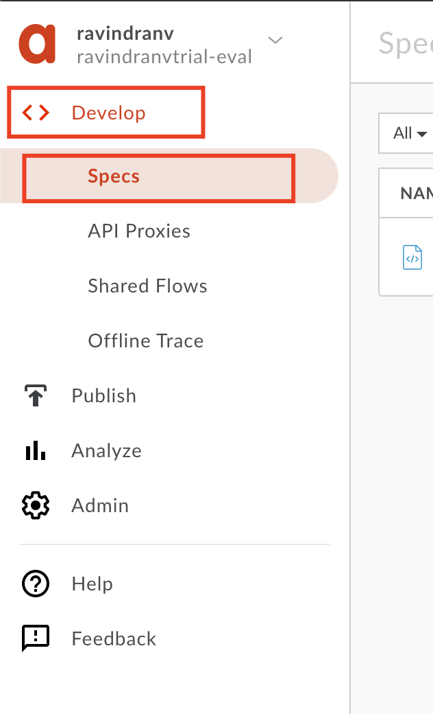

3. As we have a pre-designed sample of the spec available for this lab, we will be importing it into your Apigee Org's Spec Store. Click +Spec. Click on Import URL to add a new spec from existing source.

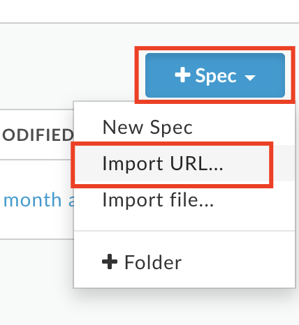

4. Enter spec details. Replace {your-initials} with the initials of your name.

* File Name: {your-initials}_hipster_products_api_spec
* URL:  [https://raw.githubusercontent.com/apigee/apijam/master/Module-1/Resources/products-catalog-spec.yaml](https://raw.githubusercontent.com/apigee/apijam/master/Module-1/Resources/products-catalog-spec.yaml)


5. Verify the values and click Import. Spec has been imported into Apigee and is ready to use. You should see your spec in the list. For example,

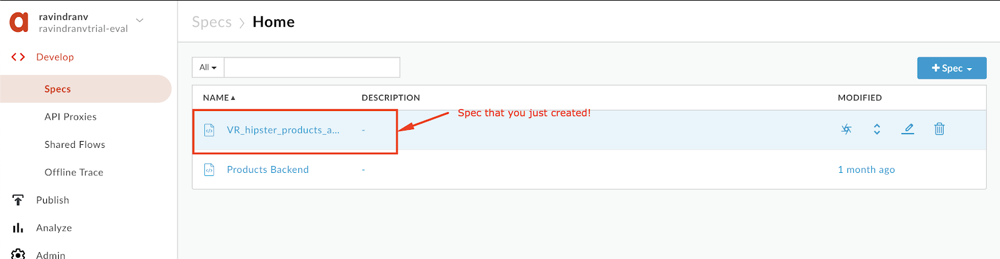

6. Click on {your-initials}_hipster_products_api_spec from the list to access the OpenAPI spec editor & interactive documentation that lists API details & API Resources.

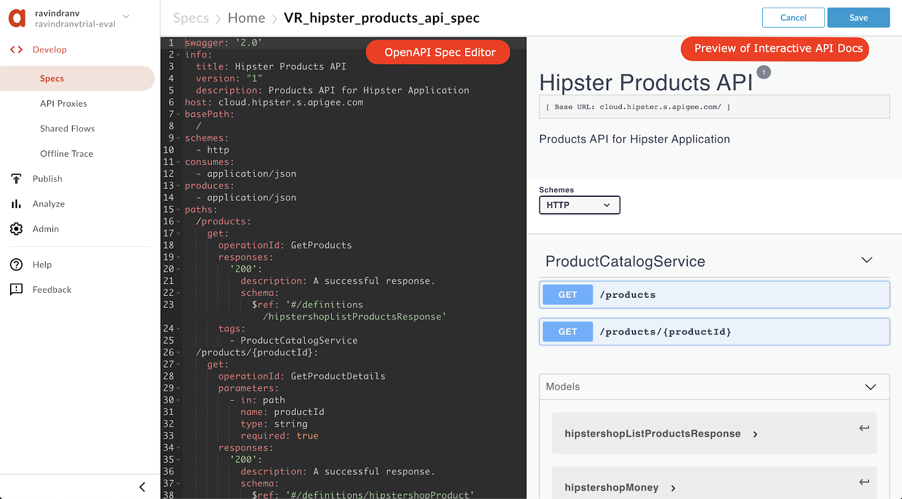


## Create an API Proxy


1. It's time to create Apigee API Proxy from an OpenAPI Specification. Click on Develop → API Proxies from side navigation menu.


2. Click +Proxy The Build a Proxy wizard is invoked.

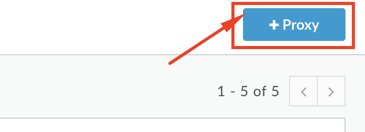

3. Select Reverse proxy, Click on Use OpenAPI below reverse proxy option.

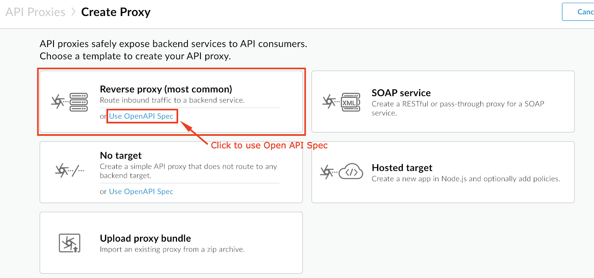

4. You should see a popup with list of Specs. Select {your-initials}_hipster_products_api_spec and click Select.

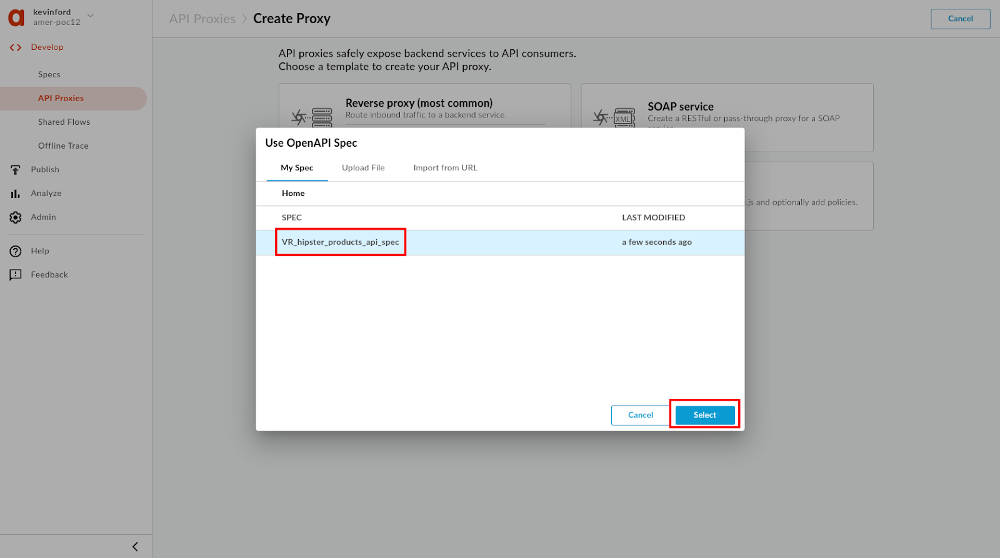

5. Enter details in the proxy wizard. Replace {your-initials} with the initials of your name.

* Proxy Name: {your_initials}_Hipster-Products-API
* Proxy Base Path: /v1/{your_initials}_hipster-products-api
* Existing API: Observe the field value which is auto filled from OpenAPI Spec.


6. Verify the values and click Next.
7. Select Pass through (none) for the authorization in order to choose not to apply any security policy for the proxy. Click Next.


8. You can select which API resources, from the list configured in the OpenAPI Spec, should be exposed. Select all & Click on Next

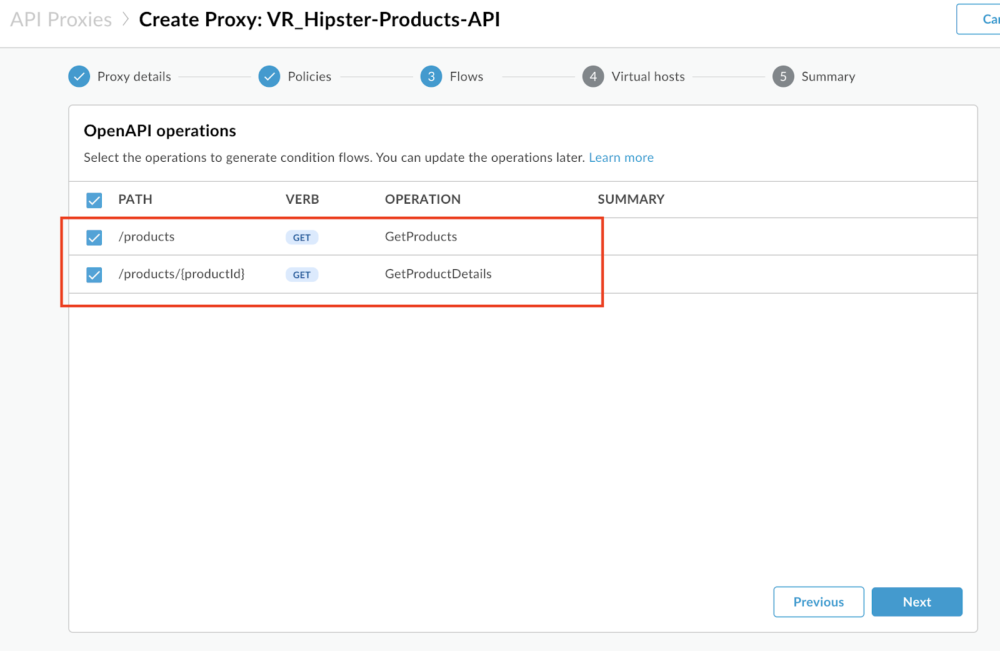

9. Go with the secure Virtual Host configuration. Ensure that the default one is unchecked.

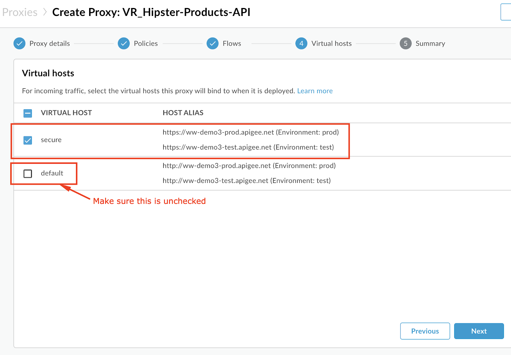

10. Ensure that only the test environment is selected to deploy to and click Create and Deploy

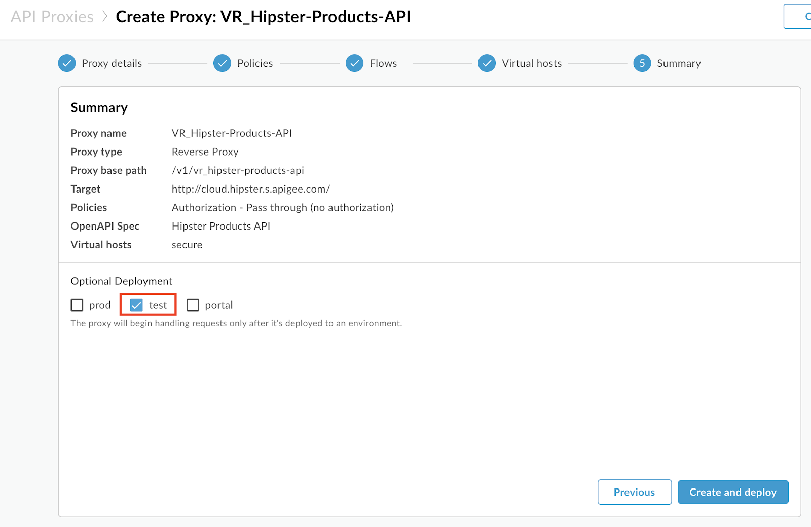

11. Once the API proxy is created and deployed click Edit Proxy to view your proxy in the proxy editor.

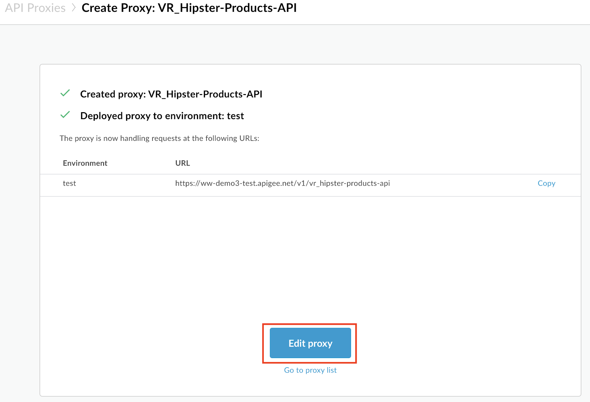

12.  *Congratulations!*  ...You have now built a reverse proxy for an existing backend service. You should see the proxy Overview tab.

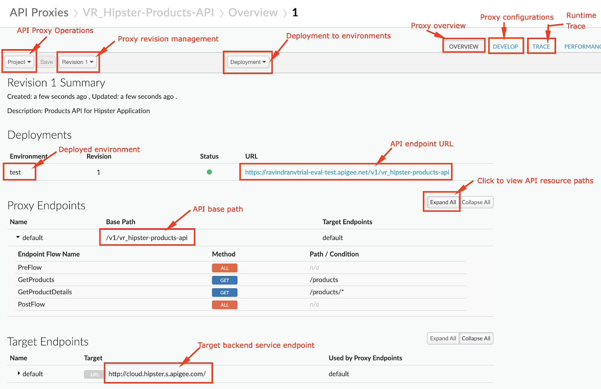


## Test the API Proxy


Let us test the newly built API proxy. You can use any HTTP client like cURL or Postman, or the  [Apigee Trace Tool](https://docs.apigee.com/api-platform/debug/using-trace-tool-0).

#### <b>Using cURL</b>

org = Organization name env = Environment where API is deployed

`curl -X GET "https://{{org}}-{{env}}.apigee.net/{{your initials}}_hipster-products-api/products"`

#### <b>Using Trace Tool:</b>

* Navigate to your proxy's Trace tab.
* Ensure that the deployed API revision is selected.
* Hit Start Trace Session.

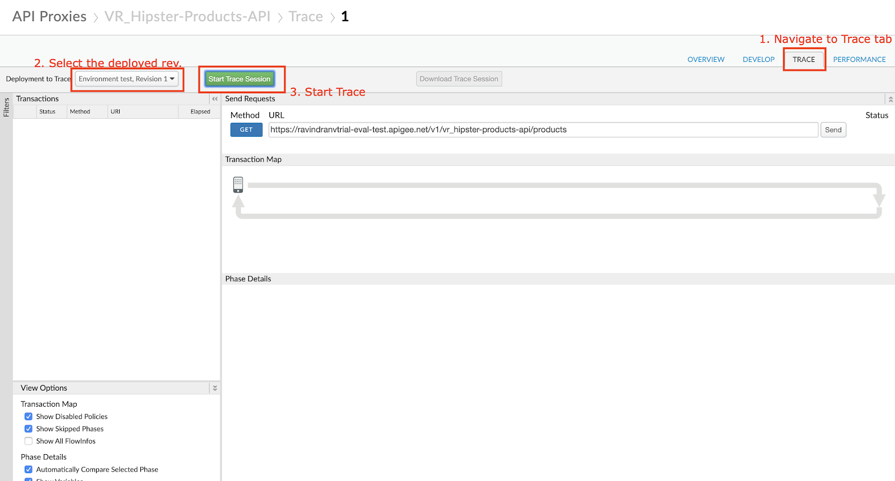

* Wait for Trace session to start.
* Modify the URL to send to a valid API resource - append a '/products' to the end of the URL.
* Hit 'Send'.

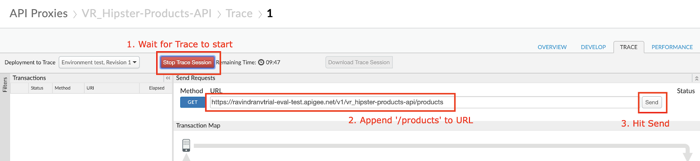

* You will see that the API proxy recieved the request and sent back a HTTP status 200 response which was logged by the Trace session. You can click on the step shown below to view the response body.

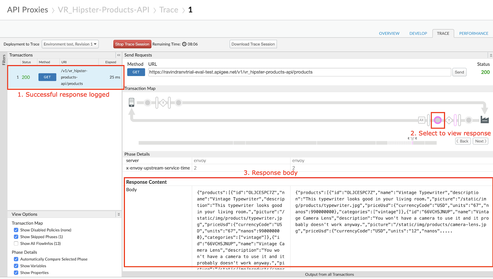

#### <b>Save the API Proxy</b>

1. Let's save the API Proxy locally as an API Bundle so that we can reuse it in other labs.
2. Save the API Proxy by downloading the proxy bundle, See screenshot below for instructions.

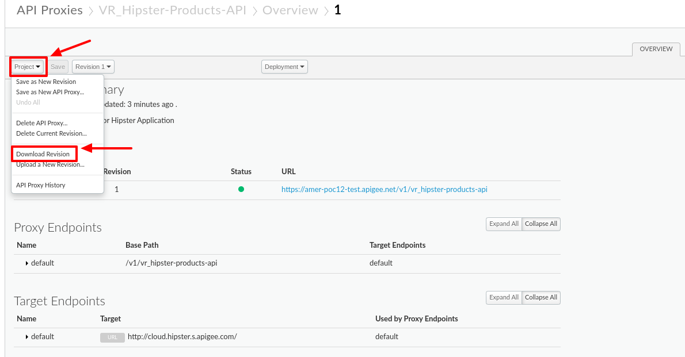


## Lab 1 - Summary


That completes this hands-on lesson. In this simple lab you learned how to use Apigee to proxy an existing backend using an OpenAPI Specification and the Apigee proxy wizard.

#### <b>Lab Video</b>

If you like to learn by watching, here is a short video on creating a reverse proxy using OpenAPI Specification -  [https://www.youtube.com/watch?v=3XBG9QOUPzg](https://www.youtube.com/watch?v=3XBG9QOUPzg)

#### <b>Earn Extra-points</b>

Now that you have created a reverse proxy using an OpenAPI spec, click on the Develop tab and explore the flow conditions populated from the OpenAPI spec. Further expore the trace tab in the API Proxy editor which supports filtering traces as well as downloading trace data for offline use. Also, explore the OpenAPI Spec editor which allows you to edit an OpenAPI specification and supports bidirectional navigation between the yaml/json and a live view of the rendered OpenAPI spec. See how you can generate an API Proxy using the "Generate proxy" action in the Specs view.  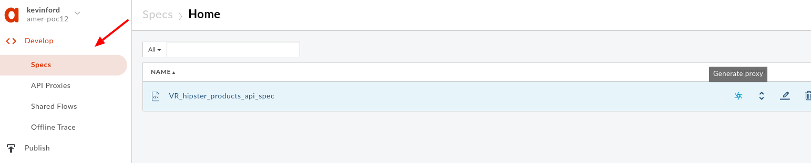

#### <b>Quiz</b>

1. How do you import the proxy bundle you just downloaded?
2. How does Apigee handle API versioning?
3. Are there administrative APIs to create, update, or delete API proxies in Apigee?

#### <b>References</b>

* Useful Apigee documentation links on API Proxies -
* Build a simple API Proxy -  [http://docs.apigee.com/api-services/content/build-simple-api-proxy](http://docs.apigee.com/api-services/content/build-simple-api-proxy)
* Best practices for API proxy design and development -  [http://docs.apigee.com/api-services/content/best-practices-api-proxy-design-and-development](http://docs.apigee.com/api-services/content/best-practices-api-proxy-design-and-development)
* Watch this "4 Minute Video 4 Developers" (4MV4D) on "Anatomy of an API Proxy" -  [https://youtu.be/O5DJuCXXIRg](https://youtu.be/O5DJuCXXIRg)


## Lab 2 - API Security and API Producer/Consumer Relationship on Apigee Edge


 *Duration : 20 mins* 

 *Persona : API Team* 

#### <b>Use case</b>

You have an API that you want to secure and expose for consumption by different Apps (API consumers). In addition to setting up authorized access to the API, you also want to be able to identify and control which App is making calls to the API so you can customize API behavior based on the the caller, or gather data on consumption patterns by differnt Apps and view that data through Analytics dashboards.

#### <b>How can Apigee Edge help?</b>

### <b>API Proxy - API Product - App Relationship</b>

On Apigee Edge, in order to secure an API Proxy and control access by consumers, we need to first understand the relationship between API Proxies, API Products, and Apps.

While the API Proxy allows you to expose the API endpoint according to API design specification, it also serves to decouple the API backend (target service) from the front end (client Apps), and in turn API production from consumption. This is accomplished by creating 'API Products' which are configurations that define how an API can be consumed. The API Product configuration may contain metadata that defines rules for consumption of the API through the particular API Product. These rules may include allowed consumption quota (Eg. 100 API calls per minute), visibility (Public vs Private vs Internal), API resource restrictions (Eg. Only /products resource URL may be called, but not /products/{product ID}), which API deployment environment the caller is allowed to access (Eg. test, prod), etc. Once the API Products are created, client Apps can then subscribe to them. On subscription, Apigee automatically generates and provisions an API Key/Secret pair for the App. These credentials can then be used to call the API endpoint with authentication and authorization, from within App code.

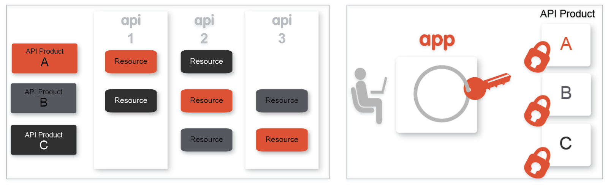

### <b>API Proxy Configuration</b>

While Apigee provides multiple ways of securing an API and authorizing API calls - including  [API Keys](https://docs.apigee.com/api-platform/security/api-keys),  [OAuth](https://docs.apigee.com/api-platform/security/oauth/oauth-home),  [JWT Tokens](https://docs.apigee.com/api-platform/reference/policies/jwt-policies-overview), and  [SAML](https://docs.apigee.com/api-platform/reference/policies/saml-assertion-policy.html) - this lab will focus on using simple API Key verification to secure an API.

Within the API Proxy, the  [Verify API Key Policy](http://docs.apigee.com/api-services/reference/verify-api-key-policy) can be used to authenticate and authorize incoming API calls, based on API Key verification. As a result of successful API Key verification, the  [Verify API Key Policy](https://docs.apigee.com/api-platform/reference/policies/verify-api-key-policy) also populates the API Proxy runtime context with details about the App making the call, the App developer, the API product associated with the call, and so on. This context can then be used to parameterize other policies applied, in order to affect API behavior such as quota enforcement or routing based on the client App. The data can also be extracted and used to gain business insights through Apigee Analytics.

In this lab, you will..

* Configure a  [Verify API Key Policy](https://docs.apigee.com/api-platform/reference/policies/verify-api-key-policy) for an existing, unsecured API proxy, and use the Apigee Trace tool to see the policy in action..
* Bundle the API Proxy into an API Product.
* Register a Developer and an App within your Org, that subscribes to the API Product, to test authorized consumption of the API.


## Prerequisites


For this lab, you will need an API proxy that is not currently secured. If you do not have an API proxy available for this lab, revisit lab 1  ["API Design : Create a Reverse Proxy from OpenAPI Spec"](https://github.com/aliceinapiland/apijam/blob/master/Module-1/Labs/Lab%201) and then return here to complete these steps.


## Choose and test the API Proxy to secure


1. Log into the Apigee Edge Management UI at  [https://login.apigee.com](https://login.apigee.com/). Navigate to Develop → API Proxies, and select the API Proxy (labeled {your_initials}_Hipster-Products-API) that you created in  [Lab 1](https://github.com/aliceinapiland/apijam/blob/master/Module-1/Labs/Lab%201).

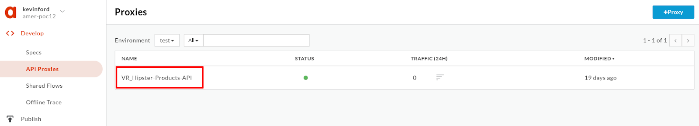

2. Verify that the API proxy is deployed to an environment from the Overview page. Environment(s) to which the selected revision of the API proxy is deployed will be indicated by a green circle. If it is not deployed, click an environment from the "Deployment" pull-down to deploy the API proxy to that environment.


3. Verify that you can successfully make calls using the built-in trace tool.

* Click the Trace tab near the top of the window.
* The Trace view allows you to initiate tracing for up to 10 minutes, during which time all requests (regardless of whether they are sent from the trace tool or any other client) will be captured and their traces made visible to you.
* Click Start Trace Session to begin a trace session.
* If you're using the API proxy you built in the  [previous Lab](https://github.com/aliceinapiland/apijam/blob/master/Module-1/Labs/Lab%201), add the `/products` resource path to the URL prior to sending a sample API call request. Click Send to send a request.
* You should see a successful 2xx response for your API Call (it may take a few seconds for the trace results to appear)


* Click the "Stop Trace Session" button.


## Add a Verify API Key Policy


1. To get to the proxy editor, click the "DEVELOP" tab next to the "TRACE" tab, or Navigate to Develop > API Proxies in the side menu, and open your API proxy. Click the Develop tab (in the upper right area of the page) to see the flow editor (you may have to move the panes to see the full request and response flow lines)
2. Click +Step on the request flow.

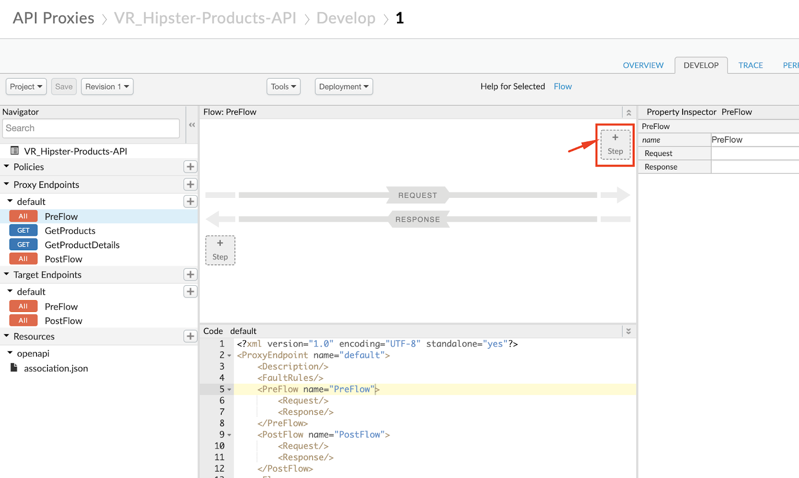

3. Select  *Verify API Key*  policy from the  *Security*  section of the list. And provide the following values:

* Display Name: Verify API Key
* Name: Verify-API-Key

Add


* The policy will be added after any policies you previously had in the Request flow. Since we likely want this to occur first, drag the new policy to be the leftmost of any policies in the flow.
* With the  *Verify API Key*  policy selected, you can see its configuration (the default policy configuration is below). Note that the API Key is being retrieved from the context as the variable  *request.queryparam.apikey* . This is the default but the policy can be configured to retrieve the key from any parameter you prefer, for example,  *request.header.client-id* , etc. (note: if you plan to use the Apigee trace tool for the lab, only query parameters are suppoted but if you have an alternative client such as cURL or Postman, feel free to use any parameter you like)

```
<?xml version="1.0" encoding="UTF-8" standalone="yes"?>
<VerifyAPIKey async="false" continueOnError="false" enabled="true" name="Verify-API-Key">
    <DisplayName>Verify API Key</DisplayName>
    <Properties/>
    <APIKey ref="request.queryparam.apikey"/>
</VerifyAPIKey>
```


* Save the API proxy.

4. Click the Trace tab near the top of the window and click Start Trace Session to begin a trace session.

* If you're using the API proxy you built in the  [previous Lab](https://github.com/aliceinapiland/apijam/blob/master/Module-1/Labs/Lab%201), add the `/products` resource path to the URL prior to sending a sample API call request. Click Send to send a request.
* You should see a 401 (unauthorized) response for your API Call because the API proxy was expecting an API Key as a query parameter. See the trace session below
* NOTE: In subsequent steps, you will get an API Key that will allow you to make this API call successfully.


## Create API Product


1. Select Publish → API Products from the side navigation menu, and click the +API Product button.

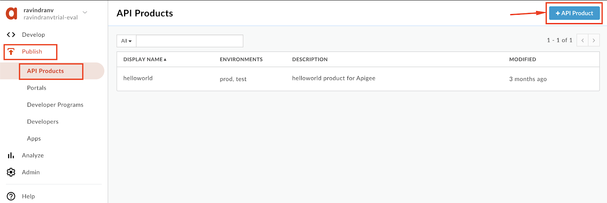

2. Populate the following fields

 *Note* :  *Replace {{your initials}} with your initials, so as to not accidentally modify other developers' work. Eg. API product 'Name = xx_Hipster-Products-API-Product'.* 

* Section: Product details
* Name: `{{your initials}}_Hipster-Products-API-Product`
* Display name: `{{your initials}}_Hipster Products API Product`
* Description: `Product that provides access to the Hipster Products API.`
* Environment: `test`
* Access: `Public`
* Section: API resources
* Section: API Proxies
* Click the Add a proxy link
*  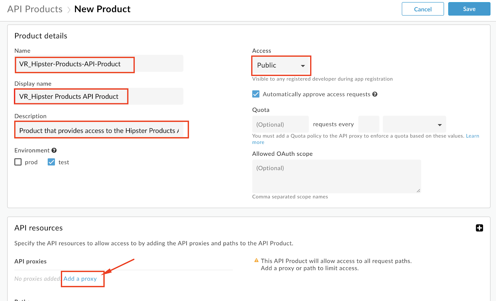
* In the popup window, select the API Proxy & path radio button. Then select your Hipster Products API Proxy (with deployed revision), select the `/` option for Path, and click Add.
*  

3. Save the API Product.  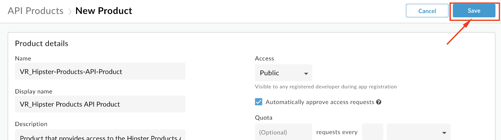

Note: We are adding the entire API Proxy to the API Product. We can just as easily select one or more operations from one or more API proxies and bundle them together in an API Product.


## Manually register App in Management UI & generate API Key


1. Select Publish → Developers from the side navigation menu, and click the +Developer button.


2. Populate the following details:

* First Name: `{{your initials}}_Test`
* Last Name: `Developer`
* Username: `{{your initials}}_testdev`
* Email: `{{your initials}}_testdev@test.com`

3. Click Create


4. Select Publish → Apps from the side navigation menu, and click the +App button.


5. Populate the following details:

* Name: `{{your initials}}_Hipster-Products-App`
* Disaplay Name: `{{your initials}}_Hipster Products App`
* Select the `Developer` radial option.
* Select the developer you previously created.
* Click the Add Product button.

6.  

* Select the API Product you previously created, and click Add.

7.  
8. Click the Create button to save.

9. Once created, you will then see that Apigee has generated an API Key and Secret pair for the App. Click on the 'Show' link next to the Key, and copy this API Key.

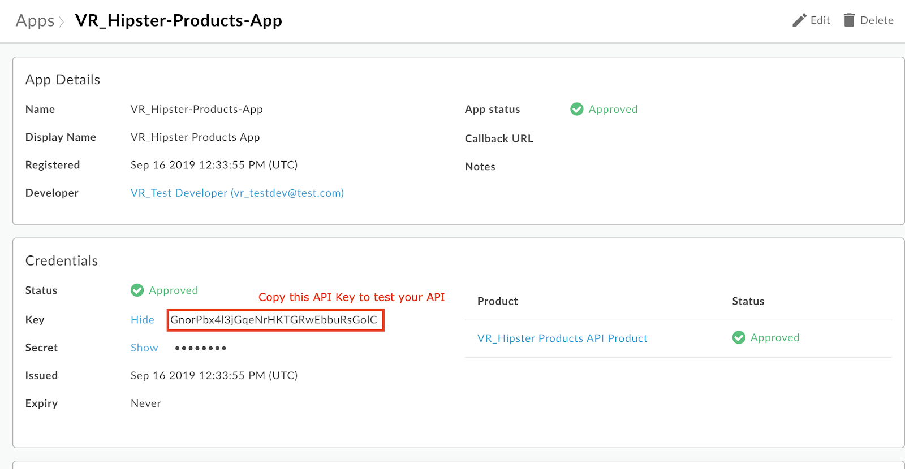

You can now use this API Key to make a valid API request to your API Proxy.


## Test your API with valid API Key


1. Navigate to Develop > API Proxies in the side menu, and open your API proxy. Click the Trace tab near the top of the window and click Start Trace Session to begin a trace session.
2. Add the `/products` resource path to the URL prior to sending a sample API call request. In addition, add a query parameter called `apikey` with the value of the API Key you copied. Click Send to send a request.
3. You should now see that the API request returns a 200 OK response, as the Verify API Key policy has found the API key to be valid.

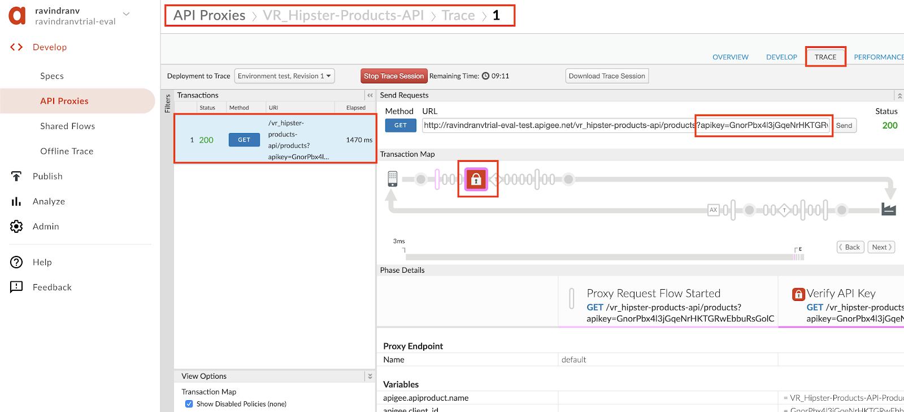


## Lab 2 - Summary


In this lab you learned how the relationship between API Proxies, API Products and Apps, helps obfuscate API production from API consumption; and how to protect your API proxy using the Verify API Key policy. You then implemented the policy and tested it using the built-in Trace Tool.

#### <b>Lab Video</b>

If you would rather watch a video that covers this topic, point your browser  [here](https://youtu.be/3nUFCOgGlS8).

#### <b>Quiz</b>

1. Why is the Verify API Key policy typically found as the first policy in the Request PreFlow? When might it be in a conditional PreFlow instead of the "All" PreFlow?
2. How would you configure the policy to get the API Key from a header called "Api-Key" instead of the default query parameter location?

#### <b>References</b>

* Link to Apigee docs page
* Verify Api Key Policy  [https://docs.apigee.com/api-platform/reference/policies/verify-api-key-policy](https://docs.apigee.com/api-platform/reference/policies/verify-api-key-policy)


## Lab 3 - Manage tiered API Product subscription through API call quotas


Duration : 15 mins

Persona : API Product Team & API Dev Team

### <b>Use Case</b>

API tiering is a new look at API as a Product. With tiering you provide the base level (e.g. bronze) as a free option. This offer is an entry point to leverage your data offering with a potential upsell to premium API Products. The goal is to upsell to additional functional levels. This term is also known as "freemium". The basic approach is as follows – offer basic functions or call quotas as an entry level and if more data access or more functionality is required, offer these options for a fee. This gives developers the chance to have a working prototype and explore your API in a real life scenario before making an informed purchase decision.

### <b>How can Apigee help</b>

Apigee offers the concept of API Products abstracted from the functional logic of API proxies. The proxies can access and enforce the limits defined in API Products. This way the API product team can focus on the business model (e.g. establishing usage quotas and entitled API operations on a per API Product basis) while the API development team works with these values to implement the parametrized behaviour.


## Pre-requisites


Pre-reqs are met if you have completed  [Lab 1](https://github.com/aliceinapiland/apijam/blob/master/Module-1/Labs/Lab%201) and  [Lab 2](https://github.com/aliceinapiland/apijam/blob/master/Module-1/Labs/Lab%202).

The minimum for this lab is to have a deployed API proxy with a "Verify API Key" policy and a Developer for whom we can register an App that subscribes to our API product.


## Create API Products (Bronze, Silver, Gold)


In this lab we will create different API products that bundle the same API Proxy but with different quotas attached to it.

* Go to  [https://apigee.com/edge](https://apigee.com/edge) and log in. This is the Edge management UI
* Select Publish → API Products
* Click +API Product


* Populate the following fields
* Section: Product details
* Name: {yourInitials}_Hipster-Products-API-Product-Bronze
* Display name: {yourInitials}_Hipster Products API Product Bronze
* Description: Free version of the Hipster Product API
* Environment: test
* Access: Public
* Quota: 5 requests every 1 Minute
* Section: API resources
* Click the Add a proxy link

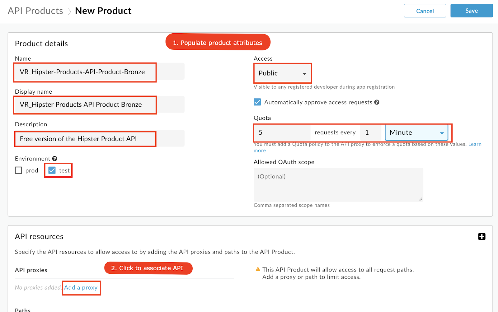

* Select {yourInitials}_Hipster-Products-API Proxy and click Add

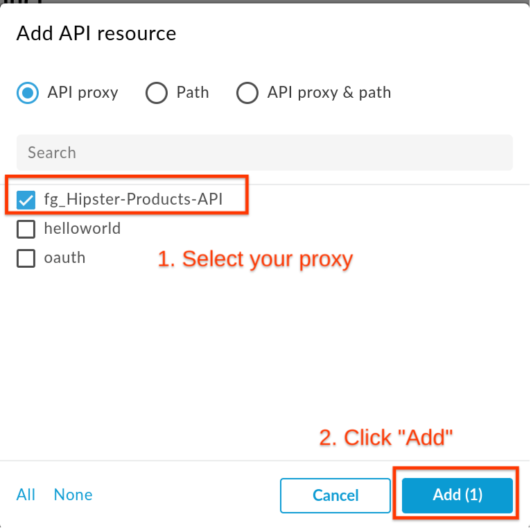

API products have a set of fields called "Quota" that allow you to configure how many requests per number of time periods (e.g. 5 requests per 1 [minute/hour/day/month]) you want to allow. Just configuring this does NOT enforce quotas though! Think of these fields as metadata that the Quota Policy (enforcement point) can dynamically reference when enforcing the policy.

* Click Save to create the API Product

We now create 2 similar products that represent our Silver and Gold Products with different Quota settings. To create another API Product just follow these steps:

* Click Publish → API Products
* Click +API Product
* For the Silver Product populate the following fields
* Section: Product details
* Name: {yourInitials}_Hipster-Products-API-Product-Silver
* Display name: {yourInitials}_Hipster Products API Product Silver
* Description: Basic version of the Hipster Product API
* Environment: test
* Access: Public
* Quota: 20 requests every 1 Minute
* Section: API resources
* Click the Add a proxy link
* Select {yourInitials}_Hipster-Products-API Proxy and click Add
* For the Gold Product populate the following fields
* Section: Product details
* Name: {yourInitials}_Hipster-Products-API-Product-Gold
* Display name: {yourInitials}_Hipster Products API Product Gold
* Description: Deluxe version of the Hipster Product API
* Environment: test
* Access: Public
* Quota: 1000 requests every 1 Minute
* Section: API resources
* Click the Add a proxy link
* Select {yourInitials}_Hipster-Products-API Proxy and click Add

Now we should end up with 3 API Products resembling our Product tier strategy.


## Create an App for our Products


* Select Publish → Apps
* Click +API Product

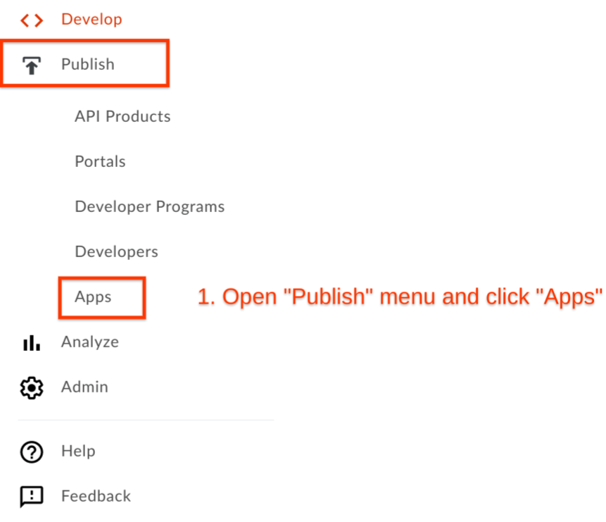

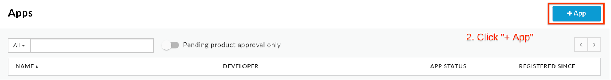

* Populate the following fields
* Section: App Details
* Name: {yourInitials}_Hipster Android App Free
* Display name: {yourInitials}_Hipster Android App Free
* Developer: Chose any existing Developer
* Section: Credentials
* Click Add product

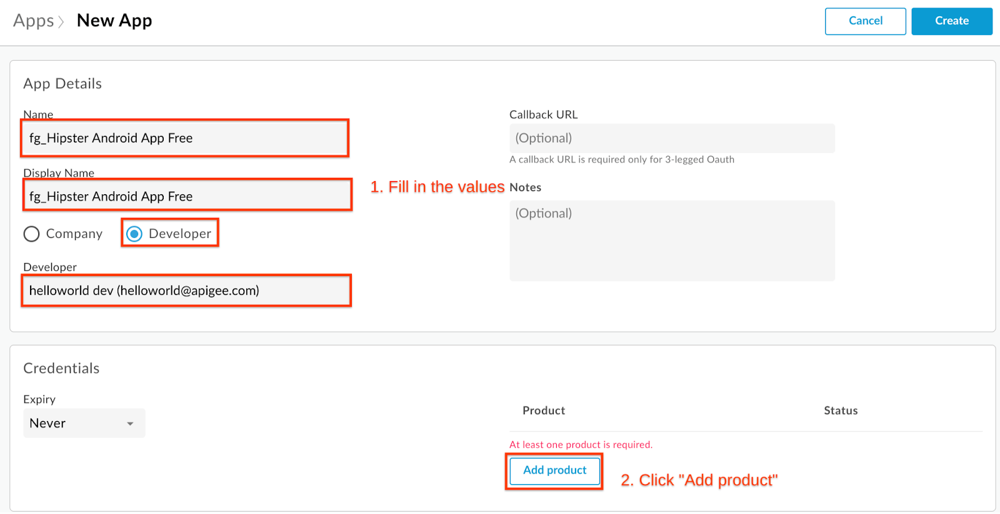

* Select Hipster Product API Product Bronze and click Add


* Click Create to create the App
* Note down the Key for later by clicking on "Show" in the App properties.


Repeat the process for the Apps that use the Silver and Gold tier as well, with using these values:

* App using the Silver API Product
* Section: App Details
* Name: {yourInitials}_Hipster Android App Basic
* Display name: {yourInitials}_Hipster Android App Basic
* Developer: Chose any existing Developer
* Section: Credentials
* Click Add product
* Select Hipster Product API Product Silver and click Add
* App using the Gold API Product
* Section: App Details
* Name: {yourInitials}_Hipster Android App Deluxe
* Display name: {yourInitials}_Hipster Android App Deluxe
* Developer: Chose any existing Developer
* Section: Credentials
* Click Add product
* Select Hipster Product API Product Gold and click Add

You should end up with three Apps with three different API keys, that you have noted down. Each App's API key will have an associated secret that will be used if you are implementing OAuth.


## Create and Configure Quota Policy


As stated, quotas are only enforced by adding a Quota Policy into your API Proxy. With the configuration of the Quota fields in the API Product, when an API call is made that presents a valid API key, Apigee will automatically fetch the associated API Product's metadata (including the Quota fields), which become available to be dynamically referenced by a quota (or any other) policy.

1. Click on Develop → API Proxies from side navigation menu. Open the existing API Proxy from the prerequisites.
2. Verify that the policy for Verify API Key exists with the proper name. Click on the Policy Name and look at the XML configuration below.

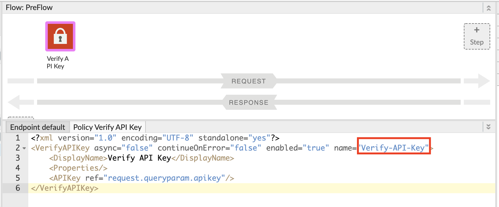

3. Click PreFlow and + Step to add a new policy


4. Click Quota Policy and Populate the following fields

1. Display Name: QU-ProductQuota

Click Add to add the policy to your flow.


5. With the VerifyAPIKey policy that we have configured in our prerequisites Verify-API-Key, the following variables are populated after verification of an API key that has an API product with the quota fields set as 3 requests per 1 second:

* verifyapikey.Verify-API-Key.apiproduct.developer.quota.limit = 3
* verifyapikey.Verify-API-Key.apiproduct.developer.quota.interval = 1
* verifyapikey.Verify-API-Key.apiproduct.developer.quota.timeunit = second

Important note about variable naming : the variables that Apigee creates to hold the metadata include, as part of the variable name, the policy that was used to verify the API Key which in this example is "Verify-API-Key". If you named your policy "check_the_api_key", you would find the "limit" in the runtime context variable:  *verifyapikey.check_the_api_key.apiproduct.developer.quota.limit* 

The next step then is to set the QU-ProductQuota Quota policy to reference these variables and use this code in the Policy Configuration

`<?xml version="1.0" encoding="UTF-8" standalone="yes"?>`

`<Quota async="false" continueOnError="false" enabled="true" name="QU-ProductQuota" type="calendar">`

`    <DisplayName>QU-ProductQuota</DisplayName>`

`    <Allow count="3" countRef="verifyapikey.Verify-API-Key.apiproduct.developer.quota.limit"/>`

`    <Interval ref="verifyapikey.Verify-API-Key.apiproduct.developer.quota.interval">1</Interval>`

`    <TimeUnit ref="verifyapikey.Verify-API-Key.apiproduct.developer.quota.timeunit">minute</TimeUnit>`

`    <Identifier ref='verifyapikey.Verify-API-Key.client_id'/>`

`    <Distributed>true</Distributed>`

`    <Synchronous>true</Synchronous>`

`    <StartTime>2019-01-01 12:00:00</StartTime>`

`</Quota>`


Note: If the field is not set in the API product, this would allow a default of 3 calls per minute

6. Click on Save after you have changed the policy in the previous step


## Test the results


Go to the API proxy and enter the trace tab so we can run some tests:

* Click Trace
* Click Start Trace Session
* Add the Bronze apikey value as a query parameter to the URL (e.g.: http://{yourapigeeorg}-test.apigee.net/v1/{yourInitials}_hipster-products-api/products?apikey=GYuZekimsQ2TLdWWMHkqB1poAquHaGsv
* Run a test by clicking the Send button multiple times

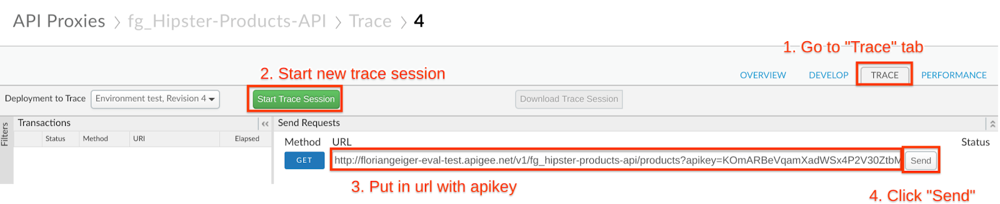

* After 6 calls we see that our free quota of 5 calls is exceeded and the quota policy shows a red exclamation mark sign


Now we switch API products and add the Silver apikey value from our App as a query parameter to the URL (e.g.: http://{yourapigeeorg}-test.apigee.net/v1/{yourInitials}_hipster-products-api/products?apikey=GYuZekimsQ2TLdWWMHkqB1poAquHaGsv

* Change your apikey parameter to match your Silver App credentials
* Run a test by clicking the Send button around 15 times before clicking Start Trace Session
* Start the trace session and click the Send button a couple of times again before reaching your limit.

Let's check out the trace result:

* Click on one of the successful trace results on the left (indicated by a green Status with 200)
* Click the quota policy icon in the Transaction Map

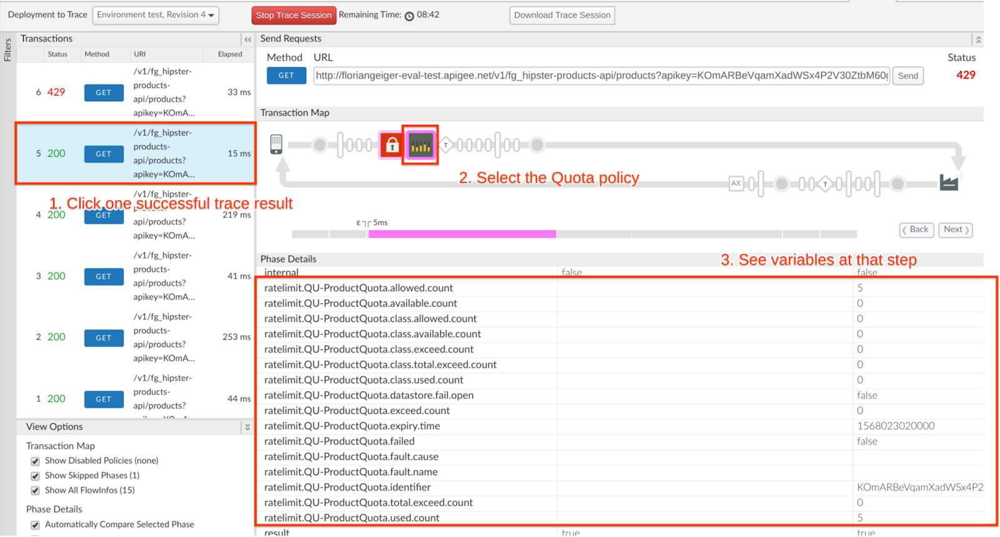

* Here we see at the end of our calls that we only have one count available (ratelimit.QU-ProductQuota.available.count) out of the original 20 (ratelimit.QU-ProductQuota.allowed.count).
* Also have a look at the other variables available as part of the proxy flow.

At this point, we will skip the Deluxe/Gold version of our product, but you get the idea, that your developers won't easily reach the limit with this one.


## Lab 3 - Summary


In this lab you have created 3 products aligned with your API product strategy to offer a tiered model and have different quotas attached to each product. We have not defined the limits in our API proxies but made the same proxy available in different API products that define the quota amount.

### <b>Quiz</b>

1. What would happen if you leave out the Identifier Tag in the Quota Policy?
2. What would happen if the Quota Policy were placed before the Verify API Key policy?
3. In the configuration we provided, the ‘Distributed' and ‘Synchronous' attributes were both set to ‘true'. What is the implication if we set these to ‘false'?
4. How would you configure the quota so that POST calls are counted as 2 calls for the purposes of evaluating the quota?

### <b>References</b>

#### Apigee Docs Links

[https://docs.apigee.com/api-platform/reference/policies/quota-policy](https://docs.apigee.com/api-platform/reference/policies/quota-policy)

#### Videos (4mv4d)

[https://www.youtube.com/watch?v=z8Rj_VzSbh4](https://www.youtube.com/watch?v=z8Rj_VzSbh4)

[https://www.youtube.com/watch?v=1RDDpH0wOdc](https://www.youtube.com/watch?v=1RDDpH0wOdc)


## Lab 4 - Build an App Developer Experience using Apigee Integrated Developer Portals


 *Duration : 30 mins* 

 *Persona : API Team* 

### <b>Use case</b>

You want to provide and manage an easy, self-service on-boarding experince for app developers who wish to consume your API Products via a Developer Portal. You want to enable app developers to learn about, register for, and begin using your APIs, as well as control visibility and access to different API Products.

### <b>How can Apigee Edge help?</b>

Apigee Edge provides multiple options for your Developer Portal. Apigee supports several developer portal solutions, ranging from simple turn-key to fully customizable and extensible. The turn-key  [Integrated Developer Portal](https://docs.apigee.com/api-platform/publish/portal/build-integrated-portal) option supports branding and customization of much of the site, such as theme, logos, and page content, and can be published in seconds, directly from the management UI. We also provide a  [Drupal-based portal](https://docs.apigee.com/api-platform/publish/drupal/open-source-drupal-8) if you want full control and to leverage any of the hundreds of Drupal modules available in the Drupal Market. This lab focuses on the Integrated Developer Portal.

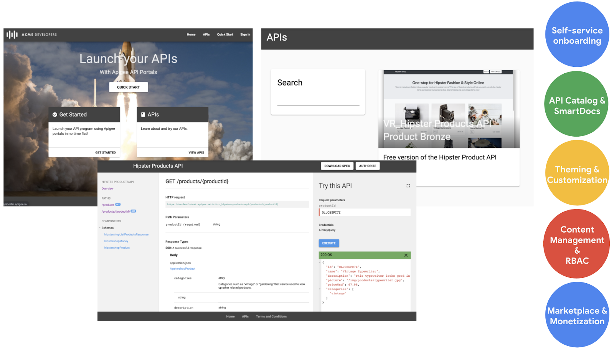

In this lab, you will create an Integrated Developer Portal wherein you will publish API Products, and through which app developers can

* learn API usage through OpenAPI specification based interactive documentation
* register Apps that consume API Products, and thereby
* generate App client credentials (API Key and Secret) that can be used to consume APIs.


## Pre-requisites


For this lab, you should have completed  [Lab 1](https://github.com/aliceinapiland/apijam/blob/master/Module-1/Labs/Lab%201),  [Lab 2](https://github.com/aliceinapiland/apijam/blob/master/Module-1/Labs/Lab%202) and  [Lab 3](https://github.com/aliceinapiland/apijam/blob/master/Module-1/Labs/Lab%203) of this module.

You will need...

* An OpenAPI specification uploaded to your Spec store within your Organization. This specification will make up the documentation of your API. If you do not have an OpenAPI Specification available for this lab, revisit  [Lab 1 - Design & Create an API Proxy with OpenAPI Specification](https://github.com/aliceinapiland/apijam/blob/master/Module-1/Labs/Lab%201)
* API Products that bundle your API Proxies. If you do not have an API Product configured, revisit  [Lab 2 - API Security and API Producer/Consumer Relationship on Apigee Edge](https://github.com/aliceinapiland/apijam/blob/master/Module-1/Labs/Lab%202), and  [Lab 3 - Manage tiered API Product subscription through API call quotas](https://github.com/aliceinapiland/apijam/blob/master/Module-1/Labs/Lab%203).


## Update API Proxy for CORS Support


CORS (Cross-origin resource sharing) is a standard mechanism that allows JavaScript XMLHttpRequest (XHR) calls executed in a web page to interact with resources from non-origin domains. CORS is a commonly implemented solution to the " [same-origin policy](https://en.wikipedia.org/wiki/Same-origin_policy)" that is enforced by all browsers. For example, if you make an XHR call to your API Proxy from JavaScript code executing in your browser, the call will fail. This is because the domain serving the page to your browser is not the same as the domain serving your API, eg. "{your org name}-{environment name}.apigee.net". CORS provides a solution to this problem by allowing servers to "opt-in" if they wish to provide cross-origin resource sharing.

In this step, we upload and deploy a version of your API proxy which includes configurations that support CORS, before it is published to a Developer Portal where it could be invoked within interactive docs pages. Typically, you would set these configurations up as described under " [Adding CORS support to an API proxy](https://docs.apigee.com/api-platform/develop/adding-cors-support-api-proxy)". However, in the interest of time, in this lab, we will make use of a pre-configured proxy revision instead.

1. Download  [this revision](https://github.com/apigee/apijam/raw/master/Module-1/Resources/Hipster-Products-API_With_CORS_Config.zip) of the API proxy. This is a version of the same Hipster Products API that we have been working on so far, but with CORS configurations.
2. Navigate to API Proxies and select your Hipster Product API proxy. Then click the Project button and select Upload a New Revision.

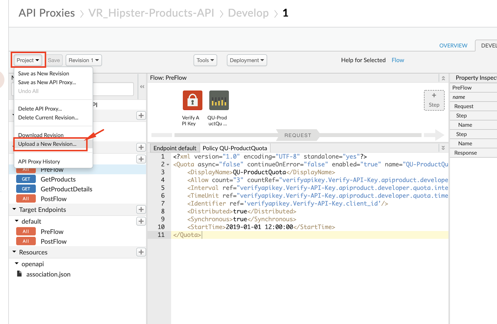

In the pop-up dialog, choose the previously downloaded revision of the API proxy, and click Upload.


3. Once uploaded, in the latest revision of your API proxy, navigate to the Proxy Endpoints >> default XML, scroll down and change the `<BasePath>` node value to match your proxy's basepath.

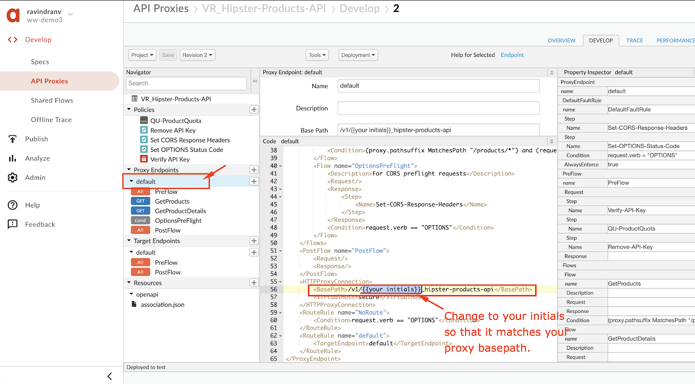

Hit Save.

4. Once saved, select the Deployment drop down and click on test, to undeploy the older revision and deploy the latest revision of the proxy to the test environment.


Your API proxy should now include configurations to support CORS processing.


## Update the Open API Spec


In order to ensure that we have an updated OpenAPI Spec that accurately describes the API endpoint exposed through our API Proxy, we must first modify the spec - specifically the `host`, `basepath`, `securityDefinitions` and `security` properties. To do this, navigate to Develop → Specs on the main menu, select the spec that we previously imported in Lab 1, and modify the the `host`, `basepath`, `securityDefinitions` and `security` properties as shown below:

`host: {{your API proxy host}}`

`basePath: /v1/{{your initials}}_hipster-products-api`

`securityDefinitions:`

`  APIKeyQuery:`

`    type: "apiKey"`

`    in: "query"`

`    name: "apikey"`

`security:`

`  - APIKeyQuery: []`

`schemes:`

`  - https`

Where {{your API proxy host}} = {{your org}}-{{environment}}.apigee.net, in Apigee Trial orgs

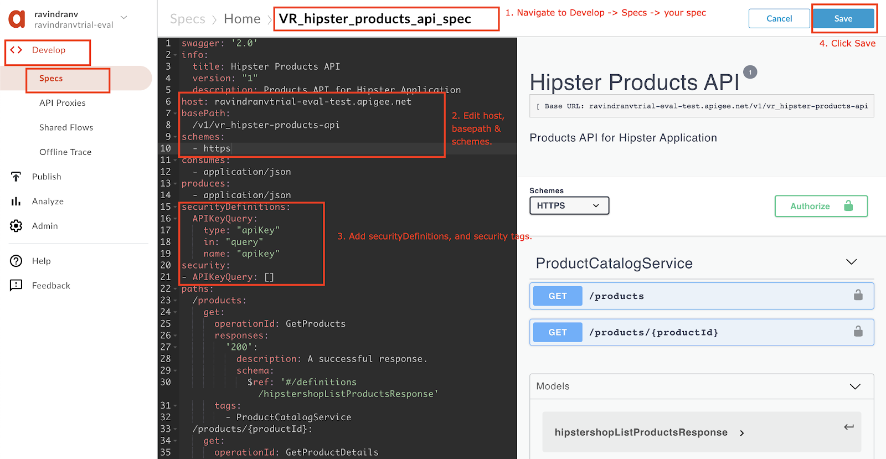


## Create a Developer Portal


1. Navigate to Publish → Portals and click +Portal, or Get started (if you haven't created any portals yet within the org).

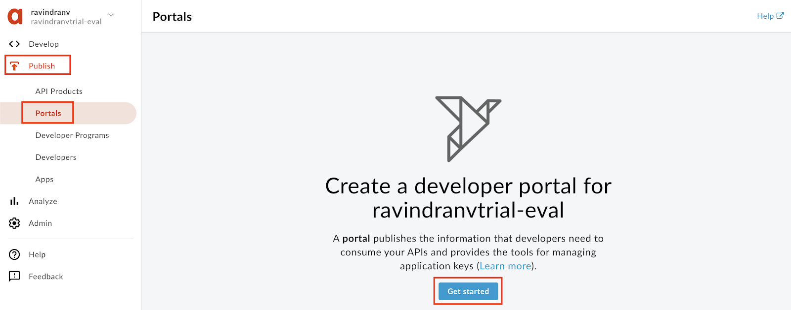

2. Enter details in the portal creation wizard. Replace {{your-initials}} with the initials of your name.

* Name: `{{your initials}}_Hipster API Portal`
* Description: `Developer portal for consumption of Hipster APIs.`

3. Click Create

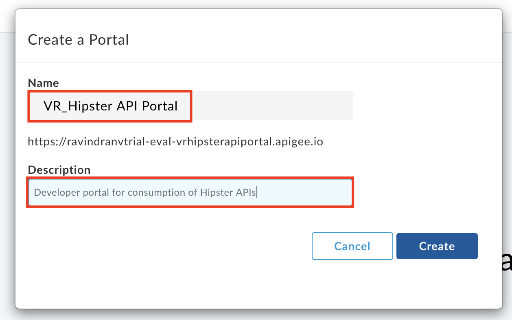


## Publish the Bronze (Free) API Product to the Portal


1. Click the Portal Editor's dropdown and select API catalog.

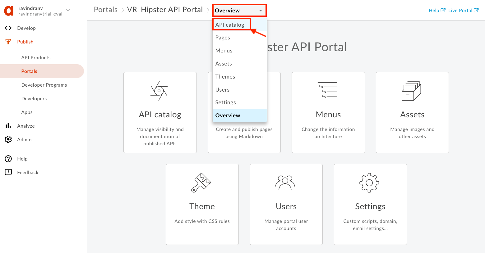

2. Click + to select the Bronze API Product to publish to the Portal. Select the API Product to publish and click Next.

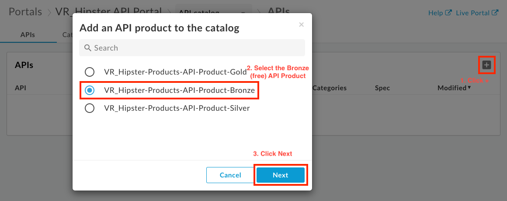

3. Make sure that the Published checkbox is checked, so that the Bronze API Product is visible to authorized App developers through the API catalog, during App creation.


4. Click the Source API spec dropdown and select Choose a different spec....

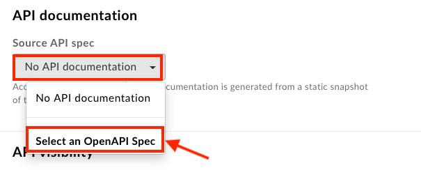

5. Select the recently updated OpenAPI Specification to use as a source. The current version (snapshot) of the selected OpenAPI Specification will be used to generate the documentation for this API product in the portal.

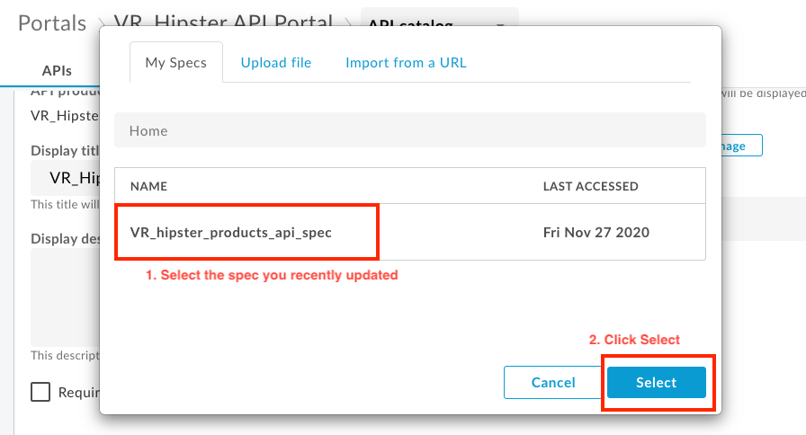

6. Select the Registered users option so registered developers on the Developer Portal can view this API through the portal. Click Next.


7. Select the Image button to update the icon image associated with this API product.


8. Then select Image URL and provide the following URL to import image.


Image URL: `https://raw.githubusercontent.com/apigee/apijam/master/Module-1/Labs/Lab%204/media/HipsterAPIProductImage.png`


9. Click Save.


The API product is now published to the developer portal.


## App Developer sign-up


1. Click the Live Portal link to launch a browser tab/window with the new Developer Portal.

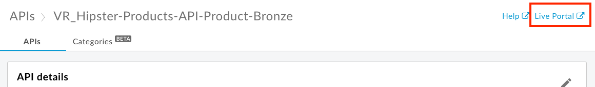

2. On the developer portal, click the main menu option labeled Sign In. This will take you to the App Developer login page. Here, click Create Account.

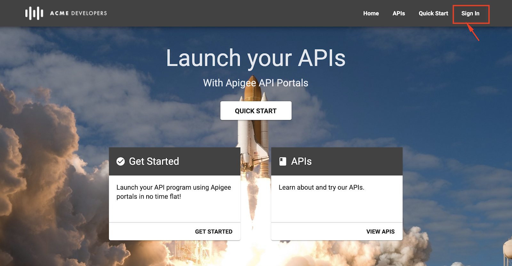


Provide the following details, and then click Create Account.
`First Name: {{your first name}}`

`Last Name: {{your last name}}`

`Email: {{your email address}}`

`Password: {{enter a password}}`

`Check the "I agree to terms." box`


4. On account creation, the App Developer will receive an email notification with an account verification link.


Since we you have provided your own email address as the App Developer in this lab, you should have received this notification. Click the link or copy and paste it into the browser to verify the account.

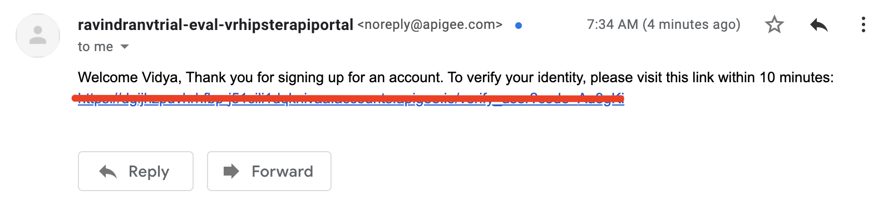

5. Once account is verified, the App Developer can sign into the portal using their credentials.


## View API Documentation


1. Log in as App Developer using the account credentials created in the previous steps. Click on the APIs menu link on the Developer Portal. This will take you to the API catalog page. Here' you will see that API product we previously published to be visible to all registered developers.


2. Click the API Product icon for the Bronze product in the catalog, to view it's documentation. This will take you to an interactive documentation page generated from the OpenAPI spec that we associated to the API product at the time of publishing.


3. Select one of the API resource paths from the left pannel of the docs and click Execute. You will then see a 401 Unauthorized response in the right pannel.

This is because you haven't yet registered any Apps and therefore have no API Keys to use for an authorized API call.


## Register Apps


1. Navigate to the developer account drop down menu on the top right corner, and select the Apps link.
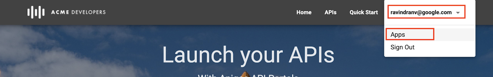
2. Click the New App button (either on the page itself or on the top panel, as shown below).
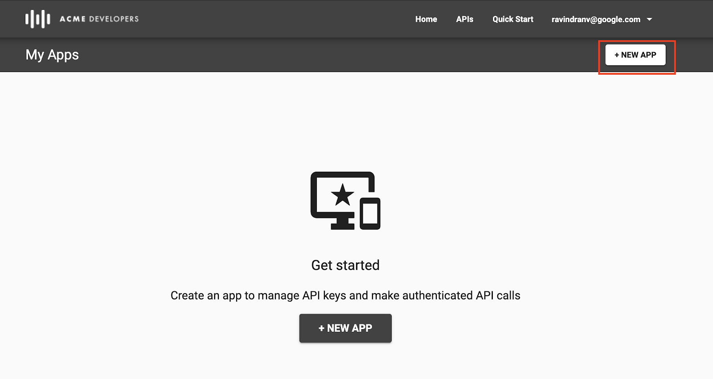
3. Enter the following App details and click Create: App Name: `{{your initials}}_Hipster-Test-App` Description: `Test app to try out Hipster Products API using the Bronze (Free) API Product`
Select the Bronze (Free) API Product that is available for subscription.
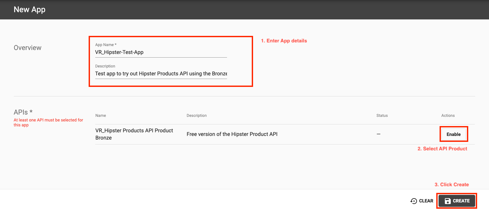
4. You will find that an API Key/Secret pair has been generated for your newly created App. You can now use this API Key to test the API.

5. Navigate to the API Catalog, select the Bronze API Product docs, and test out the GET `/products` resource again. This time though, first click on the Authorize button and select the newly created App's credentials to set authorization information (API Key) for the API call.

Click OK after authorization information is set.

Now, click Execute. You will see that a valid 200 OK API response is received.


## Optional: Try out Developer Program, Teams and Audience Management features


On Apigee Edge, a  [Developer Program](https://docs.apigee.com/api-platform/publish/portal/intro-developer-program) is the configuration set associated to each Developer Portal - specifically, App Developer accounts, App Developer identity management configuration, App Developer Teams, and Audience configuration for access to content published on the portal.

App Developers have the option of creating  [Teams](https://docs.apigee.com/api-platform/publish/portal/developer-teams) to share responsibility for an app with other developers. Each developer within a Team is assigned a role (`Owner`, `App Admin` or `Viewer` ) that defines their access level to the shared apps.

[Audience](https://docs.apigee.com/api-platform/publish/portal/portal-audience) configurations are used to segment portal users or developer teams to control access to the following resources:

* Pages in your portal
* Published API products

The following figure shows how audiences are used to control access to a set of resources.


### <b>Enable Teams and Audience Management features</b>

1. To utilize Teams and Audience Management features, you must first enroll into the Beta program within your Apigee Edge org. To do this, navigate to the Publish -> Developer Programs menu on the Management UI, and select the developer program associated with your Integrated Developer Portal.

2. Click the Enroll button to "Enroll in beta for team and audience management".

Once enrolled, you will see the Teams and Audience Management features enabled within your Developer Program.


### <b>Create Developer Team</b>

1. Ensure that you are logged into the Developer Portal with your App Developer credentials. Navigate to the Teams menu from your account drop-down.


2. Click the + New Team button.


3. Fill in team details and click Create.
Overview section:

* Team name: `{{your initials}}_Hipster App Team`
* Description: `Team that will work together on Hipster apps, and share API Keys.`
* Point of contact: `{your App Developer email address}`

Memebers:
 `Your App Developer email ID has already been added to the team with 'Owner' role.`

` If required, you can add additional Developers with different roles.`

4. `
` 
5. Once created, you will be able to access this team as a team member from the Developer Portal, and as an API producer, you can view teams created on the Developer Program within the Apigee Management UI as well.


### <b>Create Audience</b>

We will now see how to publish API products on the Developer Portal, with only certain audiences that have entitlement to view and subscribe to those products.

1. Navigate to Publish → Developer Programs → {the developer program associated to your Developer Portal}. Click the Audiences tab and click the '+' button to add a new audience.

Enter the following details and click OK.
Name: `Hipster-API-Privileged-Audience` Description: `A privileged audience that is allowed access to the Hispter API Silver and Gold products.
` 
2. Once the Audience is created, you define who should be assigned to it. To do this, click the + button in the Assignments section of the Audience.

In the popup, type in the name of the team that you previously created. Select the team and click Add(1).

Click Save to save the audience assignment.


### <b>Publish Silver API Products with New Audience Entitlements</b>

1. Navigate to Publish → Portals → {{your developer portal}} → API catalog and click the + button.


2. Select the Silver API Product and click Next.


3. Make sure that the Published checkbox is checked, so that the Silver API Product is visible to authorized App developers through the API catalog, during App creation.


4. Click the Source API spec dropdown and select Choose a different spec....


5. Select the recently updated OpenAPI Specification to use as a source. The current version (snapshot) of the selected OpenAPI Specification will be used to generate the documentation for this API product in the portal.


6. Select the Selected audiences option in under API visibility, and check the box for the Audience you just created.


7. Select the Image button to update the icon image associated with this API product.


8. Then select Image URL and provide the following URL to import image.


Image URL: `https://raw.githubusercontent.com/apigee/apijam/master/Module-1/Labs/Lab%204/media/HipsterAPIProductImage.png`


9. Click Save.


10. Validate the API visibility setting for the Silver API Product.


### <b>Create Team App</b>

1. On the developer portal, navigate to the developer account drop down menu on the top right corner, and select the Apps link. Then click the New App button.

2. Enter the following App details and click Create: App Name: `{{your initials}}_Hipster-App` Description: `App that is registered against the team to share App credentials and access Silver tier Hipster API product.` Owner: `{{your initials}}_Hipster App Team`
Select the Silver (Basic) API Product that is available for subscription.

3. You will find that an API Key/Secret pair has been generated for your newly created App. You can now use this API Key to test the API.

4. Navigate to the API Catalog, select the Silver API Product docs.

5. Select the GET `/products` resource. Click on the Authorize button and select the newly created Team App's credentials to set authorization information (API Key) for the API call. Then click Authorize within the popup.

Click OK after authorization information is set.

Now, click Execute. You will see that a valid 200 OK API response is received.


## Lab 4 - Summary


You've learned how to do the following:

* Deploy the Apigee Lightweight Developer Portal
* Publish an API Product with an OpenAPI Specification
* Use the Developer Portal UI to browse the OpenApi Specification Snapshot as a developer.

### <b>Lab Video</b>

If you would rather watch a video that covers this topic, point your browser  [here](https://youtu.be/_gDpzDJPNQg).

### <b>Earn Extra-points</b>

* Add a second product to the portal and test it by launching the Live Portal.
* Update your API specification, and then  [take a snapshot](https://docs-new.apigee.com/publish-apis#take-snapshot) of the specification to update the portal documentation.

### <b>Quiz</b>

1. What are two reasons why you might publish multiple API products to the Developer Portal?
2. Changes made to OpenAPI Specification are made available in the Developer Portal automatically. True or False?


## Lab 5 - Measure API Program Success with Apigee Analytics


Last Updated: 2019-09-03

 *Duration : 15 mins* 

 *Persona : API Product Team* 

### <b>Use Case</b>

#### <b>What comes after publishing the first API Product</b>

After you have some API Products up and running you want to have a look at how the program performs and how successful your API program is.

* How is traffic trending over time?
* When is the traffic flowing fastest?
* Where are the most users?
* What are the most active developers?

#### <b>Insights help with capacity planning</b>

With trend usage data you can see how your API calls are trending over time and predict how the traffic will be in the next year, when you need to do your capacity planning

Through visualization of the data with out of the box analytics, Apigee helps you with finding the trends and patterns of your APIs

#### <b>Tying traffic to API Products</b>


When registering an application to an API product that metadata is loaded when verifying an API key or Oauth Token so you can identify the Developer, App and the Product. This data is crucial for insights into your program.

### <b>Pre-requisites</b>

* If you have followed previous modules you can probably already see some traffic for the proxies you have created earlier and work with your previous API proxy for the custom statistics.
* If you haven't followed previous models you can follow this lab too but will see less data in your dashboards.
* (Optional) If you want the full experience setup a load generator before to see some data in your dashboards.


## (optional) Add some load to API proxies


If you have not followed previous modules you can use a load generator to have some data in your reports.

You have to have an API proxy with a default API key policy and 3 API keys ideally for different Apps and API products.

### <b>Configure and Run Load Generator</b>

You can create a new proxy by uploading the proxy in the  *loadgen*  folder in this repository.

1. Create a new proxy by clicking Develop > API Proxies > + Proxy
2. In the new proxy wizard select to upload a proxy bundle and upload your .zip file from the repository. You can download this .zip file  [here](https://github.com/aliceinapiland/apijam/blob/master/Module-1/Labs/Lab%205/loadgen/LoadGen-Proxy.zip?raw=true)


3. Click Build.
4. After the proxy was created you can directly open it in the editor and go to the Develop tab to change the values for your proxies and api keys. Navigate to the config/model.json resource in the Resources section on the left panel, and change the values as shown below:


5. After changing the values Save and deploy the proxy and run the proxy from the Trace tab.
6. Let the load generator run for a while and undeploy it to make it stop producing traffic.


## Understand API usage using the pre-built Apigee analytics dashboards


Apigee comes with a lot of pre built reports. For the purpose of these labs and in the interest of time, we will walk through the different dashboards with screenshots from populated demo environments. Feel free to use the optional load generator to follow along in your own environment.

If you prefer you can have a look at the API Dashboards by watching this video that gives you an overview of the metrics dashboards with a lot of filled values:  [https://youtu.be/mElNO44QQFQ?t=126](https://youtu.be/mElNO44QQFQ?t=126)

To get to the reports open the Analyze menu in the sidebar.


### <b>API Proxy Performance</b>

The Proxy Performance dashboard helps you see API proxy traffic patterns and processing times. You can easily visualize how much traffic your APIs generate and how long it takes for API calls to be processed, from the time they are received by Apigee Edge until they are returned to the client app.


### <b>Cache Performance</b>

The Cache Performance dashboard lets you see at a glance the value of your Apigee Edge cache. The dashboard helps you visualize the benefit of the cache in terms of lower latency and reduced load backend servers.


### <b>Error Code Analysis</b>

The Error Code Analysis dashboard tells you about error rates for API proxies and targets. The Error Code Analysis dashboard uses:

* The response code to calculate proxy errors
* The target response code to calculate target errors


### <b>Target Performance</b>

The Target Performance dashboard helps you visualize traffic patterns and performance metrics for API proxy backend targets.


### <b>Developer Engagement</b>

The Developer Engagement dashboard tells you which of your registered app developers are generating the most API traffic. For each of your developers, you can find out who is generating the most API traffic and the most errors. For example, if a particular developer's app is generating a lot of errors relative to other developers, you can pro-actively address the problem with that developer.


In the main view, if it is enabled, select the Analyze button under the Actions column for the app to view details about that app and the app developer. The following chart appears:


### <b>Traffic Composition</b>

The Traffic Composition dashboard measures the relative contribution of your top APIs, apps, developers, and products to your overall API program.


### <b>Devices</b>

The Devices dashboard tells you about the devices and servers that are being used to access your APIs. It lets you spot trends in how users are accessing your APIs. For instance, you might notice that traffic from one type of device is increasing, while another is going down, and then decide if the change requires any action or not.


### <b>Geomap</b>

The Geo Map dashboard tracks traffic patterns, error patterns, and quality of service across geographical locations. You can view information about all your APIs, or zoom in on specific ones.


## Add Statistics Collector Policy for custom analytics collection


1. Click on Develop → API Proxies from side navigation menu. Open the existing Hipster Products API Proxy that you created in previous labs, and go to the Develop tab.
2. To get the data from the path we need to extract it into an Apigee Flow variable first. We do this by adding an Extract Variables policy.
3. In the GetProductDetails Flow add a new step to the request by clicking the "+ Step" button


4. Add an Extract Variables Policy under the "Mediation" category.


5. Add an Extract Variables Policy under the "Mediation" category.

`<ExtractVariables name="ExtractVariables-1">`

`   <DisplayName>EV-ExtractProductID </DisplayName>`

`   <Source>request</Source>`

`   <URIPath>`

`      <Pattern ignoreCase="true">/products/{productId}</Pattern>`

`   </URIPath>`

`   <VariablePrefix>urirequest</VariablePrefix>`

`   <IgnoreUnresolvedVariables>true</IgnoreUnresolvedVariables>`

`</ExtractVariables>`

6. In the GetProductDetails add a new step to the request by clicking the "+ Step" button


7. Add a Statistics Collector Policy under the "Extensions" Category.


8. Edit the new Statistics Collector policy and provide it with the following values.

`<?xml version="1.0" encoding="UTF-8" standalone="yes"?>`

`<StatisticsCollector async="false" continueOnError="false" enabled="true" name="Statistics-Collector-1">`

`    <DisplayName>SC-CollectStatistics</DisplayName>`

`    <Properties/>`

`    <Statistics>`

`        <Statistic name="productID" ref="urirequest.productId" type="STRING"/>`

`    </Statistics>`

`</StatisticsCollector>`

9. Run a trace session. Click on the Trace tab and click Start Trace Session to start a trace session. Enter the api key from one of your Apps as a query parameter before clicking Send. Click on the Extract Variables Policy Icon to see the value in a variable. This value is picked up by our Statistics Collector policy.


Play around with different api keys from different API

Note: It takes about 30 minutes for a new custom dimension to be added to the database after the Statistics Collector policy is invoked for the first time, for each environment.

For example, if a Statistics Collector proxy is invoked in the test environment, data for that custom dimension starts to be available in the test environment 30 minutes later, and the custom dimension will appear in the custom reports Dimensions drop-down list.


## Create custom report


Now we want to have a look at the data we collected in our API proxy. To do that we need to create a custom report that looks for the value we have defined in the statistics collector policy before.

1. Under Analyze > Custom Reports > Reports open the Custom Reports Menu


2. Click + Custom Report to create a new custom report


3. Now we can give the custom report a descriptive report name and report description. We also want to define the metric we want to see in our Y-axis. A custom statistic variable could also be here if we would have defined it as an integer rather than a string.

For our example we want to see the Traffic of our proxy

We also define the Dimensions we want to group our traffic by. By selecting multiple dimensions we can drill down our report to find more information on the traffic metric.


4. In this lab we want to use these dimensions to demonstrate the drill down functionality. For this we chose Country, Developer App and productId as our dimensions.


5. Take a look at the other dimensions to choose from. Besides our productID that we defined in our statistics collector policy you will find other common dimensions predefined by Apigee.


6. When finished click Save at the bottom right.
7. In the report chose a proper range to filter. Make sure you are starting now or in the future and look back long enough. Maybe 1 hour as the default is too short.


8. Now you see the traffic grouped by our first dimension. In our case all of our traffic is coming from IE. In your case this will be different and in production this will definately be more diverse.


9. Drill down into the report by clicking the blue column.

Now we see the traffic split by Apps. This helps us to identify apps that are generating a lot of traffic to look closer at.


10. Let's look at the fg_Hipster Android App Free for example.


11. Now we see the product IDs that were fetched.

You can also download the data as CSV by clicking the download button to the right.


## Get Statistics via Management API


Visit the Management API documentation where you can also conveniently try out API calls:

[https://apidocs.apigee.com/management/apis/get/organizations/%7Borg_name%7D/environments/%7Benv_name%7D/stats/%7Bdimension_name%7D-0](https://apidocs.apigee.com/management/apis/get/organizations/%7Borg_name%7D/environments/%7Benv_name%7D/stats/%7Bdimension_name%7D-0)

#### <b>Enter the values and execute an API call</b>

In the documentation you can interactively make calls to your organization to see how the results look like.

* Enter your the API call data in the blue Resource URL fields:
* {org_name}: your organization
* {env_name}: your environment
* {dimension_name}: apiproxy
* Fill in the data in the table:
* Select: sum(message_count)
* timeRange: 08/01/2019 00:00~08/30/2019 23:59
* Filter: (apiproxy eq 'weather-analytics')

Caution: Update Time Range accordingly to have the end range date in the present.

* Authenticate with your Apigee username and password that you use to login into the Admin UI.
* Send a request by clicking the Send this request button


## Lab 5 - Summary


In this lab you have explored all Reports that show you the success and performance of you API Program and give you valuable insights into how to optimize your APIs.

### <b>Quiz</b>

* Why did this lab use the data type string in productId although its numerical values in the API specification?
* What happens if you put multiple statistics collectors in the proxy flow?

### <b>What we've covered</b>

* Overview of the built in Apigee Dashboards
* Modified a proxy to collect custom statistics data
* Create a custom report using the data from API calls and defining dimensions to drill down for more details.

### <b>References</b>

#### <b>Apigee Docs Links</b>

[https://docs.apigee.com/api-platform/analytics/use-analytics-api-measure-api-program-performance](https://docs.apigee.com/api-platform/analytics/use-analytics-api-measure-api-program-performance)

Analytics dashboards overview -  [https://docs.apigee.com/api-platform/analytics/using-analytics-dashboards](https://docs.apigee.com/api-platform/analytics/using-analytics-dashboards)

Exract Variables Policy -  [https://docs.apigee.com/api-platform/reference/policies/extract-variables-policy](https://docs.apigee.com/api-platform/reference/policies/extract-variables-policy)

Statistics Collector Policy -  [https://docs.apigee.com/api-platform/reference/policies/statistics-collector-policy](https://docs.apigee.com/api-platform/reference/policies/statistics-collector-policy)

Create and manage custom reports -  [https://docs.apigee.com/api-platform/analytics/create-custom-reports](https://docs.apigee.com/api-platform/analytics/create-custom-reports)

Example of custom report with statistics collector -  [https://docs.apigee.com/api-platform/analytics/analyze-api-message-content-using-custom-analytics](https://docs.apigee.com/api-platform/analytics/analyze-api-message-content-using-custom-analytics)

#### <b>Videos (4mv4d)</b>

Extract Variables Policy -  [https://www.youtube.com/watch?v=KqFpnNt_8yo](https://www.youtube.com/watch?v=KqFpnNt_8yo)

Measurement and KPIs for APIs -  [https://www.youtube.com/watch?v=x6r7xHKNINU](https://www.youtube.com/watch?v=x6r7xHKNINU)

Measuring and reporting the success of your API program -  [https://www.youtube.com/watch?v=VcNKpoakVqQ](https://www.youtube.com/watch?v=VcNKpoakVqQ)


